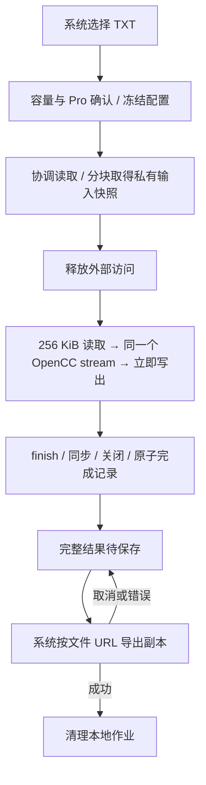

# iPhone / iPad 100 MiB 大文件转换技术方案

确认日期：2026-09-30。版本：v2.2。总跟踪：[#256](https://github.com/gewill/OpenCCman/issues/256)。

本方案将移动端单个 TXT 的输入上限提高到 **100 MiB（104,857,600 字节，约 105 MB）**，采用文件直接转换、直接保存的 Pro 工作流。100 MiB 是文件容量，不是进程内存上限。用户已确认首版前台优先：后台或锁屏安全中止，不承诺后台续跑。

## 当前事实和发布边界

以集成基线 `9daa9c77eea9d9fb6b0952b63772d4f68baf3bfd` 为准：

- 应用部署下限为 iOS/iPadOS 15、macOS 12。SwiftyOpenCC 固定 `564b094b2b69f2c1e907fa3d89fe6845469a4e4e`，OpenCC 核心 `025f371dc76b598d77384fbdab90c937471844d8`（1.4.2）。
- `makeStream()` 没有 Mac 平台限制。它保留 UTF-8、词组匹配、归一化、转换链及 IDS 上下文，不能由逐行或每块独立整篇转换替代。
- 移动端目前仍拒绝超过 10 MiB 的导入。Mac 已开放单个大文件直接转换/保存，输入上限 1 GiB。旧验收文档中的 `productionEnabled=false` 是历史候选状态，不代表当前源码。
- [Mac 流式记录](validation/large-file-streaming/README.md)有 100 MiB/1 GiB 正确性与内存测量，但只测特定配置和 Mac 服务；不是移动端整 App 的容量证据。
- [#217 强退探针](validation/issue-217-force-kill/README.md)证明源和旧目标受保护，同时证明 staging 会残留。移动端必须实现自身作业清理，不能依靠 `defer` 或系统清扫。

| 能力 | 本次范围 |
| --- | --- |
| 普通编辑器 | ≤10 MiB，沿用当前编辑、预览、转换、保存流程 |
| 移动端大文件 | >10 MiB、≤100 MiB，Pro 单文件直接转换/保存，不扣主页次数 |
| Mac 大文件 | 原有 1 GiB 及目标替换流程保持独立，并回归 |
| 输入/输出 | UTF-8 TXT，可输入 BOM；输出无 BOM；保留正文转换语义和换行 |
| 入口 | 系统选择器。首版大文件不开放拖放；≤10 MiB 拖放维持原规则 |
| 界面 | 文件名、大小、配置、阶段、数值进度、取消、保存/删除；不加载全文 |
| 后台 | App 全部场景进入后台或锁屏时中止，返回后可重新选择并转换 |
| 后续 | 更高容量、iOS 26 持续后台任务、大文件拖放、批量、全文预览和断点续转独立评估 |

不改动 2.1 提审内容、商品价格或依赖 revision；日常工作不推送 `build*`。

## 架构和接口

### 共享流循环

`StreamingConversionPump.run` 是同步接口，在专用工作队列运行，参数包括：

- 已打开的输入和输出 `FileHandle`；调用方拥有句柄，不交由 pump 关闭。
- `expectedInputBytes`、冻结的 OpenCC options、线程安全取消令牌。
- 数值进度回调，以及用于真实读写边界故障注入的 hooks。
- 生产块大小 256 KiB。测试可用 1/2/3/7/31 字节等小块触发边界，不能超过生产块大小。

结果只有实际输入/输出字节数。成功表示流转换完成，不等于已同步、发布或保存。调用方负责文件身份、同步、关闭、清理及最后提交。

逐块立即写出，每块 `autoreleasepool`，只保留不超过三字节的 BOM 前缀和引擎自身的匹配上下文。只移除文件开头 BOM，不删除正文内 U+FEFF。遇到非法/末尾截断 UTF-8、输入长度变化、取消或 I/O 错误时抛出，半成品由调用方删除。

`StreamingConversionCancellation` 使用锁管理跨线程取消；不会关闭 worker 正在使用的句柄。`commit` 串行决定发布与取消竞态，发布成功后的取消不能撤销结果。

`FileConversionPolicy` 集中管理输入限制：编辑器 10 MiB、移动端 100 MiB、Mac 1 GiB。定义移动端策略本身不启用生产入口。

### 平台适配与状态

| 组件 | 职责 |
| --- | --- |
| Mac `StreamingTextFileService` | 调用共享 pump；继续负责目标指纹、同卷 staging、安全域、NSFileCoordinator 写协调、原子目标替换及清理 |
| `MobileFilePreparationService` | 安全域与读协调、属性/容量检查、分块复制、输入快照所有权 |
| `LargeFileJobStore` | 私有目录、原子状态记录、完成结果、启动恢复、明确失败的清理 |
| `MobileLargeFileCoordinator` | MainActor 状态、全 App 单任务预约、冻结配置/资格、窗口与生命周期 |
| 移动端导出适配器 | `UIDocumentPickerViewController(forExporting:asCopy:true)`；传完整磁盘文件 URL，回报成功或取消 |

状态为 `待确认 → 准备 → 转换 → 待保存 → 保存 → 完成`；取消另经 `正在取消 → 已中止`，错误为 `失败`。每个作业唯一 UUID，迟到回调必须复核 ID；worker 收尾完成后才释放任务槽。准备和转换使用一个串行文件 worker，主线程只接收状态/数值，最多每 100 ms 更新一次。

全 App 最多一个大文件作业，未保存结果也占预约。iPad 各窗口共享协调器，同时保留各自原稿、结果、阅读状态。切换布局不取消，不重新构造业务模型。关闭所属场景中止未完成任务；完整结果仍可由其他窗口取回。现有小文稿业务不为启动大文件而清空；并行普通转换的内存情况纳入验收。

## 文件生命周期

### 选择、确认和输入快照

导入文件大于 10 MiB 时转入大文件确认，展示文件名、大小、配置和 Pro 条件。大于 100 MiB 明确拒绝，不改原稿。非 Pro 走现有付费入口，不开始大文件复制/转换；开始时重查资格并冻结配置。任务不扣主页次数。

外部 URL 的属性、打开和读写都在后台队列。使用安全域和 NSFileCoordinator 协调读取，读协调仅覆盖取得私有快照，不跨 UI 交互或后续转换。取得副本后释放协调及安全域。源文件必须为普通文件；复制前后检查身份、大小和修改时间，普通并发修改时失败；不宣称防御伪造元数据的恶意 writer。

实际复制逐块累计，超过 100 MiB 立即失败，BOM 计入输入容量。文件属性预检不能替代实际计数。iCloud/第三方等待与复制阶段分别显示；无可靠下载进度时使用不确定进度。

后续大文件拖放不得走全文 NSString/loadData 回退。`loadFileRepresentation` 回调内必须取得稳定 FD 所有权，再异步复制；回调后的临时路径不能用于重开/协调/身份复核。原始 fileURL/in-place 输入仍要求安全域和读协调覆盖复制。此后续分流需独立 iOS 提供方测试，Mac 的 unlink 后读取证据不能替代。

### 私有存储和完成点

在 Application Support 专属根目录建立 UUID 作业目录，排除备份，目录/文件使用 `.complete` 文件保护。输入和部分输出不通过文件共享暴露。

完成顺序固定为：输入长度/身份检查及 `finish` → 输出同步/关闭 → 私有目录内原子改名为完整结果 → 原子完成记录 → 删除输入快照。完成记录含版本、UUID、配置、源 basename、预期结果 basename 和实际字节计数，不记录正文或长期外部访问 bookmark，不向服务器上传。

只有完成记录有效且结果大小一致时才进入待保存。取消在完成点之前获胜则清理；完成点已提交则保留结果。未完成输出不交给保存面板。

### 保存及恢复

系统导出磁盘 URL，`asCopy:true` 保留重试来源；默认 `<原名>-converted.txt`，位置、重名、覆盖提示由系统处理。取消和失败保留完整结果；系统成功回调后显示“已保存”并删除私有结果。成功仅代表提供方接受导出，不代表云端远端同步完成；跨提供方覆盖原子性由系统/提供方实现，需实测，不能作统一保证。

启动时只扫描自己专属根目录，不扫描任意 TemporaryItems 或用户目录。拒绝不可信路径和符号链接；验证作业结构、状态版本和预期文件名后删除自身内容。未完成作业删除快照/partial，重新转换需要重新选原文件。完整有效结果恢复待保存，供保存或明确删除；最多一份，不构成本地历史。受保护数据尚不可读时延后，不误判损坏并删除。异常清理失败明确记录，可重试，不宣称清理通过。

不做字节偏移续转。恢复 OpenCC 必须同时恢复所有匹配/转换链状态，单一 offset 不足以保证输出一致。

### 生命周期

- 短暂 inactive、来电、控制中心、系统文件面板不直接视作后台。App 所有场景实际进入后台、主动锁屏或保护数据不可用时请求取消。
- 提前配对 `beginBackgroundTask` / `endBackgroundTask`，只为取消/关闭/清理争取有限时间；过期 handler 不阻塞主线程，不能承诺固定时长。未能清理的作业由启动恢复接管。
- 取消立即显示状态，但不能中断正执行的 C++、构造器或阻塞文件操作；等待 worker 返回再删除其文件及释放预约。
- 准备/转换期间临时禁止自动锁屏，保存原值并在所有终止路径恢复。用户主动锁屏仍中止。
- 内存警告中止大文件并释放任务资源，保留主页内容；强退/jetsam 不会运行 defer，不能依靠它收尾。

## 磁盘、内存和隐私

输入为 S、实际输出为 O：准备占 S，转换占 S+O，完成删除输入后占 O，系统按副本导出还可能增加 O。提供方下载缓存另算。

锁定词库的 `顯存 → 視訊記憶體` 有 2.5 倍 UTF-8 增长；字表也有 4/3 增长。引擎的 1.2 倍 reserve 仅是分配优化，不能用作输出上限。

启动空间预检预算为 `4*S+64MiB`，100 MiB 输入约 464 MiB；属于产品预算，不是所有文本/提供方的空间保证。导出前按实际 O 再查本机复制空间；不足保留结果，释放空间后重试。容量查询失败不等于零；实际每次读/写/同步/关闭都处理 ENOSPC/EIO/EACCES，不得截断后报告成功。

当前隐私清单仅有 UserDefaults。新增 DiskSpace `E174.1`（用户可见的不足空间行为），补文件 metadata 的 FileTimestamp `C617.1`（容器文件）/`3B52.1`（用户选文件）；有空间展示时再核对 `85F4.1` 的实际用途。不得借 SDK manifest 替代 App 自身声明。空间/元数据用于本机处理，不发送离开设备；正文不进日志。签名包需读回最终 manifest。

内存不设统一的“App最多100MB”保证。架构要求：没有全文 String/Data/FileDocument，没有 Data 队列积压，串行256KiB＋字典/上下文。工程验收目标为同设备同配置同预热条件，100MiB相比20MiB峰值physical footprint增量≤16MiB；冷/热/使用过七配置缓存分开测。App会保留用过的converter，字典常驻与泄漏要区分。`os_proc_available_memory` 只能作为实时辅助，不能等同总RAM或固定jetsam阈值。

## 验证与交付

| 顺序 | 任务 | 可独立验证的关闭标准 |
| --- | --- | --- |
| A | [#257 共享核心及容量策略](https://github.com/gewill/OpenCCman/issues/257) | 七配置、随机/小块、BOM/Unicode/IDS/NUL、异常UTF-8、大小变化、取消/错误、句柄所有权；iOS Simulator100MiB全哈希；Mac文件回归及两端完整构建 |
| B | [#258 快照、恢复、清理](https://github.com/gewill/OpenCCman/issues/258) | 所有真实I/O边界故障、取消/提交、强退、目录所有权、保护数据、空间声明及生命周期集成 |
| C | [#259 移动端UI与系统保存](https://github.com/gewill/OpenCCman/issues/259) | Pro/配置快照、单作业、多窗口、状态、保存取消重试、原稿阅读保持；真实前后截图和交互视频 |
| D | [#260 真机验收及开放](https://github.com/gewill/OpenCCman/issues/260) | 低内存iPhone+iPad，签名Release100MiB全流程与资源矩阵；帮助/容量提示/CHANGELOG完成后开放 |

正确性 oracle 使用同一锁定 wrapper 的**整篇转换**生成完整预期 SHA-256，不用另一次同算法stream或任意独立切片拼接作唯一对照。设备以分块读取计算输出完整哈希。

边界：10MiB、10MiB+1byte、100MiB、100MiB+1byte，BOM计入；七配置×无换行/CRLF空行/ASCII/复杂Unicode/IDS/扩张词组/块间词组，非法UTF-8首部、跨块和末尾。小块/随机块补生产256KiB边界。

真机：本机Files、未下载iCloud、至少一个第三方提供方；权限撤销/源变化/断连、准备/转换/同步/导出磁盘不足、前台取消/后台/锁屏/强退、多窗口/关闭场景、保存重名/取消/重试。提供方未完成的真实场景明确保留，不能由故障注入替代。

性能：20/50/100MiB每样本三次，冷/热/七配置缓存；空白主页及保留接近10MiB原稿与结果。记录整App峰值footprint、阶段耗时、温度/热状态、取消至清理、十轮常驻与目录/句柄变化。取消界面即时响应，本机文件worker收尾目标≤1秒，提供方等待另记。无崩溃、watchdog、jetsam。Simulator不代替设备内存。

最低iOS15运行证据由#16承接；实际Pro资格与签名包购买链路关联#14/#71。无环境不写通过，发布取舍由维护者明确。Mac1GiB、覆盖竞态、同文件、取消/强退探针必须回归。

每项从最新develop新建codex分支，PR合develop，有依赖时保留祖先关系。App Regression必需，不绕过；UI真实证据用gh --attach引用，最低系统缺项转出并保持未通过。容量不达标时修复实现，不用更低容量冒充目标。

## 官方依据

- [跨进程文件协调及后台期限](https://developer.apple.com/documentation/foundation/nsfilecoordinator)
- [文件选择、安全域与提供方](https://developer.apple.com/documentation/uikit/providing-access-to-directories)
- [文件URL导出](https://developer.apple.com/documentation/uikit/uidocumentpickerviewcontroller/init%28forexporting%3Aascopy%3A%29)
- [有限后台执行](https://developer.apple.com/documentation/uikit/uiapplication/beginbackgroundtask%28expirationhandler%3A%29)
- [Complete文件保护](https://developer.apple.com/documentation/foundation/fileprotectiontype/complete)
- [临时文件representation生命周期](https://developer.apple.com/documentation/foundation/nsitemprovider/loadfilerepresentation%28fortypeidentifier%3Acompletionhandler%3A%29)
- [Required Reason API类别及用途](https://developer.apple.com/documentation/bundleresources/app-privacy-configuration/nsprivacyaccessedapitypes/nsprivacyaccessedapitype)
- [Jetsam事件及设备内存](https://developer.apple.com/documentation/xcode/identifying-high-memory-use-with-jetsam-event-reports)
