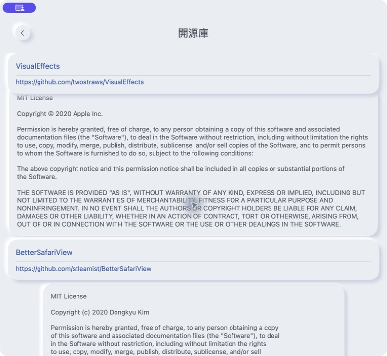
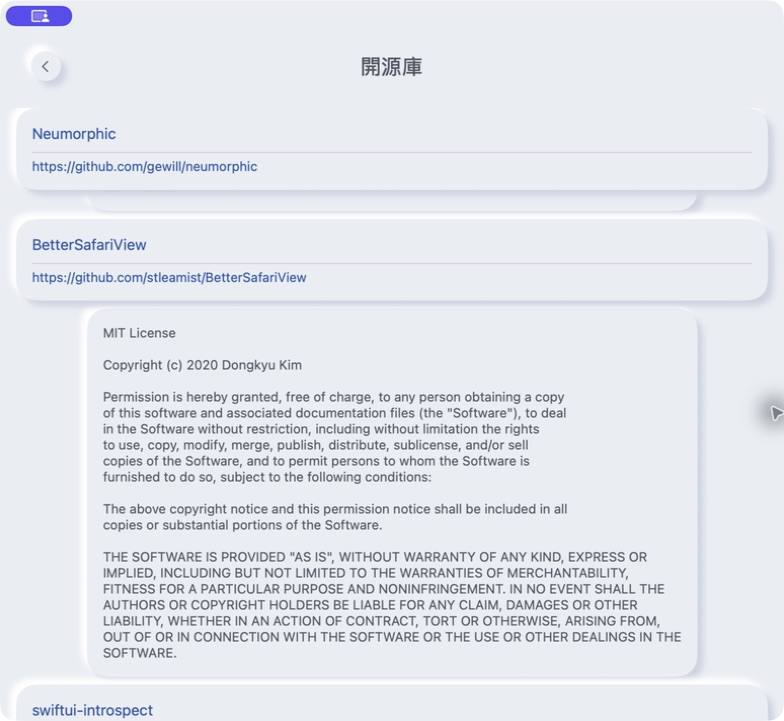

# 闲置控件与 VisualEffects 清理

日期：2026-09-13。任务：[#38](https://github.com/gewill/OpenCCman/issues/38)。基线 `7e77bb31af0b0e83a8014285d57bb73a49c7c5dc`；清理代码 `f17c2e32521f9393f45258f139f7eaee2ecfd1f3`。

## 范围与依据

应用源码、工程、测试和预览中，`SmallButtonStyle` / `smallButtonStyle`、`MacButtonStyle` 只有定义；`smallSizeSoftButtonStyle` 只有自身预览调用。删除这些实现和专用 `ButtonStyles.swift`，同时移除其工程源文件引用。现用的卡片包装和 `modify` 保留。

应用已没有 VisualEffects 调用，保留包的 manifests 也没有依赖它。删除它的 package/product/framework 引用和 `Package.resolved` pin；只在确认未进入链接输入和最终包后删除应用内对应开源声明。其他 14 个 pin（包含全部字段）和其他开源声明逐项保持原样。

本次不改变转换、额度、购买或分段选择器样式。未测量启动、内存或包体性能收益，不将删除依赖直接等同于性能提升。

## 验证 Log

- `bash scripts/check-project.sh`：工程、Swift 语法、Info/entitlement/privacy 和三种语言资源通过。
- Xcode 26.6：macOS Debug、iOS Simulator Debug 均 `BUILD SUCCEEDED`，仍为 iOS 14 / macOS 11 部署下限。
- 使用新的 derived data 目录，并启用 `-onlyUsePackageVersionsFromResolvedFile`。构建后再次核对：锁文件从 15 项变为 14 项，剩余 pin 完全相同。
- macOS/iOS Simulator × arm64/x86_64 的四份 `OpenCCman.LinkFileList` 均无 VisualEffects；两个应用产物中无其资源或框架路径，`nm -j` 符号表无 VisualEffects 模块符号。
- Debug 二进制仍可搜索到一条 VisualEffects URL，来自未修改的 SwiftUIOverlayContainer `BackgroundStyle.swift` 的旧系统模糊效果建议文本；它不是 VisualEffects 实现或依赖边，因此未修改第三方源码来清除这个普通字符串。
- macOS 隔离应用启动、设置导航和开源声明页面通过；Neumorphic 后直接进入 BetterSafariView，对应声明已移除。
- `git diff --check` 通过。这里是 Debug 构建与清理验证，不替代最终 Xcode Cloud 分发包、最低系统或 #37/#40 的验收。

构建使用项目 `OpenCCman.xcodeproj`、scheme `OpenCCman`，分别指定 `generic/platform=macOS` 和 `generic/platform=iOS Simulator`，`CODE_SIGNING_ALLOWED=NO`。运行截图使用构建后的副本、隔离 bundle ID `org.gewill.OpenCCman.NeumorphicQA20260913` 与 ad hoc 签名。

## 前后截图

同一 Mac、macOS 26.6.2、繁體中文、浅色、默认字号、784 × 721 窗口。前图来自清理前最终应用代码 `e1bf1ea`（应用与工程文件和本次基线 `7e77bb3` 无差异），后图来自本清理提交。原始 JPEG 直接保存，没有修图或拼接。

比较开源声明中的相邻条目区域：前图有 VisualEffects，后图显示 Neumorphic 后接 BetterSafariView。删除条目改变列表总高度，两图分别定位该区域，滚动百分比不相同。

| 清理前 | 清理后 |
| --- | --- |
|  |  |

| 原图 | 像素尺寸 | SHA-256 |
| --- | --- | --- |
| `credits-before.jpg` | 784 × 721 | `fa1426ab2dbfabf3e3e284116b9c26634356b4d52acfaf9703f7e8b009557b8b` |
| `credits-after.jpg` | 784 × 721 | `d8a874d7e619480983eab3c70ea92559b1e26241a87951db49822e843f2bebc4` |
