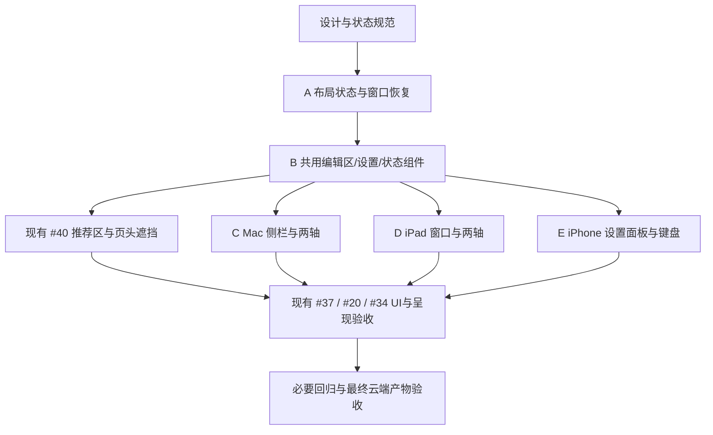

# 实施计划与任务拆分

设计入口：[完整画稿](README.md)、[UI 与交互规范](UI-SPEC.md)。状态：设计 #51 已合并；#46/#47/#40/#48/#49/#50 实现分别经 #53/#54/#55/#56/#58/#59 合并 `develop`。真实验收仍有开放项目，见[当前运行记录](../../validation/adaptive-workspace/README.md)。每项使用独立 codex 分支与 worktree，必要时从父候选继续开发。

## 交付顺序

A/B 先合并，避免三端各自复制业务逻辑。C 先实现参考方向，稳定组件后 D/E 可独立推进；#40 的整改与平台接入协调合并，不能在新旧布局间重复修改同一区域。最后使用同一最终 SHA 补齐验收，不以各平台早期截图拼出“全通过”。

## 新增实现任务

| 任务 | 依赖 | 代码范围与产物 | 关闭标准 |
| --- | --- | --- | --- |
| [#46](https://github.com/gewill/OpenCCman/issues/46) A · 布局状态与窗口恢复 | 设计规范 | 纯值布局偏好/实际布局解析、两轴比例、每窗口恢复接口；不改 HomeViewModel 转换/收费规则 | 719/720/759/760 临界缓冲、主动上下不被扩大覆盖、窄窗恢复左右、两个窗口隔离；纯值测试通过 |
| [#47](https://github.com/gewill/OpenCCman/issues/47) B · 共用工作区组件 | A | 提取 ConversionInspector、SourcePane、ResultPane、LayoutPicker、状态呈现；参数来源和旧快照文案 | 复用同一个 HomeViewModel；导入/转换/取消/失败/快照可用性正确；输入法、选区、焦点和滚动不因换容器丢失 |
| [#48](https://github.com/gewill/OpenCCman/issues/48) C · Mac 侧栏与两轴 | A/B | 系统窗口工具栏、可隐藏侧栏、两轴分割和键盘/菜单等价入口 | M01/M02，300 pt 到宽窗、拖动/均分、50次切换、两窗口不同稿/布局、任务中切换无重复预约 |
| [#49](https://github.com/gewill/OpenCCman/issues/49) D · iPad 窗口适配 | A/B，复用 C 验证后的组件 | 侧栏/面板切换、两轴、触摸分隔线、窗口宽度/旋转/软硬键盘 | P01/P02/P03；宽窗上下和竖窗左右都能选，窄窗回退不覆盖偏好；单文件拖放、焦点与44pt命中区通过 |
| [#50](https://github.com/gewill/OpenCCman/issues/50) E · iPhone 与键盘 | A/B | 上下可滚动页面、转换设置 sheet、更多菜单、唯一转换操作区和键盘 inset | F01/F02/F03；320–430pt、横屏和最大字号，光标/取消可达；复制/导出禁用正确，推荐不遮挡，iOS14回退通过 |

A 的布局指标应集中维护；B 只有实际证据证明 `TextEditor` 无法保持状态时才引入最小原生适配。C/D/E 不应各写一份转换、配额、文件权限或词库映射逻辑。

## 复用现有 issues

| 现有 Issue | 本轮责任与依赖 |
| --- | --- |
| [#40 推荐与页头遮挡](https://github.com/gewill/OpenCCman/issues/40) | B 后将推荐区纳入布局，移除固定300pt/负offset；“移除推荐”仍进Pro；大字号/键盘/非Pro路径复测 |
| [#37 Neumorphic UI 验收](https://github.com/gewill/OpenCCman/issues/37) | C/D/E/#40 后补两轴、三端、主题、高对比度与状态图的真实截图 |
| [#20 VoiceOver/键盘](https://github.com/gewill/OpenCCman/issues/20) | 选中/禁用播报、焦点顺序、可访问分隔线、非拖动操作、中文输入与文本选择 |
| [#34 What’s New 呈现](https://github.com/gewill/OpenCCman/issues/34) | 布局切换、文件/设置面板、转换期间不误触发新功能或 Pro 弹层 |
| [#15 文件与跨 App](https://github.com/gewill/OpenCCman/issues/15) | 最终签名包文件导入/保存、Services/快捷键无回归 |
| [#16 最低系统](https://github.com/gewill/OpenCCman/issues/16) | iOS14/macOS11实际运行，缺少环境时保留未验收 |
| [#14 购买/Pro](https://github.com/gewill/OpenCCman/issues/14) | 确认入口重排未改变商品、资格与恢复流程；不因UI计划重复交易测试 |
| [#18 性能](https://github.com/gewill/OpenCCman/issues/18) | 定向测量布局切换/窗口缩放的大文本响应，复用现有同机基线方法 |

既有 Issue 保留原验收证据和发布责任，不因这次关联就关闭；不另建相同的遮挡或无障碍缺陷单。

## 每个实现 PR 的要求

1. 关联具体 Issue，只交付本任务范围；先通过已有最小回归，再按影响范围验证。
2. UI 改动附真实前后截图，统一 SHA、设备/窗口尺寸、语言、主题、字号、Pro/非Pro与输入；不能用生成稿替代运行后的截图。
3. 布局模型只测有意义的分支与恢复行为；任务中切换、焦点/选区/滚动需实际 UI 验证，不用镜像实现的测试代替。
4. 依赖锁文件不漂移，不提高系统下限，不增加完整模拟器矩阵，不以 CI 成功替代最低系统或购买验收。
5. 日常 PR 合入 `develop`。按本轮用户明确授权，检查通过且依赖已合并后使用 merge commit 顺序合并；CI 排队时推进独立后续任务，不绕过检查。不得推送 build* 或触发 Xcode Cloud；发布另行授权。

## 完成定义

- [ ] A/B/C/D/E 已分别合并并通过对应验证。
- [ ] #40 的重叠/遮挡问题在新布局中有真实关闭证据。
- [ ] 两轴、侧栏、窗口恢复不改变任务ID/业务数据/额度，选区和滚动恢复有验证。
- [ ] 英语/简繁、浅深色、大字号和VoiceOver/键盘必测场景都有记录。
- [ ] 系统文件面板与 What’s New/Pro 呈现互斥未退化，最低系统/签名包的必要最终验收明确通过或保留阻塞。
- [ ] 更新 README/CHANGELOG 和最终实现截图；发布版本由维护者在真实验收后确定。

## GitHub 跟踪

总跟踪：[#45 自适应转换工作区](https://github.com/gewill/OpenCCman/issues/45)。

- [ ] https://github.com/gewill/OpenCCman/issues/46 — [UI][A] 建立窗口独立的布局偏好、两轴解析与恢复
- [ ] https://github.com/gewill/OpenCCman/issues/47 — [UI][B] 提取共用设置、编辑器与结果状态组件
- [ ] https://github.com/gewill/OpenCCman/issues/48 — [UI][C] 实现Mac设置侧栏、左右/上下分栏与键盘操作
- [ ] https://github.com/gewill/OpenCCman/issues/49 — [UI][D] 实现iPad双布局、窄窗口与软硬键盘适配
- [ ] https://github.com/gewill/OpenCCman/issues/50 — [UI][E] 实现iPhone上下阅读、转换设置面板与键盘避让

现有 #40/#37/#20/#34 已补充本轮设计关联；创建任务不表示实现或验收完成。
