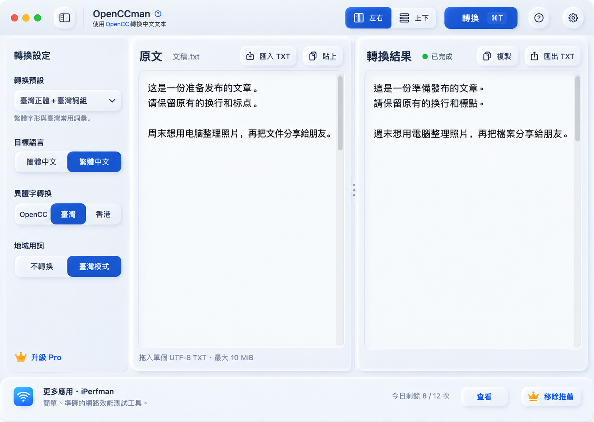
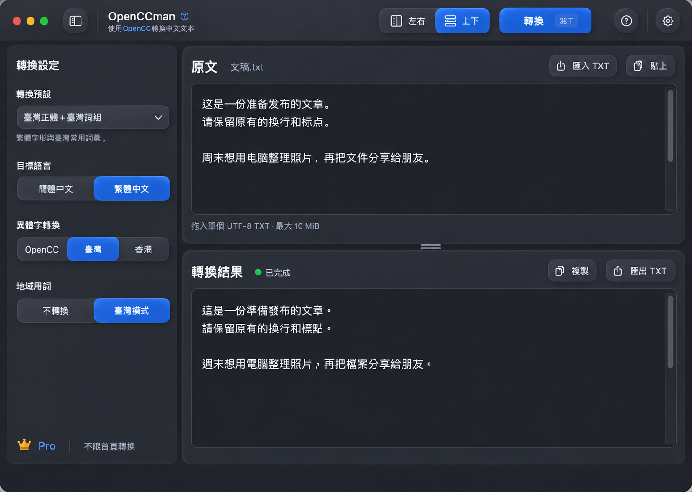
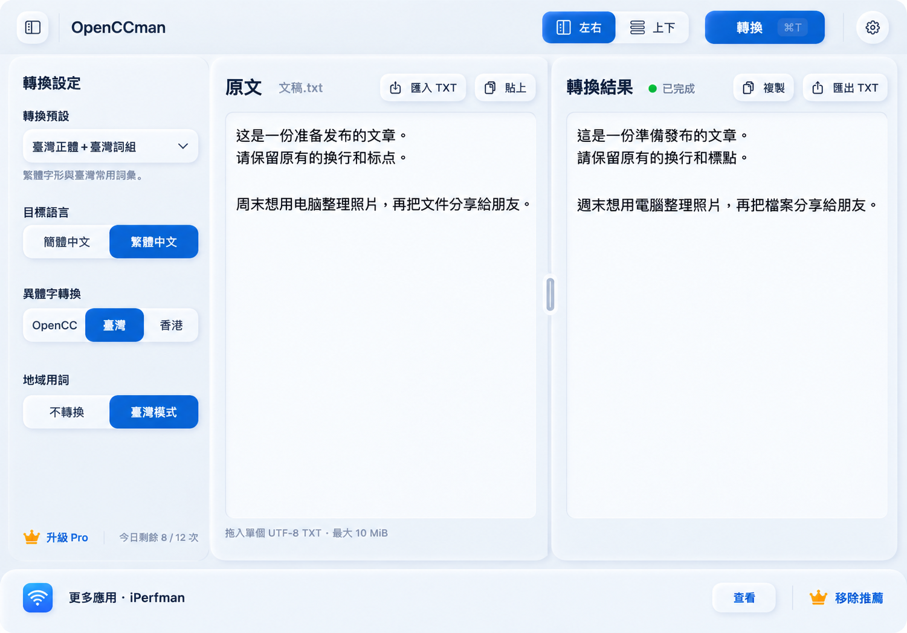
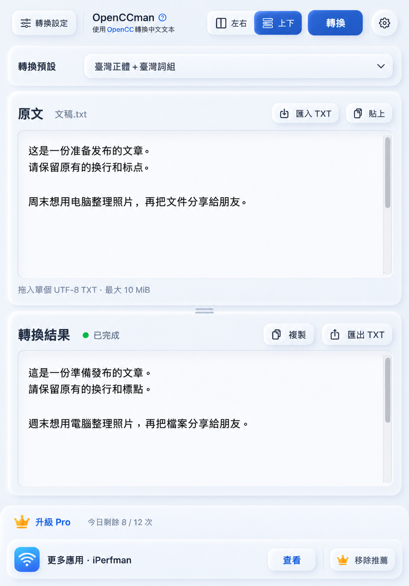
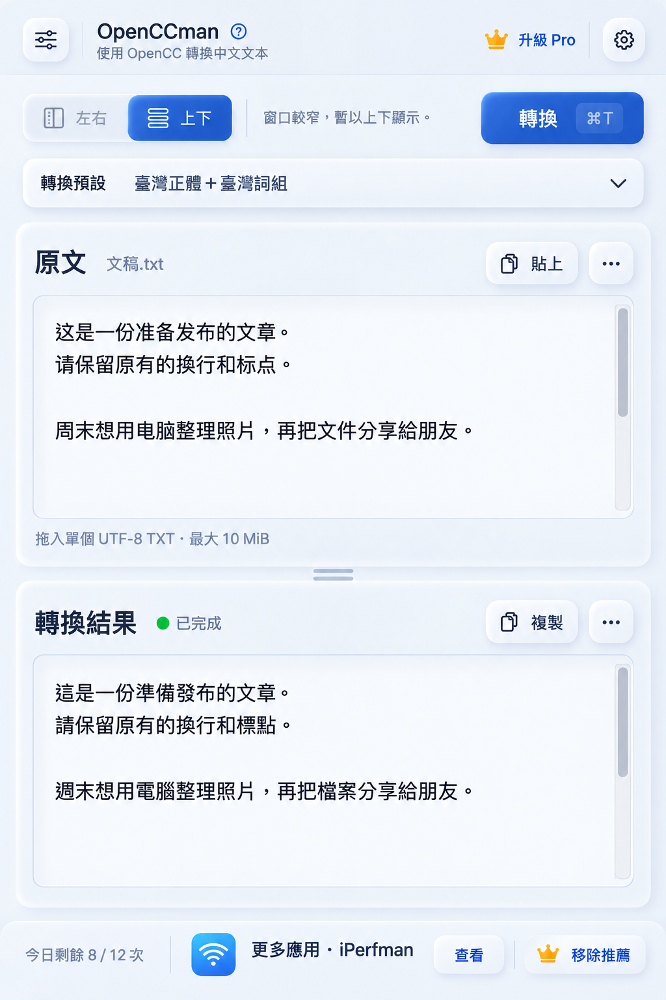
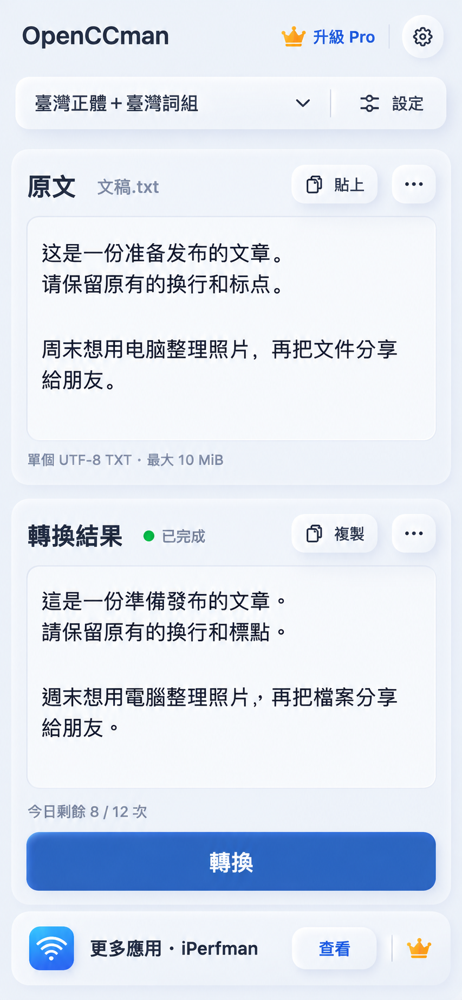
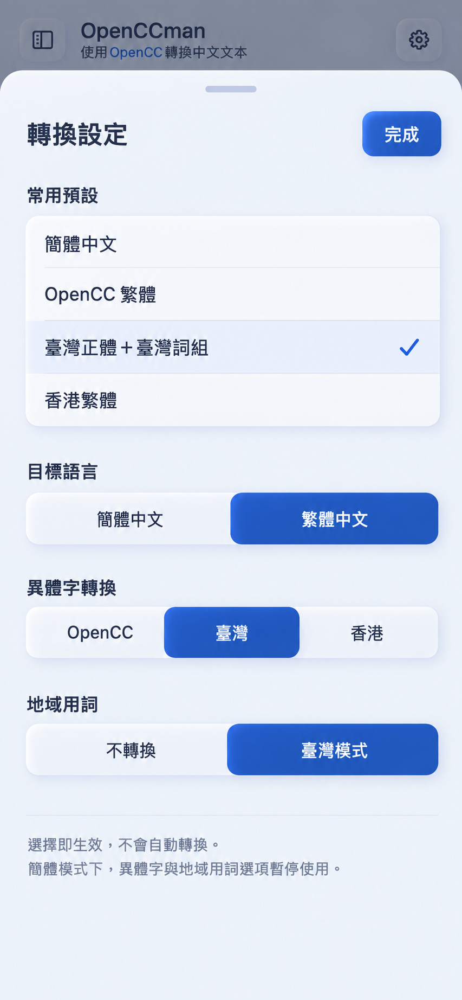
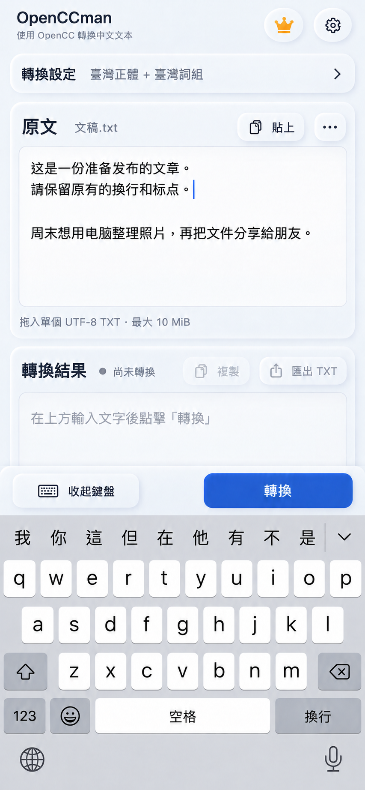
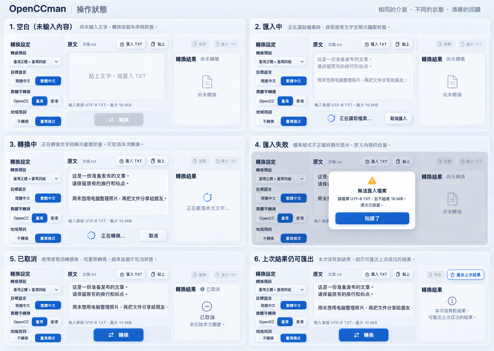

# 三端自适应转换工作区 · UI 稿

日期：2026-09-13。采用维护者选定的**第 2 稿：设置侧栏＋上下阅读**，扩展为 Mac、iPad 和 iPhone 共用的转换工作区。这里交付设计和实施计划，**尚未实现应用 UI**，不改变版本号、价格、购买资格或引擎依赖。

- [详细 UI 与交互规范](UI-SPEC.md)：布局、尺寸、切换、状态、键盘及无障碍。
- [实施计划与 issues](PLAN.md)：依赖顺序、拆分边界和关闭标准；[总跟踪 #45](https://github.com/gewill/OpenCCman/issues/45)。
- [原始画稿清单与 SHA-256](manifest.json)：10 张 PNG 原样保存；其中 1 张为已选初稿、9 张为展开稿。

图片是 AI 生成的视觉设计稿，不是运行截图，也不是像素或系统 API 可用性的证明。画稿中的比例、图标、中文字符和示例内容用于表达设计；准确按钮状态、文案、布局阈值及实现边界以 UI-SPEC 为准。图中推荐图标必须在实现时复用真实资产，不能把生成图标当成 App 图标。最终 PR 仍须附真实运行的前后截图。

## Mac

| M01 · 左右 / 浅色 / 非 Pro | M02 · 上下 / 深色 / Pro |
| --- | --- |
|  |  |

设置侧栏可隐藏；原文和结果独立滚动，分隔线可拖动。布局切换属于窗口显示状态，不重新发起转换。深色稿展示 Pro 路径，移除推荐后把空间还给编辑器；三端均需支持浅深色，不能只实现图示的主题组合。

## iPad

| P01 · 横向窗口 / 左右 | P02 · 竖向窗口 / 上下 |
| --- | --- |
|  |  |

两种排列都可主动选择，取决于实际窗口可用宽度，不根据设备型号或屏幕方向硬编码。横向 iPad 也可以上下排列，竖向宽窗口也可以隐藏侧栏后左右排列。

P03 · 多任务窄窗口：暂时回退上下

左右暂不可用时显示原因，保留用户原来的左右偏好；重新拉宽后恢复。软键盘出现也不能丢稿；仅在连接硬件键盘时显示相应快捷键提示。

## iPhone

| F01 · 主页成功状态 | F02 · 转换设置面板 | F03 · 键盘输入状态 |
| --- | --- | --- |
|  |  |  |

窄屏不强塞双栏：原文在上、结果在下，四项预设和高级选项进入设置面板。键盘出现时隐藏推荐区，把唯一转换按钮放在键盘上方；输入发生变化后无有效结果，复制、导出均禁用。F03 已修正初次生成稿中导出按钮误显示启用的问题，最终版本见 manifest。

## 共有状态

S01 包含空白、导入中、转换中、导入失败、取消和上次结果仍可导出六类组件示意。状态板为便于比较省略了完整平台外框，不能据此改变各端转换按钮的位置。额度耗尽、导出系统面板、设置变更和高对比度等规则详见 UI-SPEC 的状态表及验收矩阵。

## 参考与范围

- 已选初稿：[第 2 稿原图](images/00-selected.png)。
- 当前源码依据：`develop` 的 `fbd1ac02fd964d85949cfe33cf6474e8098c6329`；`HomeScene`、`HomeViewModel`、`RootView`、`ConversionConfiguration`、`SegmentView`、`MyAppView`。
- 保留现有 Neumorphic 2.4.1 及 iPerfman 风格的一体式分段控件，不引入新主题或控件库。
- 本轮覆盖转换主工作区、转换设置、版式切换、文件入口、编辑/任务状态及三端适配；现有应用设置、Pro 购买、帮助、开源致谢和 What’s New 页面保留现有流程，通过入口和呈现互斥验收。它们的整页重设计不在本轮范围。
- 发布目标按实现及验收结果再确定，本设计文档不宣布 1.3 已发布，也不自动扩大 1.3 发布门禁。
