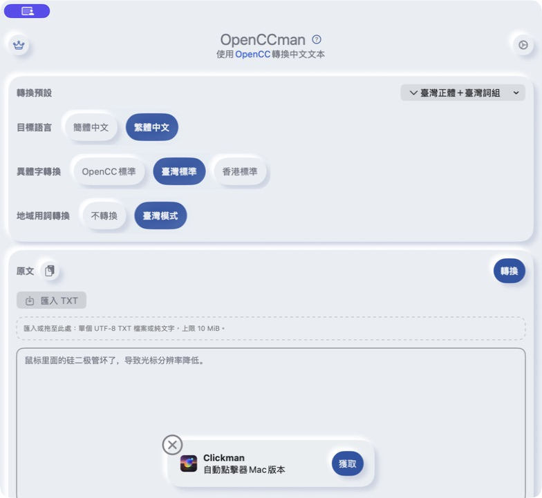
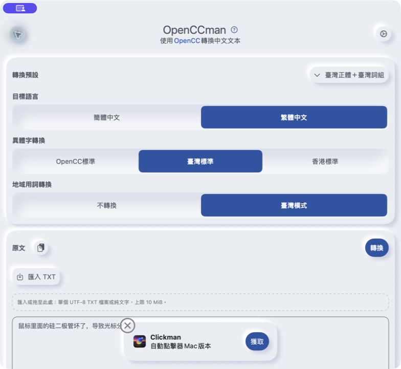
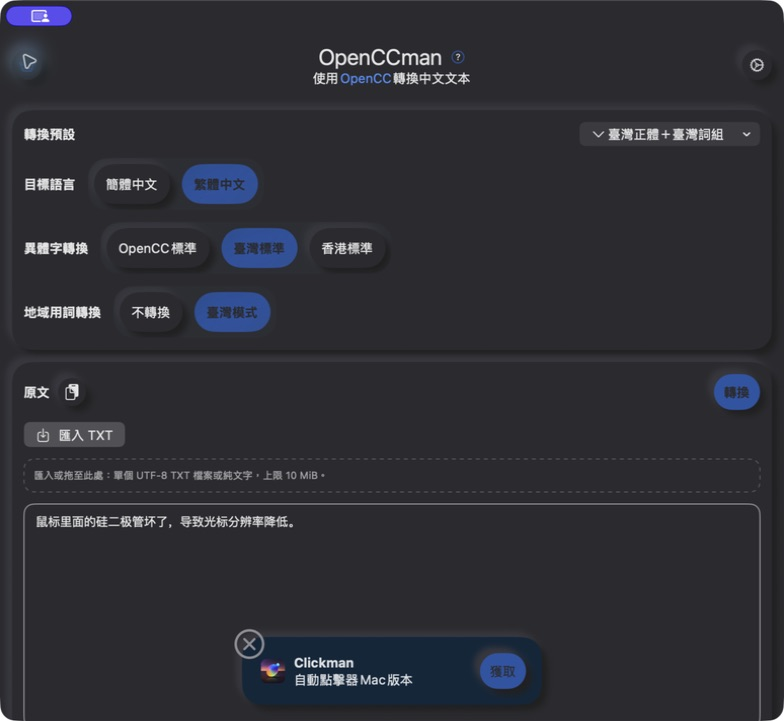
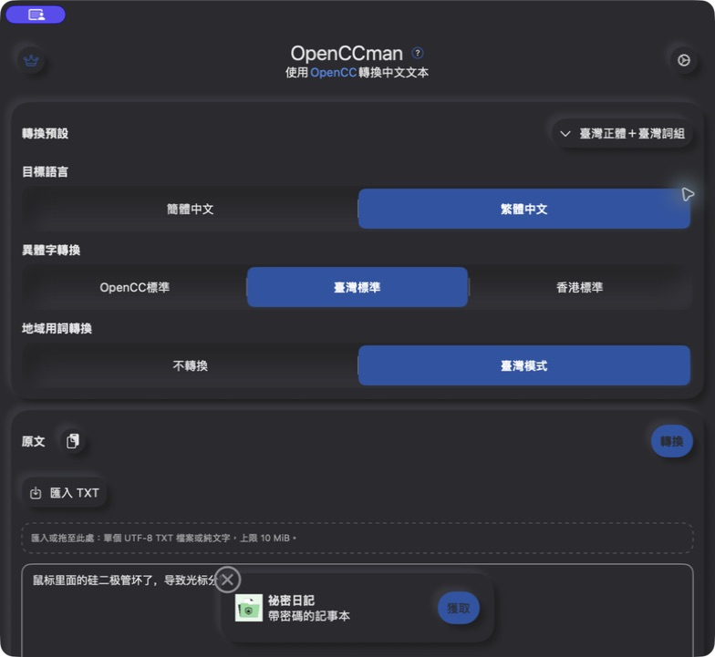
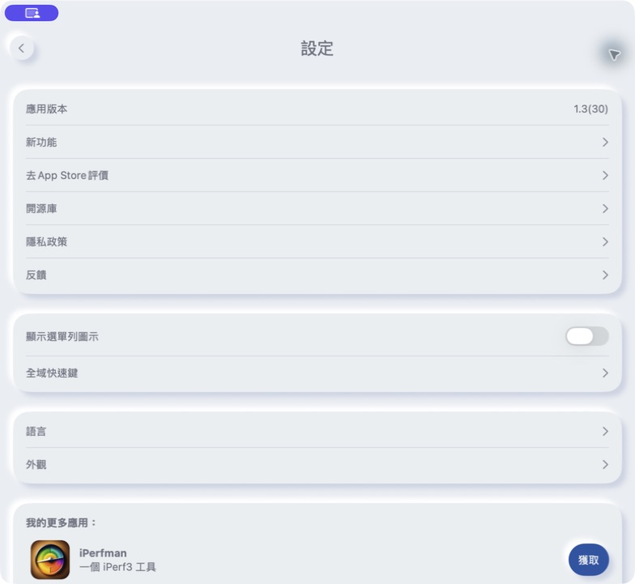
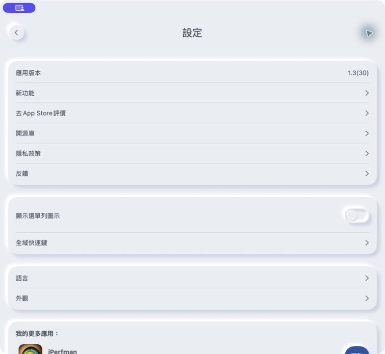

# PR #39 前后截图

拍摄日期：2026-09-13。全部为实际运行应用的窗口截图，直接保存截图工具返回的 JPEG，未修图、缩放或拼接。PR 的表格仅缩放展示，原图可打开查看。

- 修改前：PR 基线 `9cfee8f3682e6b1ac7aa0d9848bb8e1fd05ccd2c`，独立 checkout，以自己的 Package.resolved 完成 macOS Debug 构建（`BUILD SUCCEEDED`）。
- 修改后：应用代码 `e1bf1ea35e9a5f46531b7693b5fcc922924674d6`，选择器已按 iPerfman 的一体式凹槽与选中色调整；三张 after 图均重新拍摄。
- 相同 Mac / macOS 26.6.2 / Xcode 26.6 / 繁體中文 / 默认字号；每对截图使用相同主题及窗口尺寸，原图均为 **784 × 721**。
- 同一隔离 bundle ID `org.gewill.OpenCCman.NeumorphicQA20260913` 依次运行两个版本，保留相同窗口与偏好；没有修改正式应用。拍摄结束后已将 QA 应用文件恢复为修改后版本。
- 主页均为繁体＋台湾标准＋台湾模式，原文为内置示例，尚未转换；设置页菜单栏开关均关闭。
- 底部推荐内容自动轮换，轮换内容、鼠标位置及系统屏幕共享标识不属于 PR 改动。未修改轮换逻辑来配图。

| 场景 | 修改前 | 修改后 |
| --- | --- | --- |
| 浅色主页 |  |  |
| 深色主页 |  |  |
| 浅色设置与开关 |  |  |

这些图片用于审阅外观变化，不代替完整验收。大字号问题仍由 [#40](https://github.com/gewill/OpenCCman/issues/40) 跟踪；本轮试图补图时 Simulator 窗口菜单持续返回无效元素，尚未取得可保存的问题截图。这里没有用普通字号图冒充大字号证据。其余结果见 [验收记录](../../NEUMORPHIC_ACCEPTANCE.md)。

## 原图校验

| 文件 | 像素尺寸 | SHA-256 |
| --- | --- | --- |
| `macos-home-light-before.jpg` | 784 × 721 | `dd85b64ba084755613d4244e7cec1696b8425d334ae00ac7a6cf9ab0842f2764` |
| `macos-home-light-after.jpg` | 784 × 721 | `15e710f69cec8e7a2be9c17170049a8604bf5745b1dfc5c5eeb0d902e21511ef` |
| `macos-home-dark-before.jpg` | 784 × 721 | `1c5db6ebbb5f1b878e13f61bdcc2d1fbd7c181dbb6236baec18b4b490892c596` |
| `macos-home-dark-after.jpg` | 784 × 721 | `df04dc68af300f2e44c13f286bc919a9c14a223fcfb5c385b40adbad18797ac8` |
| `macos-settings-light-before.jpg` | 784 × 721 | `ea049d5ae4dae6c70a73cb9bba26fbbbfc9afacfe74e2cf023eaf6aebd4f287d` |
| `macos-settings-light-after.jpg` | 784 × 721 | `bc12a74afa3628cba29a3006aa71e19078291a4a59083bb08b836309230b4511` |
