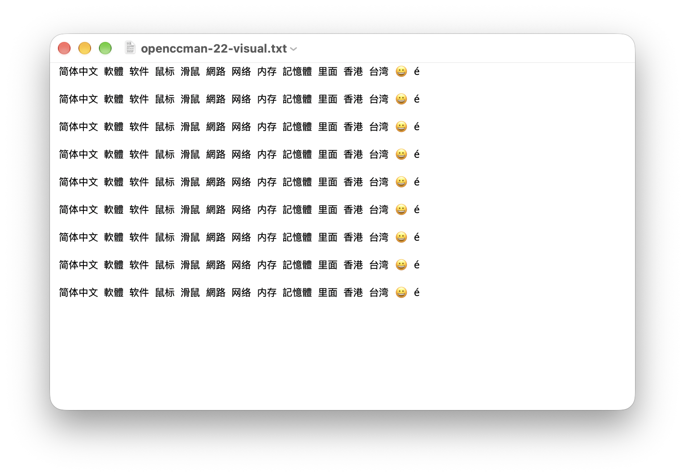
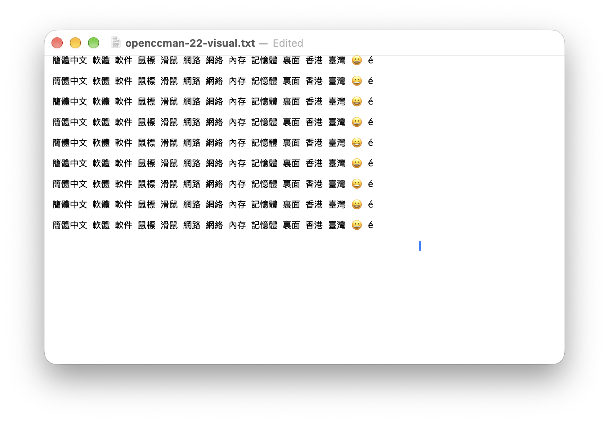

# TextEdit 中的 Services 菜单与大文本补测（2026-09-23—24）

来源为 `develop` 的 `3cc4e76fc48b33c5ed3d323d15e167e9ec3e387a`，macOS 27.0 (26A428)、Xcode 27.0 (27A266a)，Apple Silicon。应用以 Debug 方式完整构建，主程序 SHA-256 为 `33e2c65abf0923d2293ce1f4bb54dbfdce304714afe11b6fbcf318344dbc5d4e`。测试副本使用独立 bundle ID、服务菜单名称和 port，并以原有沙盒 entitlement 作 ad-hoc 签名；这不是正式分发包验收，也没有操作已安装的正式 OpenCCman。

## 菜单可见性：同一构建的 A/B 对照

[Apple 的 Services 属性文档](https://developer.apple.com/library/archive/documentation/Cocoa/Conceptual/SysServices/Articles/properties.html)说明 `NSRequiredContext` 必须存在，即使值为空；否则服务虽能注册，也不会在用户上下文中自动呈现。当前 `Info.plist` 的两个服务原来都缺此键。本次为两者加入空字典，不收窄原有服务使用场景。

从同一编译产物制作两个隔离副本，除不可避免的 bundle ID、菜单名称及 port 隔离外，对照差异只有 `NSRequiredContext`：

| 副本 | `pbs -dump` | TextEdit 已选中文本时的 Services 菜单 |
| --- | --- | --- |
| `ServicesCapacityQA20260923`，两个服务均含空 `NSRequiredContext` | 两项均注册 | `OpenCCman QA Capacity Convert`、`OpenCCman QA Capacity Open` 均出现 |
| `ServicesNoContextQA20260923`，两个服务均无该键 | 两项均注册 | 两项均未出现 |

对照只证明本机 TextEdit 的菜单呈现差异，不把注册成功当成可调用。随后实际点选带键副本的转换服务，TextEdit 选区被正确替换。此前 `develop` 无键测试副本虽已注册但未出现在菜单中的观察可由此解释。菜单由辅助功能树核对；窗口截图不能拍到该虚拟菜单，因此下面的截图只证明转换前后的文本，不冒充菜单截图。

## 固定语料与结果

使用 `scripts/generate-services-fixtures.py --modes s2t` 生成两种段落 × 1 KiB／1／5／10 MiB 的八组输入及期望，生成器 SHA-256 `99a4e254fc1a6e71b6fd947537a9a36e14bd5ac182cf7c40b09234c58d83dd7b`。期望来自 OpenCC CLI 1.4.2（SHA-256 `f91870fcfab117e42fa1ed65c44fc59043ae8340a358ab62f248e427ab5b1a7e`），使用锁定资源 manifest SHA-256 `ae10b2fbf67844395aa5b5600a93b98c755336dfa9b2190f3bf1ba46bb13292d`。运行时完整语料位于 `/tmp/openccman-22-fixtures/`，不提交大文件；本目录的 [结果清单](results.json)可供核对。

在 TextEdit 中选中短段落全文，从应用的 Services 菜单点击 QA 转换服务。输出直接从 TextEdit 选区读取；1 KiB 的展示样本另外保存为 TXT 并与期望逐字节比较。

| 输入 | 输出与同版本 CLI 期望 | 菜单点击调用耗时 | 点击至辅助功能状态返回 |
| ---: | --- | ---: | ---: |
| 1 KiB | 1024 字节，SHA-256 `79063c4f…1204c`，完全一致 | 243 ms | 823 ms |
| 1 MiB | 1048576 字节，SHA-256 `b21bd7e4…674a`，完全一致 | 228 ms | 670 ms |
| 5 MiB | 5242880 字节，SHA-256 `9d30b4eb…25a62b0d`，完全一致 | 2116 ms | 2894 ms |

上述是各一次实际目标 App 操作的 `Date.now()` 墙钟观察，包含电脑操作桥接、菜单交互及辅助功能读取，**不是**纯 `NSPerformService` 时间、用户可编辑恢复时间或稳定分位数。5 MiB 没有发生超时，但单次结果不足以定义可接受容量。[此前 Release 服务调用基准](../2026-09-15/README.md)另测过 10 MiB；该数据不能替代 TextEdit 操作。

1 KiB 同一 TextEdit 文件的真实截图：

| 转换前 | 转换后 |
| --- | --- |
|  |  |

截图均为 macOS 27.0、TextEdit、浅色、同一窗口与默认字号；来源提交为本页首段 SHA。截图分别在点击服务前与服务完成后采集，后者已保存并按字节核对。截图不包含 Services 菜单本身。

## 10 MiB 与剩余验收

直接向电脑操作接口传入 10 MiB 字符串超过该接口的消息上限；一次看似完成的操作实际仍处理 5 MiB 旧稿，该样本已剔除。随后通过 TextEdit 正常打开磁盘上的 10 MiB 原稿，文件本身为 10485760 字节、SHA-256 `8a020df3f5bf1f4e69a4b080da6616d69448a39a30e01a35b3683a8518edb816`。选区后的 Services 菜单曾列出 QA 项，但电脑操作桥接在点击时返回 `elementHasNoFrame`，且读取整段辅助功能文本超过消息上限；未取得可核对的服务输出。因此 **没有 10 MiB 的目标 App 成功、失败或超时结论**。第二种目标 App、重复样本、失败路径与正式签名包仍待 #22 后续验收，不调整容量限制。

测试结束后，TextEdit 中本轮创建的未命名文稿保存到 `/tmp/openccman-22-untitled-qa.rtf` 后退出；两个 QA 提供者退出、从 Launch Services 注销、`pbs -dump` 无 QA 服务，应用副本移至废纸篓，专用偏好删除。未操作正式应用及其偏好，未启用 VoiceOver。
