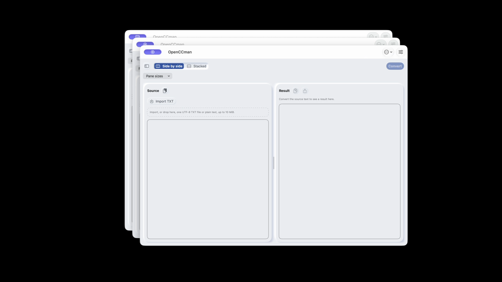
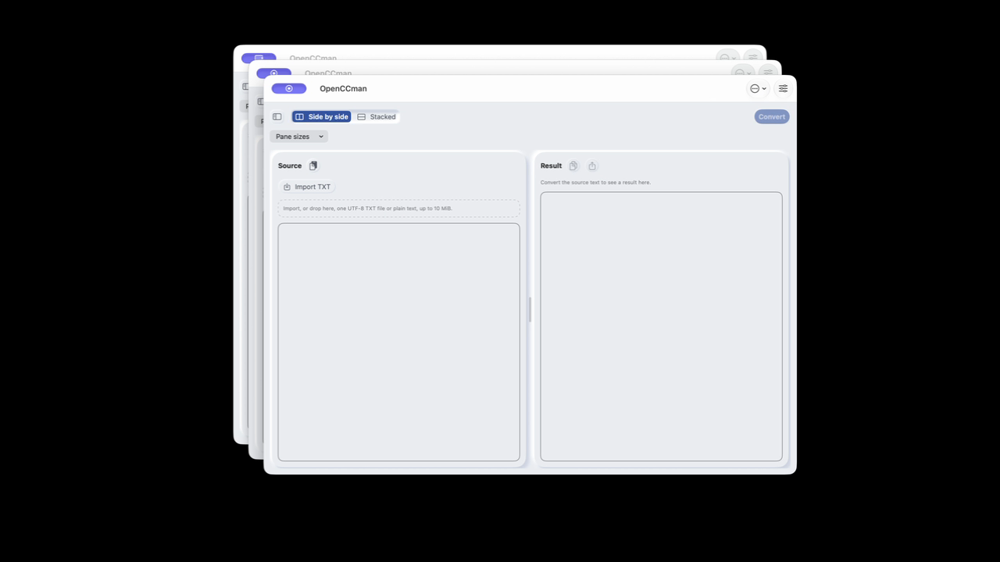

# #93：关闭窗口的业务子树释放与验收门禁

产品修复来源 `8228f4e`（初始候选 `2c894e6`），基线 `f4b71e5bd1e809af9c4d8d6e0f7fb1d9792dea5e`。关闭 macOS 窗口时移除 Router/RootView 的业务子树，并在下一次主队列回调对弱引用宿主执行布局更新。关闭后的隐藏宿主可能不再自动布局，只有改变条件状态仍不能可靠释放 StateObject。保留原生 WindowGroup、窗口身份和当前窗口模型；未关闭窗口不受影响。

本轮也修正验收工具：原校验器即使记录了关窗后模型累积，只要时序完整仍返回成功。现在协议完整与模型释放分别报告，失败保留全部证据。

## 修复的依据与范围

无业务依赖的 SwiftUI 最小复现，在 CUA 分别查询两个窗口后，基线最终保留两个模型。单独条件移除子树仍保留两个；条件移除后增加延后的 `needsLayout` / `layoutSubtreeIfNeeded()`，第二窗关闭后只剩模型 1，最终关窗 +5/+20 秒为 0。两个原始宿主视图依然存活，说明修复释放的是窗口业务子树，**不宣称修复系统宿主本身，也没有确定外部强引用的完整来源**。[成功最小复现源码与日志](effective-minimal-probe.zip)。

Apple 的 [layoutSubtreeIfNeeded](https://developer.apple.com/documentation/appkit/nsview/layoutsubtreeifneeded()) 允许显式更新视图及子视图的布局；这里没有调用私有 SwiftUI API、替换窗口 delegate 或禁用无障碍。监听匹配窗口的 [willCloseNotification](https://developer.apple.com/documentation/appkit/nswindow/willclosenotification)，而非 route/onDisappear 来决定窗口终结。RootView 在同一通知中立即取消转换与导入，旧任务不能等到图更新后才停止回写。

初始候选 `2c894e6` 在完整录屏中仍保留首窗模型 1，未作为最终通过。进一步确认应用侧引用链：被保留的 `MainWindowReader.ReaderView` → `onAttach` 闭包 → 所属 SwiftUI 视图/StateObject → 模型。给 reader 增加 `dismantleNSView`，清空已经失效的回调后，刻意保留 reader 的组件测试从失败变为通过。它不清空正文、不改变活窗口编辑状态。外部为何保留 native reader/宿主仍不在本轮证明范围内。

本机原生组件回归刻意强持有关闭窗口的 NSHostingView **及嵌套 reader**，验证子模型仍释放；同时覆盖隐藏/重新显示、无关窗口通知、重复关闭以及新窗口创建。这是组件测试，不替代下列真实 WindowGroup 文稿和三轮诊断。

## 当前 2.0 应用，同一签名二进制

来源 `f4b71e5bd1e809af9c4d8d6e0f7fb1d9792dea5e`，Release / arm64，Xcode 27.0 (27A266a)，macOS 27.0 (26A428)。沿用已有原生文稿诊断：真实 WindowGroup/Router/RootView/HomeViewModel、当前依赖；仅隔离购买配置、Services 和全局快捷键，记录弱模型身份并自驱动。完整准备清单见 [current-app-build.json](current-app-build.json)。ad-hoc 诊断不是 Cloud/TestFlight 签名验收。

| 条件 | 每个新增文稿/活动任务关窗后 +20s | 最终零窗 +5/+20s | 文件/业务协议 |
| --- | --- | --- | --- |
| LaunchServices 正常启动，无 CUA、AX 查询或录屏 | 只剩首窗模型 1 | 0 / 0 | 通过 |
| 同包，CUA getApp 启动时查询一次，后续无查询/录屏 | 只剩首窗模型 1 | 1 / 1 | 通过，释放门禁失败 |

两轮各包括 1 MiB 两份、10 MiB 两份、关闭实际转换中的窗口、保留窗转换时关闭另一空闲窗。原生 begin/end 覆盖关窗通知，完成文件逐字节等于历史固定 oracle；每轮 5 份实际导出（被取消任务没有输出），包含 BOM 去除、CRLF、空行、Emoji、组合字符和 NUL。成功计次 6、最终预约 0、取消任务无迟到结果回写。所有新增模型 2–7 释放；只有被启动查询的首窗出现持有。单轮成对诊断不证明全部生产场景无泄漏，也不证明 CUA 的具体哪个内部操作持有模型。

原始 JSONL、协议结果、释放门禁结果、实际输入/输出及运行说明在 [current-app-results.zip](current-app-results.zip)。两个运行只改变启动/观察方式；期间还有独立合成实验，绝对 CPU、延时和内存数值不是隔离性能基线，不据此宣称提速或内存降幅。

## 初始候选完整文稿回归（2c894e6）

同机、同配置构建初始候选（[来源与哈希](candidate-app-build.json)）；两轮均启用 `--require-model-release`：

| 修复版观察方式 | 所有新增窗口 +5/+20s | 最终零窗 +5/+20s | 完整文稿协议／释放门禁 |
| --- | --- | --- | --- |
| CUA getApp 启动查询一次 | 只剩模型 1 | 0 / 0 | 全部通过 |
| LaunchServices 启动，无查询/录屏 | 只剩模型 1 | 0 / 0 | 全部通过 |

两轮分别完成四份 1/10 MiB 文稿、活动调用中关闭、保留窗口活动转换；每轮五份实际导出逐字节相等、成功计次 6、最终预约 0。[候选原始日志、验证结果及合成文件](candidate-app-results.zip)。这是业务接口级、ad-hoc 诊断验收，不代替系统保存面板或实际购买。

## 最终候选文稿回归（8228f4e）

reader 回调清理后，再编译 Release 并执行完整文稿协议。启动时 CUA 查询一次、之后无查询/录屏：四份 1/10 MiB 文稿、活动转换中关窗、保留窗口活动转换均通过；新增窗口 +5/+20s 只剩模型 1，最终零窗 +5/+20s 为 0，所有导出字节及额度检查通过，释放门禁通过。

[最终构建来源与可执行文件哈希](final-app-build.json)核对实际构建副本的所有产品 Swift 文件与从 `8228f4e` 重新准备的副本完全一致；[最终原始结果及合成文件](final-app-results.zip)。[本地构建和回归日志](local-validation.zip)同时保留诊断扩展放错文件引起的一次编译失败及修正后的构建，不计作产品构建失败。

## 最终三轮录屏对照（8228f4e）

同机 Release / macOS 27.0 / Xcode 27.0，原生 File/New Window 每轮新增两窗再关闭，保留首窗；三轮后关闭全部窗口。ScreenCaptureKit 仅录制目标 PID 对应应用，无音频、无其他应用内容；两轮均无成功 CUA/AX 查询且没有同时运行另一诊断应用。最终候选增加仅诊断用的边界时序事件，未改变协议。

| 版本 | 三轮关窗后 +5/+20s 模型数 | 最终零窗 +5/+20s | 释放门禁 |
| --- | --- | --- | --- |
| 基线 f4b71e5，独立复测 | 3 / 5 / 7 | 7 / 7 | 失败，返回 4 |
| 最终候选 8228f4e | 1 / 1 / 1 | 0 / 0 | 通过 |

保留窗口的正文、结果、配置、任务和额度指纹一致。完整原始日志、准备信息、实际诊断源文件、录制辅助程序，以及中途失败记录均在 [cycle-results.zip](cycle-results.zip)。早期基线还与另一诊断包同时运行；上表只采用后来独立重跑的基线，不使用并发轮宣称绝对性能收益。

以下失败没有删除：初始候选录屏后最终保留模型 1；一次录制因应用尚未出现在 ScreenCaptureKit 清单而失败，该轮没有视频，不能作为录屏验收；强持有原生 reader 的组件测试在清理前失败、清理后通过。探索过 `displayIfNeeded` 的编译，但没有以其运行结果作结论，也没有把额外绘制调用放入产品。

### 真实界面与交互

English / Light / 默认字号，内容区 1024×768pt，原生窗口级联位置略有差异；录制画布 1280×720px。静态图取各自录像第 14 秒，展示同一三窗口阶段，不是设计稿。布局未作视觉改动，模型释放以日志和门禁判定，不能由截图推断。

| 修改前 f4b71e5 | 修改后 8228f4e |
| --- | --- |
|  |  |
| [完整交互录像](media/before.mp4) | [完整交互录像](media/after.mp4) |

截图和视频使用 `gh api POST repos/gewill/OpenCCman/git/blobs` 上传，返回对象 SHA 与本地 `git hash-object` 一致，再随证据提交引用；见 [上传记录](media/uploads.json)。

## 进一步区分观察方式

使用无业务依赖的同一最小 SwiftUI 二进制，固定两窗→一窗→零窗，自行退出。除注明者外，末次关窗后 +5/+20 秒结果一致。

| 独立条件 | 关第二窗后模型 | 最终模型 |
| --- | --- | --- |
| 正常启动，无查询 | 1 | 0 |
| 短生命周期原生 AX 客户端读两窗 | 1 | 0 |
| 原生 AX 客户端持续保存 25 个元素，跨过关窗再释放 | 1 | 0；释放客户端元素前已为 0 |
| 原生 AXObserver 成功注册 256 项通知，跨过关窗再移除 | 1 | 0；移除前已为 0 |
| 遍历两窗及菜单、读取全部可枚举 AX 属性 | 1 | 0 |
| 使用 screencapture 各截取两个阶段的单窗画面 | 1 | 0 |
| CUA 分别查询两窗 | 2 | 2 |

原生客户端均只访问本次合成进程；没有读取用户应用。来源、查询状态和日志见 [native-client-controls.zip](native-client-controls.zip)。一个附加实验尝试设置 AXEnhancedUserInterface，API 返回 -25208；**没有成功改变该属性，不作为已启用条件的因果证据**。AXObserver 首次尝试因客户端编译错误失败，诊断 PID 39010 已终止，重试 PID 39245 完成；失败记录保留。

以上结果排除了这些具体查询组合在本轮中的复现，不等于全部 AX API、真实 VoiceOver 或所有录屏方式都没有影响。不能把 CUA 条件关联直接改写为通用 AX 缺陷或工具内部所有权已证明。

## 未采用的候选与反证

以下未采用的候选仅在临时合成程序尝试：

- 只在关闭时条件移除 SwiftUI 子树、没有显式布局更新：模型仍存活。
- 关闭时异步/同步清除 contentView、prepareForReuse、禁止关闭动画：没有可靠解决；部分轮次查询错过第二窗，分别标注，不能作为严格同条件对照。
- 隔离 fixture 中拦截系统通知注册，识别 `_commonAwake` 注册的 `NSAntialiasThresholdChangedNotification`；最终零窗后显式移除 97 个匹配 token，5 秒后仍有两个模型。它是有侵入性的反证实验，含重复 +20s 日志，**不通过原协议验收**。这不支持将先前发现的通知闭包直接当成唯一存活原因。

[探索清单](exploratory-summary.json)及[完整失败/探索来源](exploratory-evidence.zip)保留日志和来源 SHA。私有系统通知移除、runtime 方法交换均未进入应用或常规测试；不要将其作为修复。Apple 的 [close](https://developer.apple.com/documentation/appkit/nswindow/close()) 与 [prepareForReuse](https://developer.apple.com/documentation/appkit/nsview/prepareforreuse()) 是不同生命周期语义，公开 API 存在并不证明可用于此处绕过系统所有权。

## 回归门禁

```sh
python3 scripts/check-native-window-lifecycle.py \
  --raw /path/to/raw.jsonl --documents --active-anchor \
  --require-model-release --output /path/to/new-report
```

先验证完整时序、模型身份、文稿、额度和活动区间，再检查每个 +20s：仍有窗口时只能保留模型 1；最终零窗必须无模型。以身份判断，不能用另一个模型替换首窗后仍靠相同计数通过。

- `valid_protocol` 与 `model_release_passed` 分开记录。
- 释放失败返回 4，保留原始日志和成功的协议证据；不是“已证明生产泄漏”的声明。
- 未指定该选项时维持观察性诊断，历史查询/录屏轮次不会被改写或丢弃。
- CI 无 CUA/录屏的自运行诊断启用门禁；栈采样模式保留观察性结果。没有新增自动构建矩阵或发布任务。

70 项相关 Python 检查通过，覆盖真正的失败退出与原始证据保留。对本轮真实应用两份日志分别得到：无查询通过；启动查询轮在最终 +20s 因模型 1 存活失败。actionlint 1.7.12（官方发行 SHA256 核对）与 diff 空白检查通过。

## 边界与后续

未清空正文掩盖对象持有，未禁用无障碍，未改变原生窗口架构、依赖、最低系统或发布配置。最低系统、真实 VoiceOver/输入法、签名包以及 #19 系统入口仍由原 Issue 跟踪。本轮没有新 Cloud 构建。[清理记录](cleanup.json)确认隔离偏好恢复，VoiceOver 未更改；用户主工作区已有的工程文件改动保留。

应用侧窗口业务子树释放已实现；若继续追查宿主本身，仍需定位观察客户端或系统对象的强引用来源。该研究与本次关闭窗口释放业务资源分开记录，不声称已确定通用 AX 根因。签名包、最低系统、真正 Dock/Services 入口与发布验收仍保留原 Issue。
