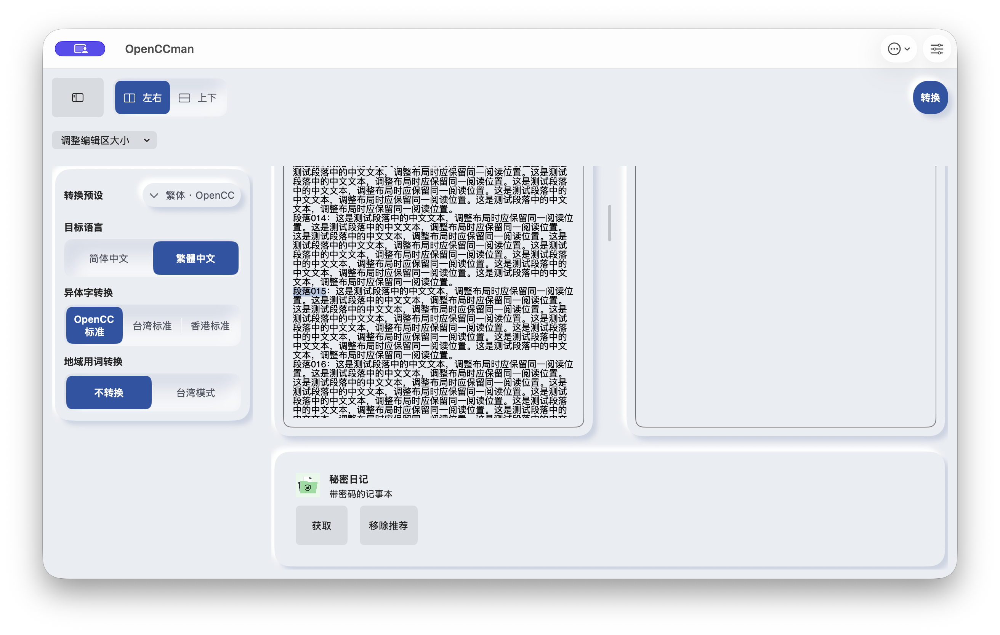
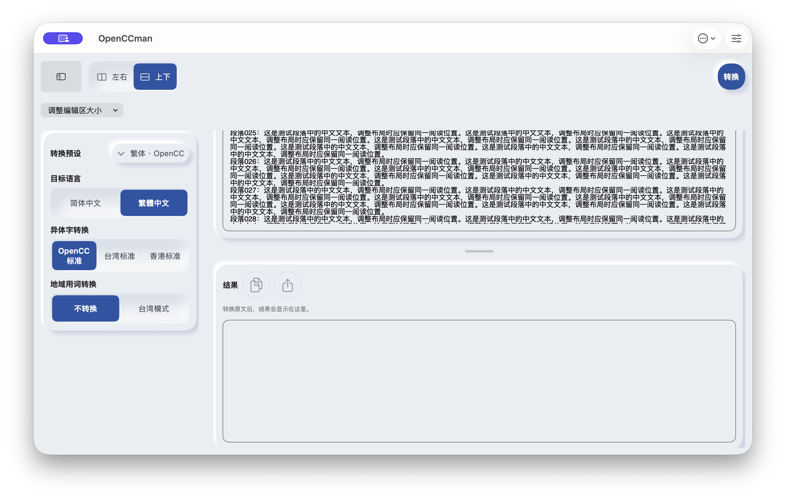
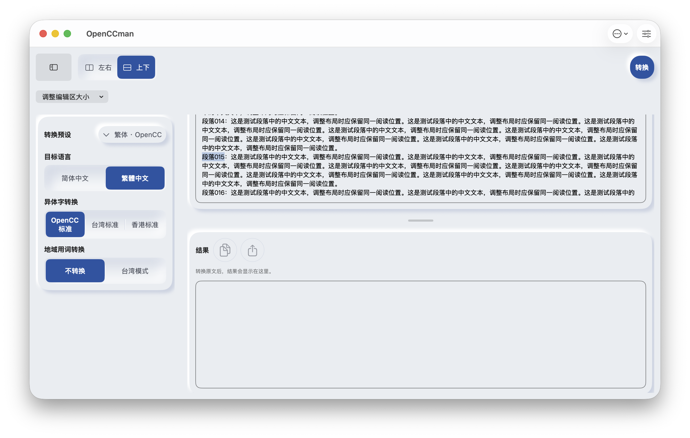

# #20 Mac 长文本滚动锚点

Mac恢复可操作后，在3054cde上实际复现：30个带编号的长中文段落，左右布局选中段落015，切换上下后选区仍为015，但可见正文跳到025。80个较短段落不触发这种明显跳段，因此之前短行测试不足以证明重排正确。

## 修复与验证

- 保留SwiftUI TextEditor及其代理、选区、输入法和同一个业务模型；通过现有Introspect安装窗口/编辑器独立的观察器。
- 缓存可见首行的字符位置和行内偏移，尺寸变化后在主队列等待原生布局完成再恢复。合并连续尺寸变化；文本替换、重新挂接使旧恢复失效。
- 不复制整份正文、不为测量强制布局整个10MiB文档；只查询当前锚点附近的原生文本布局。
- b6870b8实际运行：同样的段落015选区在上下切换后保留，视口仍在014–016附近；不再跳到025。附真实截图。
- 原生AppKit回归覆盖双向重排、选区、连续缩放、新稿重置及marked range保持；使用warnings-as-errors编译通过，并纳入App Regression。marked range测试通过不等同于实际中文输入法候选窗已验收。
- macOS完整构建、iOS Simulator构建、工程与布局检查通过。iOS保留原系统编辑器行为，未把Mac修复冒充iPad长文验收通过。
- 用户确认没有iOS14/macOS11环境，保留为发布前验收；VoiceOver真实朗读、iPad长文/输入法仍在#20/#16。

实现依据：[AppKit bounds通知](https://developer.apple.com/documentation/appkit/nsview/boundsdidchangenotification)、[NSLayoutManager字符/字形定位](https://developer.apple.com/documentation/appkit/nslayoutmanager)。

## 前后截图

macOS26.6.2 / arm64 Debug，1200×722pt，简中/浅色/系统默认字号/非Pro；相同30段合成原文、空结果。Before=3054cde；After=b6870b8。窗口在桌面上的位置不同，应用窗口尺寸相同。

| 切换前：选中015 | 修复前：切换后跳025 | 修复后：仍在015附近 |
|---|---|---|
|  |  |  |
