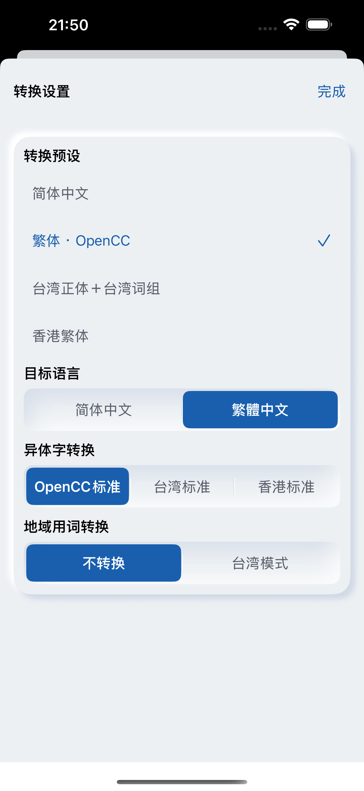

# #20 触摸命中区与编辑器回归

iPhone15ProMax / iOS18.6模拟器，430×932pt，简中/浅色/默认字号/非Pro，默认原文/空结果。Before 5bd8783，After 72bf310，同一专用模拟器重装应用，时间和背景推荐可能不同。

真实 AX 树发现设置“完成”只有34×20.3pt，扩大外部frame不等于扩大按钮label。修复后44×44pt。导入/转换/取消明确设置label最小高度；推荐“获取”原宽34pt，补足44pt。

After运行命中区：

- 粘贴文本: 50.7×50.7pt
- 导入 TXT: 119.7×50.7pt
- 复制结果: 45.0×45.0pt
- 导出 TXT: 45.0×45.0pt
- 获取: 44.0×44.0pt
- 移除推荐: 67.7×44.0pt
- 转换: 60.7×50.7pt

macOS与iOS Simulator完整构建通过；工程/布局/What’s New检查通过。核心与额度/剪贴板完整回归在5bd8783完成，后续只调整命中区，无业务变更。

16c805a编辑器运行复验：转换成功后复制/导出从禁用变启用；点击结果区注入READONLY_TEST，结果与原文均未改变。此检查不能代替长文本选择复制、中文marked text或VoiceOver。Mac仍锁定，宿主键盘/选区/播报验收保留#20；AXe提供的元素树不等于真实朗读。

| Before | After |
|---|---|
|  |  |
