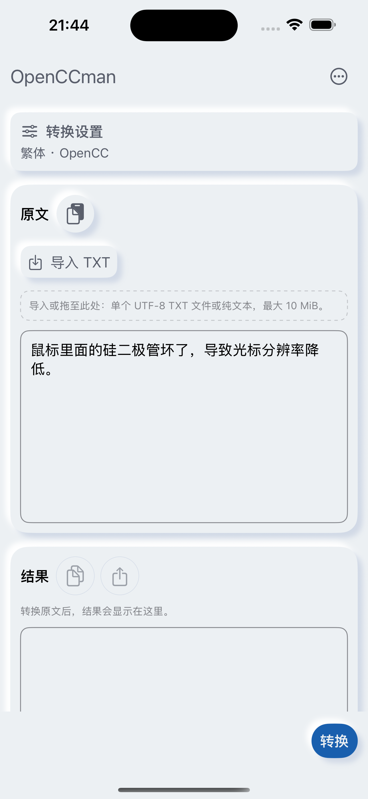

# #34 设置面板呈现互斥回归

2026-09-13，iPhone 15 Pro Max / iOS18.6 模拟器，430×932pt，简中/浅色/默认字号/非Pro/默认原文。Before 为 #50 的设置面板截图（bdf846d 的面板源码）；After = 5bd8783，同一专用设备，重装测试包后运行。设置面板外观不变；后台推荐轮播和时间可能不同。

- 新增窗口内 conversionSettingsIsActive，在开始展示时置位，系统 onDismiss 后释放。关闭 binding 为 false 时继续阻挡 What’s New，避免关闭动画期间竞争呈现。
- 状态回归覆盖自动/手动请求被阻挡、关闭动画仍阻挡、完成后可预约、第二窗口不被污染；通过。
- macOS 与 iOS Simulator 完整构建通过；核心转换/文件/额度、布局、文案与 What’s New 检查通过。
- 真实 iOS 设置打开、点击完成、原文保持通过。该记录不将状态测试视为真实未读卡片与长任务/文件面板竞态的 UI 验收。
- Mac 锁定使宿主 UI 工具受阻。真实 VoiceOver、横屏全屏 sheet、输入法、最低系统和最终签名版本仍保留 #34/#20/#16，不能关闭总验收。

实现依据：[Apple sheet 文档](https://developer.apple.com/documentation/swiftui/view/sheet%28ispresented%3Aondismiss%3Acontent%3A%29)。

| Before | After | 关闭后 |
|---|---|---|
|  |  |  |
