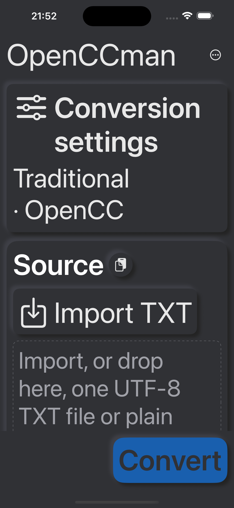
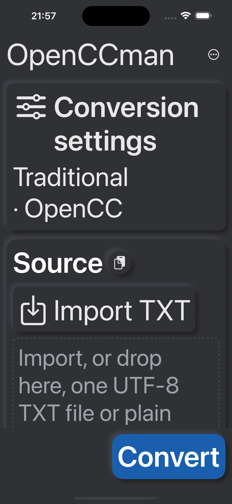
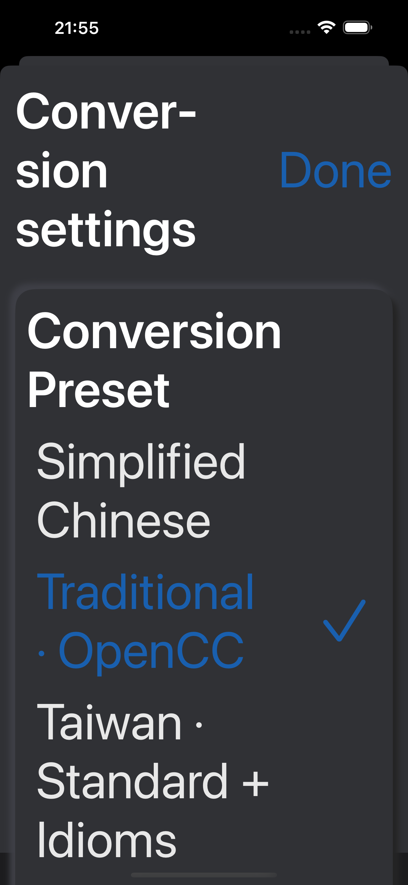
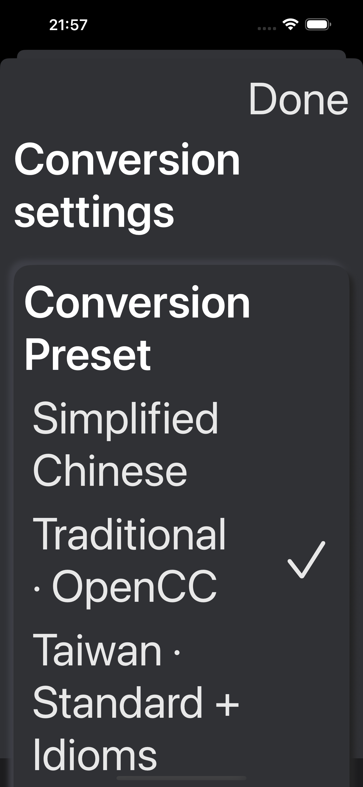

# #37 深色与辅助字号视觉补验

2026-09-13，同一专用iPhone15ProMax / iOS18.6模拟器，430×932pt，英文、深色、最大辅助字号、非Pro、默认原文空结果。

- 转换按钮 Before=72bf310；设置页头 Before=dcbb64b；两处 After=3054cde。均为真实运行截图，时间不同。High Contrast另图为系统increase_contrast=enabled。
- 发现蓝底转换按钮在深色使用了深色文字，改为白字。发现最大字号设置标题与完成按钮并排时被挤成Conver-sion，改为独立按钮行和完整标题；深色预设与完成文字使用可读的前景色，仍有选中勾号及AX选中语义。
- 3054cde：macOS/iOS Simulator完整构建通过，工程、布局、What’s New和三语言控件检查通过。先前业务核心/额度/剪贴板完整回归通过；本次无业务变化。依赖锁相对设计基线无漂移，部署下限未改。
- 最大字号打开和关闭设置仍可操作；高对比度模式实际显示已截图。尚未验证所有控件的定量对比度，不声称全应用符合某个等级。
- iPad 72bf310繁中深色宽屏运行显示两轴与侧栏。后续HID长文本检查遇到空AX树，未取得有效验证结果。中文输入法、长文本锚点、VoiceOver、最低系统、真实键盘与签名包仍保留#20/#37/#16。
- Mac宿主锁定使最终源码运行截图和纯键盘复验受阻。已有Mac/iPad截图保留自己的SHA，不能冒充3054cde全部平台通过。

| 转换 Before | 转换 After |
|---|---|
|  |  |

| 设置 Before | 设置 After | 高对比度 |
|---|---|---|
|  |  |  |
