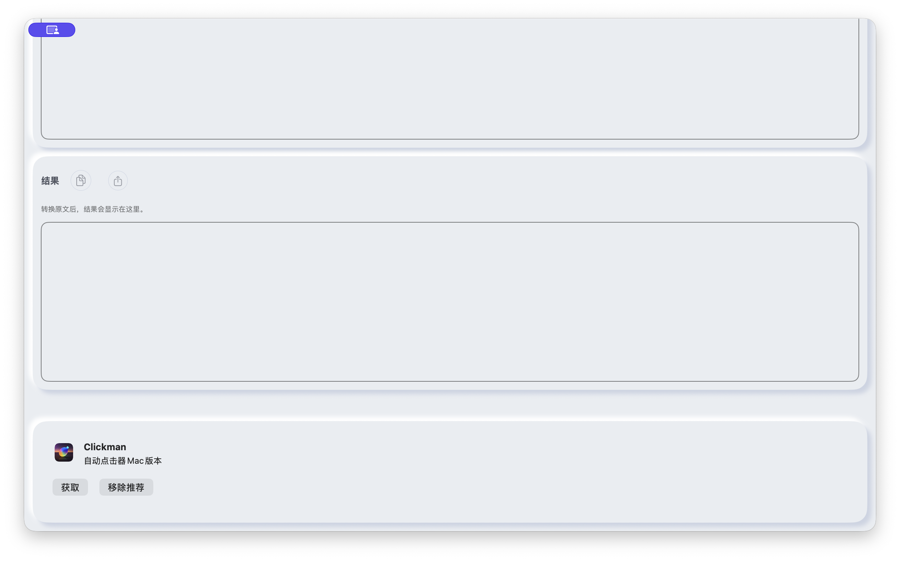

# #40 推荐区与页头

macOS 26.6.2（Xcode/SDK 26.5；更正原先混用的系统版本），1200×722pt，简中/浅色/系统默认字号/非Pro/默认原文/空结果。Before 为 c7cfe6b；After 为本目录首次提交源码的 Debug 完整构建。

- xcodebuild macOS Debug：BUILD SUCCEEDED。
- AX 与截图：推荐区在结果后，可随正文滚动，不覆盖文本；移除固定300pt和负offset。页头标题与更多菜单正常占位。
- Pro 路由保留 `/pro`，未变更购买或权益逻辑。运行点击后的购买页验收仍需最终签名产物，未计为通过。
- 最大字体、窄窗和键盘由 #49/#50 最终三端回归补充。

| Before | After |
|---|---|
|  |  |

滚动到底部：

