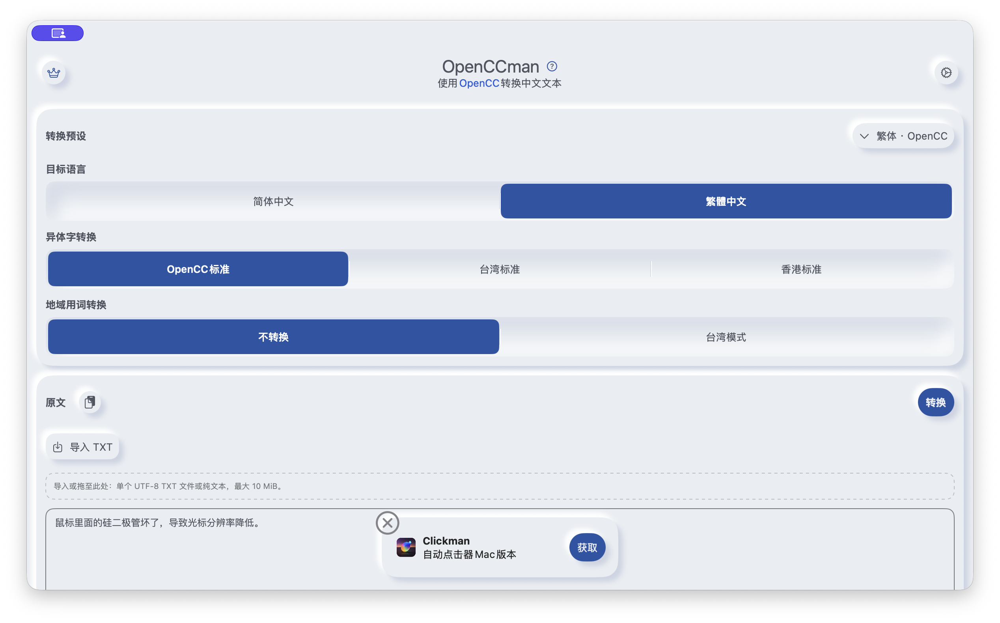
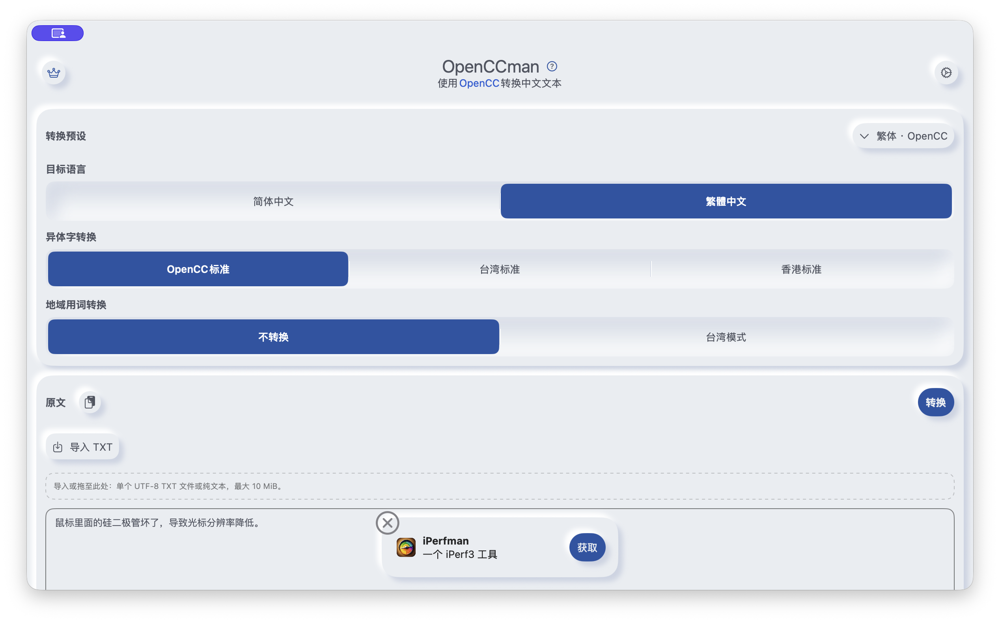

# #47 共享组件回归

2026-09-13，macOS 26.6.2（Xcode/SDK 26.5；更正原先混用的系统版本），arm64 Debug，窗口 1200×722pt，浅色、简体中文、系统默认字号、非 Pro；默认原文，OpenCC 繁体预设、空结果。推荐轮播内容随计时器变化。

- Before：`1b086b7181e234f41f40a880eaa66a0c2eb466a2`，设计 PR 源提交，应用与 develop 基线相同。
- After：本目录首次提交中的应用源码；截图前已完整构建（不是生成稿）。
- Mac xcodebuild：BUILD SUCCEEDED。
- check-core：7 组选项、Unicode/换行、模型释放、取消/替换、配额、文件与 Provider 全部通过；新增设置改变后保留旧结果及零扣次检查通过。
- AX 检查：原文可编辑、结果只读；空结果复制/导出禁用；替换 0% 为可操作的空结果说明。
- 跨容器切换尚未接入，编辑器身份/输入法与滚动保持在 #48/#49 接入时验证。未宣称最低系统实机或 VoiceOver 听觉验收通过。

| Before | After |
|---|---|
|  |  |
