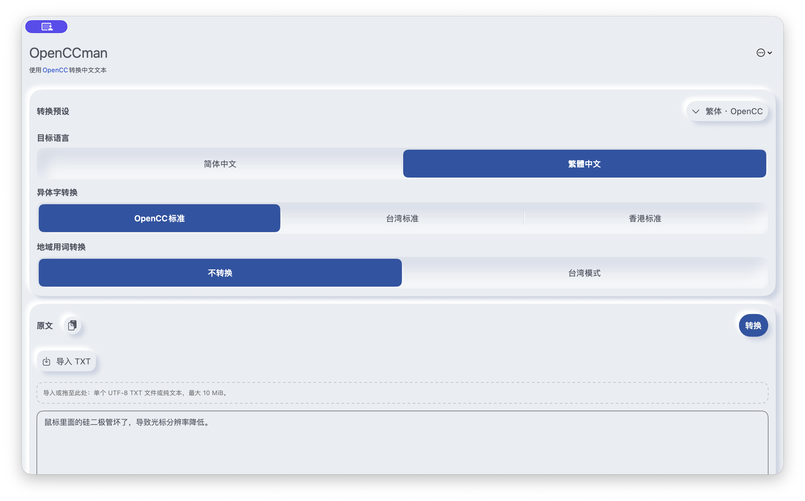
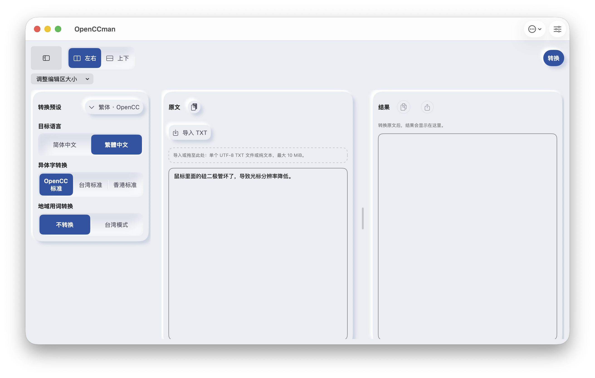
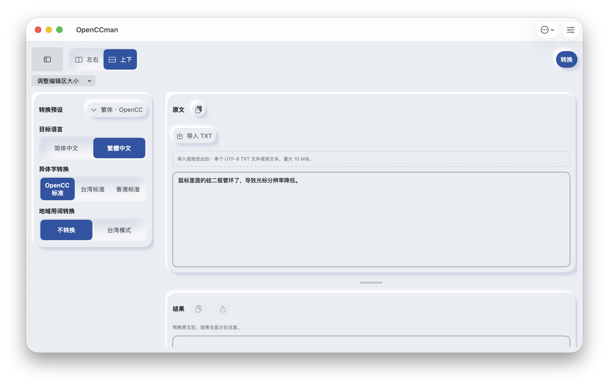

# #48 Mac 工作区运行验收

2026-09-13；macOS 26.6.2（Xcode/SDK 26.5；更正原先混用的系统版本）、arm64 Debug、1200×722pt、简中、浅色、系统默认字号、非Pro、默认原文、空结果。Before=f8a1001；After=本目录首次提交对应源码。新增系统标题栏属于本次变更。

## 已执行

- Mac 完整 xcodebuild：BUILD SUCCEEDED；check-workspace / check-whats-new / check-control-labels / check-project 通过。
- 在最终构建选中“鼠标”，通过 ⌘⌥1/2 连续切换50次；AX仍报告相同选区和原文。另单次切换并读图确认布局实际改变。
- 在新布局实际转换默认原文，成功得到繁体结果，复制/导出变为可用。
- 1200pt缩至650pt，出现临时上下说明，左右偏好保留；放大1200pt恢复左右和侧栏。
- 分隔条AX Increment从50%变55%；菜单提供均分和两种扩大操作，无需拖动。
- 两窗口经系统窗口菜单明确切换：窗口1=上下/50%/成功结果/原文选区，窗口2=左右/55%/空结果，未共享稿件或布局。
- 源码使用同一ZStack中的稳定TextEditor；按pane分组AX阅读顺序，原文→分隔条→结果。
- #40补验：实际点击移除推荐后，AX可见会员页及恢复购买/开通入口；未执行购买。

## 保留的验收

- SceneStorage只保存UI偏好，不保存正文。跨进程恢复由系统是否恢复原scene决定；新建窗口使用默认值，不宣传草稿恢复。
- 真正中文输入法marked text、长稿滚动锚点、任务中长时间拖动、VoiceOver听觉与macOS11实机，继续在#20/#37/#16跟踪，未以AX选区验证冒充全部通过。
- 未修改依赖锁、部署下限、购买、文件容量及额度规则；未推送build分支。

| Before | 左右 | 上下 |
|---|---|---|
|  |  |  |
