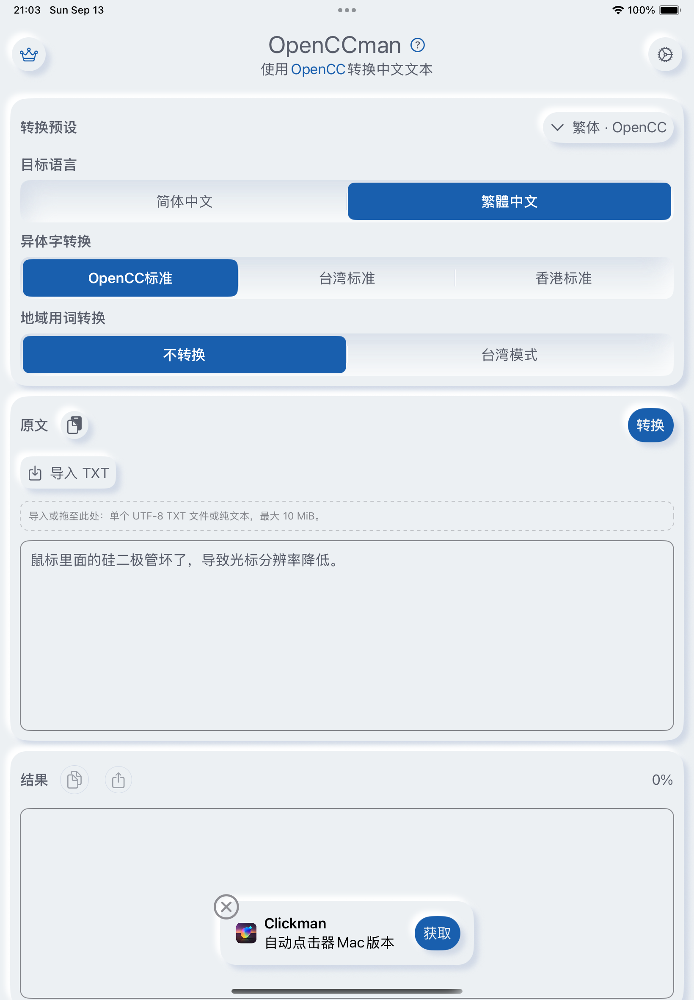
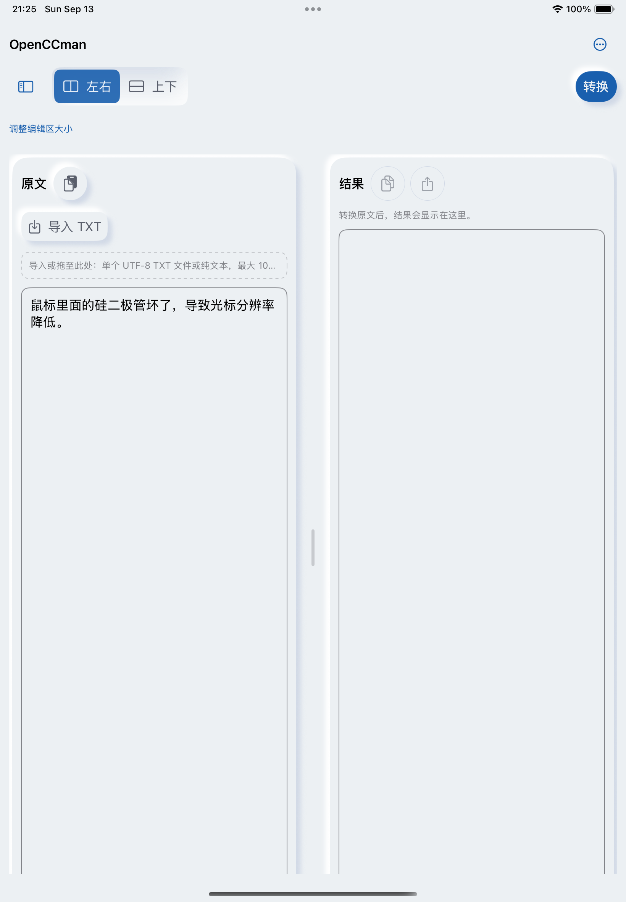
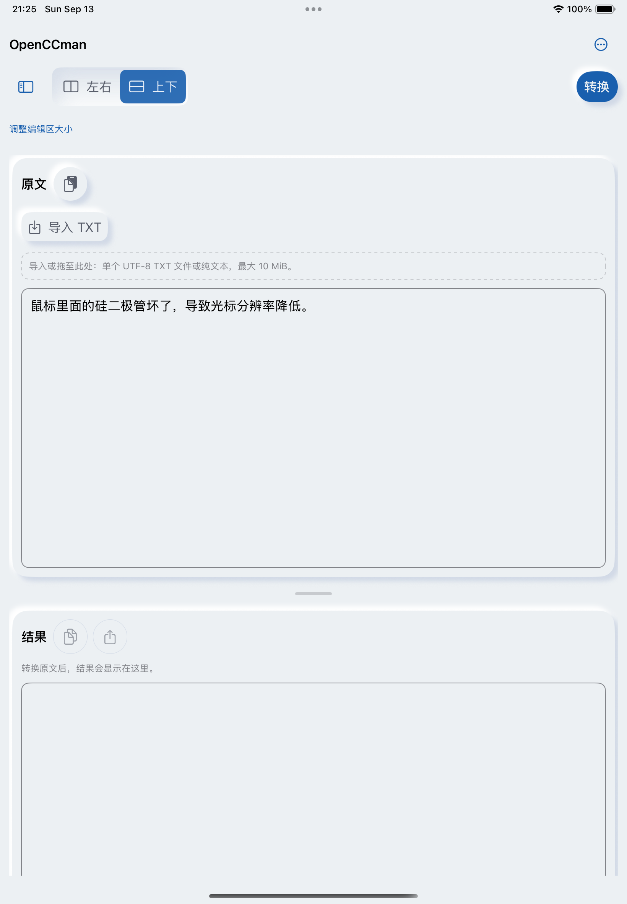
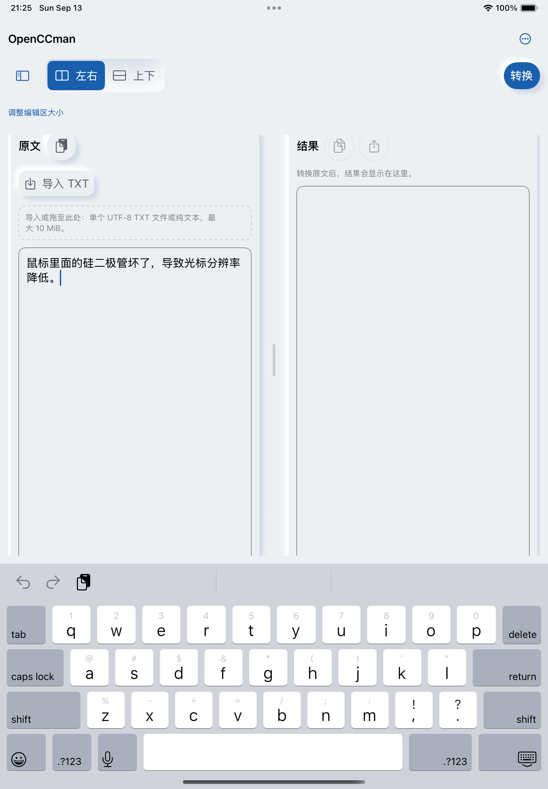

# #49 iPad 运行验收

iPad Air 11-inch M2 / iPadOS18.6模拟器，820×1180pt，简中/浅色/默认字号/非Pro，默认原文/空结果。Before=1b086b7；After=本目录首次提交源码。Before使用原验收设备，After使用同型号/系统的新专用验收设备，时间和推荐轮播内容可能不同。

- iOS Simulator完整构建通过；布局解析测试覆盖空间阈值/侧栏/辅助字号。
- 真实触摸左右/上下切换成功；软件键盘出现后原文、光标、布局操作和转换仍可到达；键盘中切换仍保留原文。
- 旋转横屏出现设置侧栏；主动上下选择不因旋转被覆盖，仍可再选择左右。
- 粘贴/复制/导出按钮与布局按钮触摸区域补足44pt，推荐操作的命中区域位于按钮label内。
- 模拟器安装替换后曾出现空AX树；基线同样复现。调试器确认主线程空闲、UIWindow存在；重启后发现LaunchServices登记路径不存在。专用测试设备卸载测试包并以完整ad-hoc签名重装后恢复。不是已证实的布局源码缺陷。
- AX框架将自定义adjustable百分比规范化为nan，但同时提供50%描述；实际VoiceOver播报和硬件键盘快捷键需#20补验，未声称通过。
- Stage Manager自由窗口、中文marked text、iPadOS14实机保留在#37/#20/#16最终验收。

| Before | 左右 | 上下 |
|---|---|---|
|  |  |  |

软件键盘：
