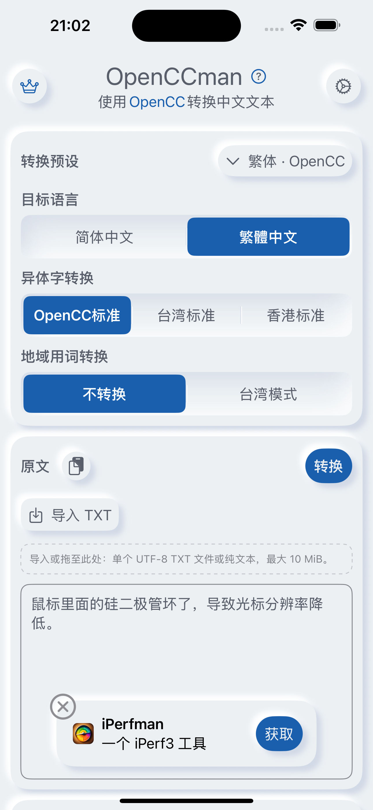
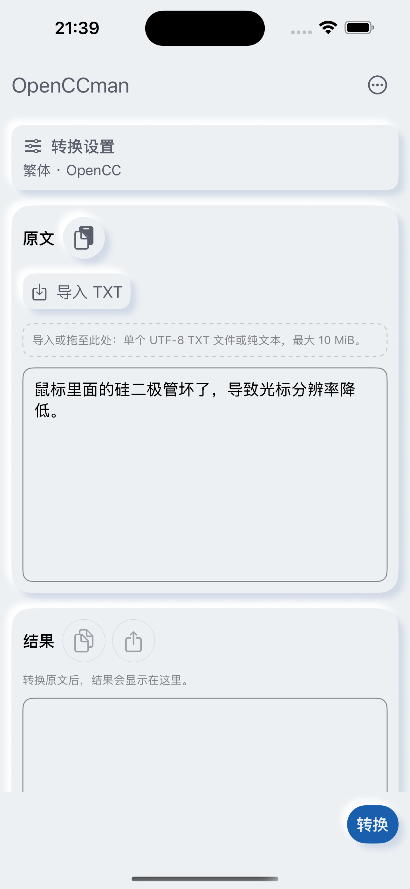
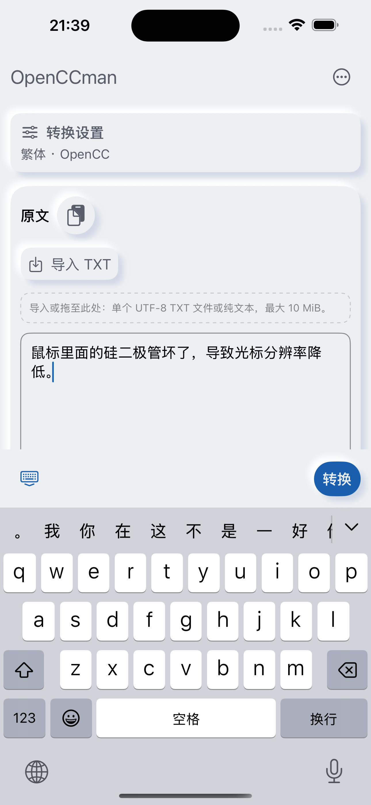
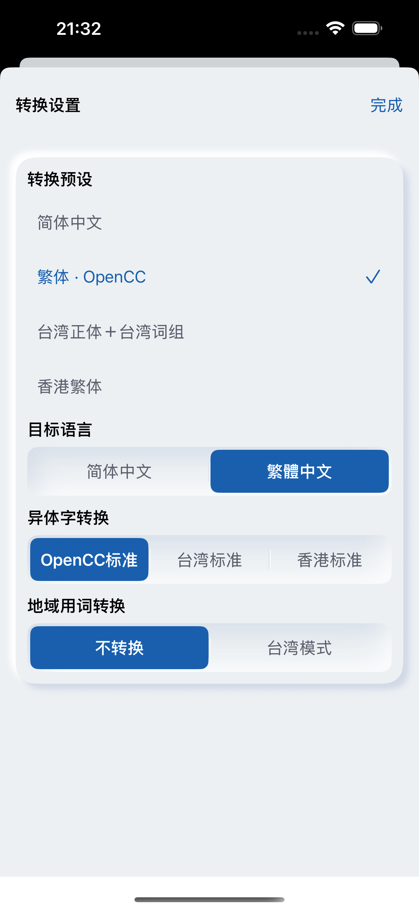
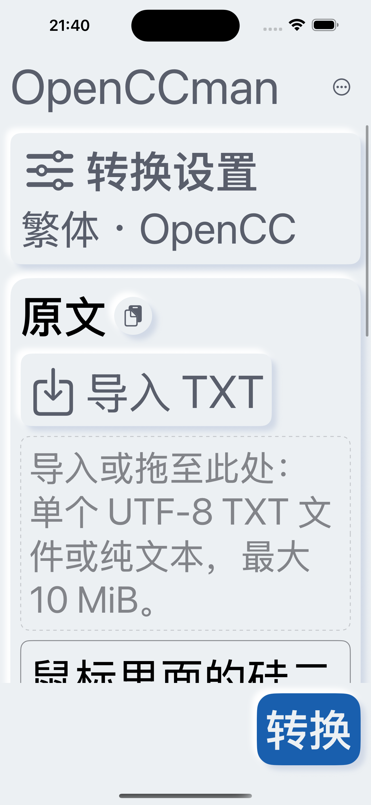
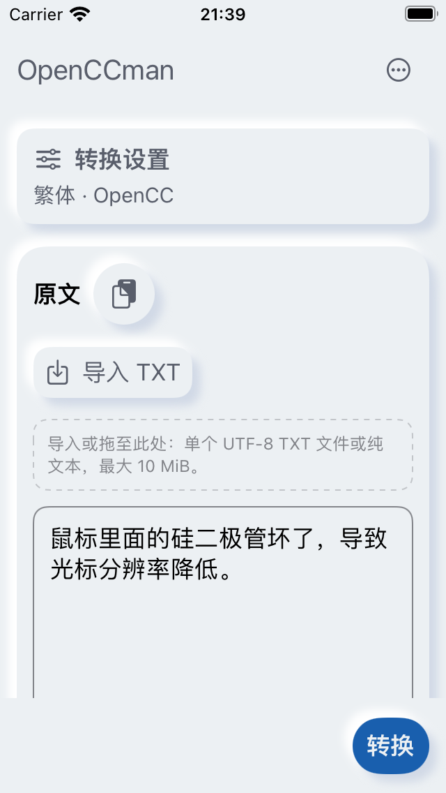

# #50 iPhone 运行验收

2026-09-13，iPhone 15 Pro Max / iOS 18.6 模拟器，430×932pt，简中、浅色、默认字号、非 Pro、默认原文与空结果。Before = 1b086b7；After = ae9914d（截图文档提交没有源码变更）。Before 与 After 使用同型号系统的不同设备实例；时间、推荐轮播可能不同。

- iOS Simulator 完整构建通过；工程、布局边界、What’s New 和三语言控件文案检查通过。
- 软件键盘出现后，标题保持在安全区域内；可收起键盘，转换按钮唯一，推荐区隐藏，原文内容保持。
- 设置面板展示四个预设与原有高级选项，关闭后回到原工作区。
- 最大辅助字号修复了操作图标溢出；正文可滚动，转换入口仍可到达。字号切换保留滚动位置，截图已向上滚回。
- 320×568pt / iPod touch 7 / iOS 15.5 模拟器真实运行截图使用 8877271 加页头修复的源码；与 ae9914d 差异仅图标字体限制。默认字号下控件不横向出界；这不能替代 iOS 14 验收。
- IQKeyboardManager 自动移动和工具栏关闭，由系统安全区域与窗口内键盘交集控制；不改变转换、额度及文件规则。
- 真实输入法 marked text、硬件键盘、VoiceOver 朗读、最低系统与签名分发包仍由 #20/#37/#16 跟踪。本记录不宣称这些项目通过。

| Before | After |
|---|---|
|  |  |

| 软件键盘 | 设置 | 最大辅助字号 | 320pt |
|---|---|---|---|
|  |  |  |  |
