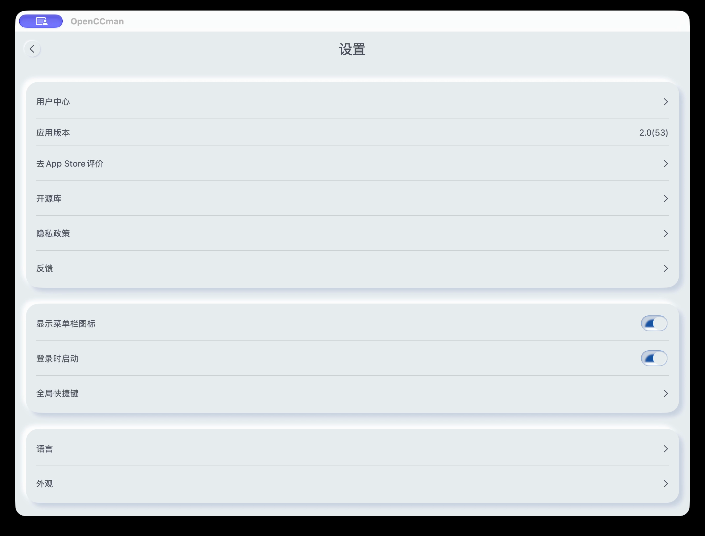
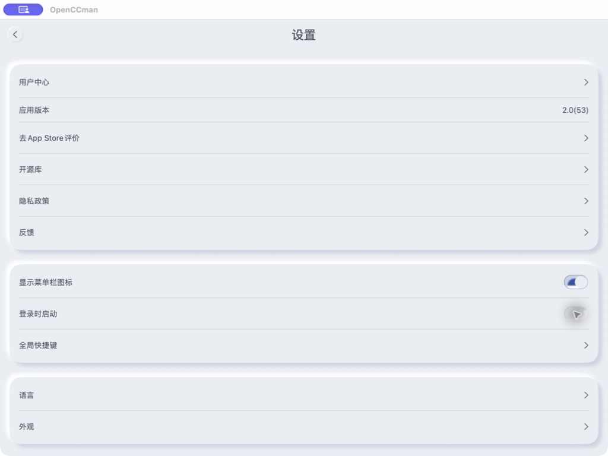
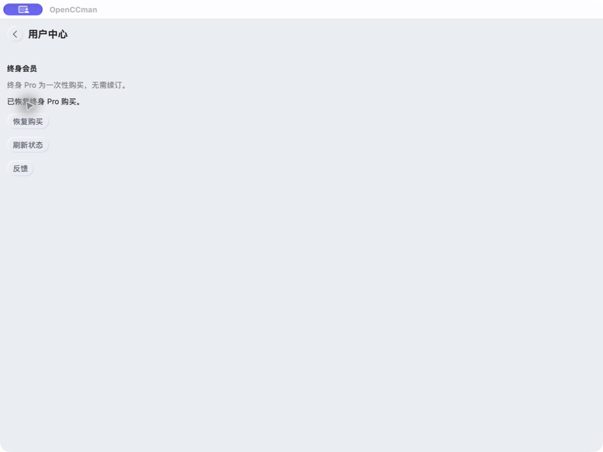

# OpenCCman 2.0 Build 53 验证（2026-09-16）

## 来源与云端结果

- #118 冲突已解决，App Regression [35101211515](https://github.com/gewill/OpenCCman/actions/runs/35101211515) 通过后合并。
- 来源：`82b84780283927bff8d1782231524a3dc3282229`；分支 `release/v2.0-20260916-02`、`build-v2.0-20260916-02`。
- Xcode Cloud run `953ebf29-f2b7-40ff-9e6c-62142781b2c6`，Build 53，最终 COMPLETE / SUCCEEDED；两个 Archive 和内部 TestFlight 流程完成。
- Archive 日志确认 Xcode 27.0 (27A266a)、RevenueCat 5.78.0。
- macOS build `49490843-5c63-4eb4-8695-e11642daa812`：VALID，最低 12.0。
- iOS build `aa410bd0-9559-452f-baf3-f30a13a04b19`：VALID，最低 15.0。
- 两端三语 What to Test 写入并逐字读回，见 test-notes.json。既有 Internal Group 有访问权限，未新增测试人员或外部发布。

## 实际 Mac 签名包验收

本机 macOS 27.0 (26A428)，1024×768 窗口，简体中文、浅色、默认字号。TestFlight 第一次安装未完成，重试成功；最终 `/Applications/OpenCCman.app` 的版本为 2.0(53)，最低系统 12.0。`codesign --verify --deep --strict` 成功，签名链为 TestFlight Beta Distribution → Apple Worldwide Developer Relations Certification Authority → Apple Root CA。

| 检查 | 实际结果 |
| --- | --- |
| 登录时启动初始状态 | off |
| App 内开启／关闭 | 无障碍树读取 on → off；上游 getter 从 SMAppService.mainApp.status 读取，非独立偏好占位 |
| 恢复测试现场 | 回到设置再次读取 off；原菜单栏 on 未改；VoiceOver 未改 |
| 用户中心 | 显示既有终身 Pro，刷新后保留 |
| 恢复购买 | 真实 TestFlight 包触发后显示“已恢复终身 Pro 购买。”，不等同从无权益账户首次购买或跨账号恢复 |
| TestFlight 自动更新 | 指定版本安装暂时关闭；已恢复原 on 状态 |

| 登录项开启（录像第 10 秒原始帧） | 登录项关闭 |
| --- | --- |
|  |  |

[开关完整往返录像](login-roundtrip.mp4) · [用户中心刷新与恢复录像](customer-center.mp4)

截图使用 CUA，窗口视频使用系统 screencapture，视频用 ffmpeg 转封为 H.264 MP4。媒体通过 gh Git Blob API 上传，校验清单见 uploads.json。只捕获应用窗口，无账号/交易明细。辅助 sfltool dumpbtm 超时已终止，未把它计为独立系统登录项验证。

## 未完成项目

- macOS 系统设置外部更改后的状态同步、拒绝/批准路径；注销后重新登录自动启动（不得擅自中断用户会话）。#119 继续开放。
- macOS 12 运行时隐藏入口，iOS 15 最低系统运行；工程目标/ASC 元数据不代替最低系统实机验收。
- iOS 真机新依赖与 RevenueCatUI 交互：已检查 Xcode 27/devicectl 能力和设备列表；有 iOS 27 已配对 iPhone，但 Device Hub 两次读取超时，iPhone Mirroring 指向另一台不可连接的 iPhone。已请求维护者恢复镜像设备；未把工具可用等同真机验收通过。
- 新购买、取消、失败、跨账号/重装恢复、离线路径；#14/#71 保留后续验收。没有实际新付款。

## Issue 版本迁移

29 个开放 Issue 的当前目标更新为 2.0 / iOS 15 / macOS 12，并读回验证；历史版本、旧包和旧系统测量不改写。涉及 #110、#107、#98、#93、#71、#68、#65、#57、#52、#45、#40、#37、#34、#31、#30、#29、#28、#27、#26、#25、#22、#20、#19、#18、#17、#16、#15、#14、#11。

本记录不宣称完成全部 2.0 发布验收，不代表已提交 App Review 或正式商店发布。
