# 控件完整尺寸修正与验收

日期：2026-09-13。功能分支 `codex/control-sizing`，目标 `develop`，基线 `03d687ccd81cbdc3b41fe420b1b2aca089735476`。本次仅修改应用样式、布局指标、回归与文档；Neumorphic 仍为 2.4.1（`1f5745173dedddf0227fffc47cbdaa3100e5569a`），没有修改包缓存或锁文件。

## 问题与实现

两项原因叠加：fork 的动态按钮样式在最外层无条件设置 44×44 最小框；应用调用层又给内容设置 44pt/32pt 等框并追加 padding。Mac 因此被迫采用触控密度，触控端也出现“44pt 内容 + 额外外框”的放大。

内部 `AppControlMetrics` / `AppNeumorphicButtonStyle` 统一计算完整占位，复用库的颜色与阴影能力。控件背景单独绘制，阴影预留在占位内、边框向内，只裁剪装饰；按压缩放背景，完整矩形命中区域不缩放。系统编辑器、业务模型和任务状态未改。

| 完整占位（pt） | Mac | iPhone / iPad |
| --- | ---: | ---: |
| 图标按钮 | 28×28 | 44×44 |
| 普通文字按钮默认高度 | 28 | 44 |
| 转换 / 取消主操作默认高度 | 32 | 44 |
| Segment 含外槽默认总高度 | 28 | 44 |
| Segment 单项最小点击宽度 | 28 | 44 |
| 分隔条拖动带 | 16 | 44 |
| 默认图标字号 | 14 | 18 |
| 每边阴影预留 | 2 | 4 |

默认高度不是上限；语义字体、大字号或多行内容可以自然增高。Segment 分隔线改为不参与命中和布局间距的 overlay，接缝两侧均属于真实按钮。辅助字号纵排继续由现有 `sizeCategory` 处理。拖动带的宽度同时用于 pane 尺寸计算，避免视觉和可拖动区域不一致。

覆盖工作区图标/文件/主操作、两种 Segment、推荐、返回、设置、Pro、开源库、快捷键和自定义弹窗按钮；两个 Mac 自定义开关使用同一完整尺寸原则。语言/外观的自定义选择行加平台最小高度。系统工具栏、菜单、反馈页系统按钮、What’s New、文件面板等保留系统行为；多行信息卡片保持内容高度。

Apple [Accessibility 平台表](https://developer.apple.com/design/human-interface-guidelines/accessibility?changes=lat_6&language=objc) 的默认列为 macOS 28×28、iOS/iPadOS 44×44（最小列分别是20×20与28×28）。[Buttons](https://developer.apple.com/design/human-interface-guidelines/buttons) 另有一般性的44pt命中建议，不能由此推导所有 Mac 可见表面必须44pt。阴影包含在占位内是本项目选择，不是 Apple 强制规定。

## 上游反馈

反馈仅提交给 [gewill/neumorphic](https://github.com/gewill/neumorphic/issues)。`561b886fc45d20938a2ac5f92c7a0d2f7b8c230c` 引入了无条件44pt框；`SoftButtonStyle.swift:108` 和 `FixedSizeSoftDynamicButtonStyle.swift:95` 在2.4.1仍保留它。没有把 fork 引入的行为报告为原始仓缺陷。应用修复不依赖上游发布。

建议以兼容入口保留旧默认，提供可配置命中/布局尺寸，并明确 `size`、padding、表面、阴影的含义；阴影收纳作为可选能力。Issue 附同进程运行测量与本修复 PR。

## 同条件真实前后截图

截图未经绘图重建或尺寸编辑。Mac PNG 包含系统窗框及捕获 API 的阴影外缘，像素画布可能不同；比较条件为相同1200×722pt窗口。iOS截图为设备原始像素，逻辑尺寸列于下表。推荐内容会轮播，时间/光标/状态栏状态不是固定快照内容。

| 平台与条件 | Before 来源 | After 来源 |
| --- | --- | --- |
| macOS 26.6.2，1200×722pt，浅色、简中、默认字号、左右均分、相同测试文本/空结果 | `b6870b8`（#63） | `56131ce` |
| iPhone 15 Pro Max / iOS18.6，430×932pt，深色、英语、默认字号、相同内置文本/空结果 | `3054cde`（#62） | `56131ce` |
| iPad Air 11 M2 / iPadOS18.6，820×1180pt，浅色、英语、默认字号、左右均分、相同内置文本/空结果 | `3054cde`（#62） | `56131ce` |

基线 `03d687c` 为 #63 合并提交；#63 只修改 Mac 滚动锚点，因此两份 iOS 基线的 UI 与其一致。后续 `8982997` 补语言/外观选择行最小高度、开关禁用透明度及原生几何回归；不改变这些截图中的工作区和启用态测量。其 Mac/iOS 完整构建也通过。

### Mac

| Before | After |
| --- | --- |
| 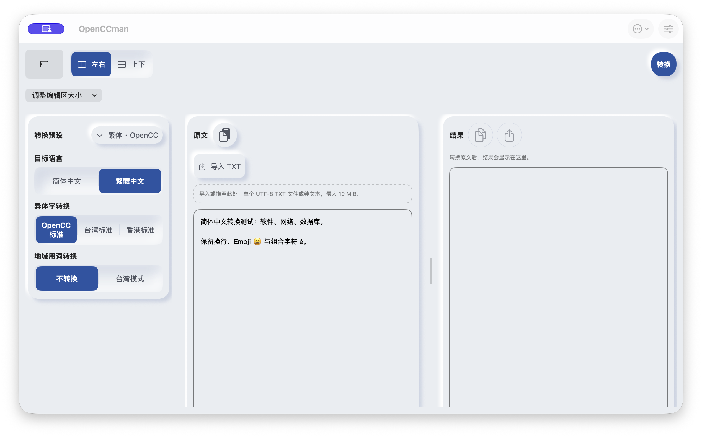 | 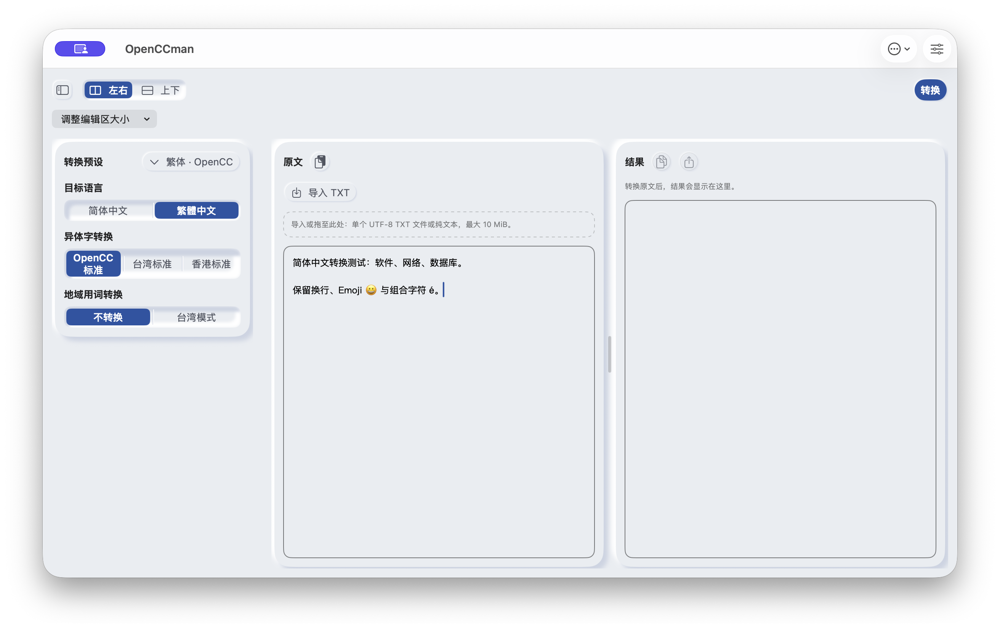 |

### iPhone

| Before | After |
| --- | --- |
| 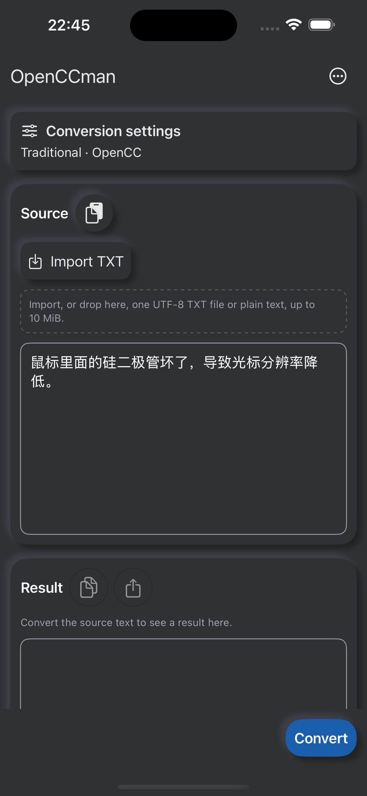 | 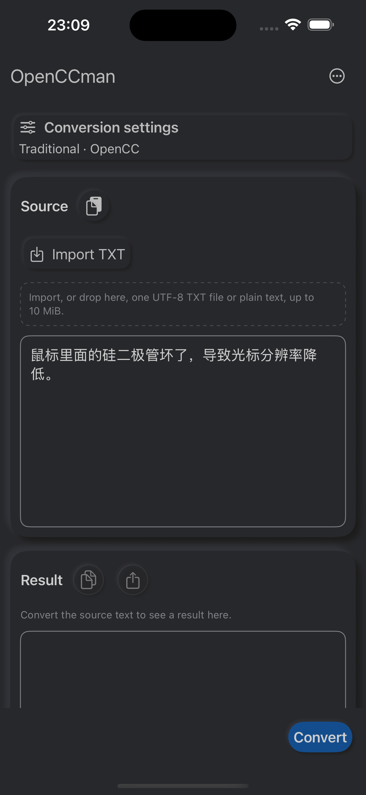 |

### iPad

| Before | After |
| --- | --- |
| 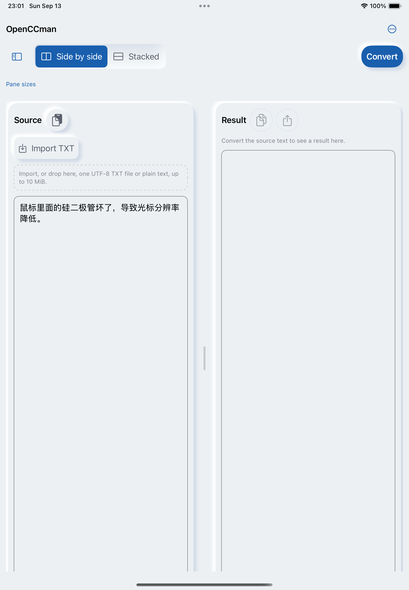 | 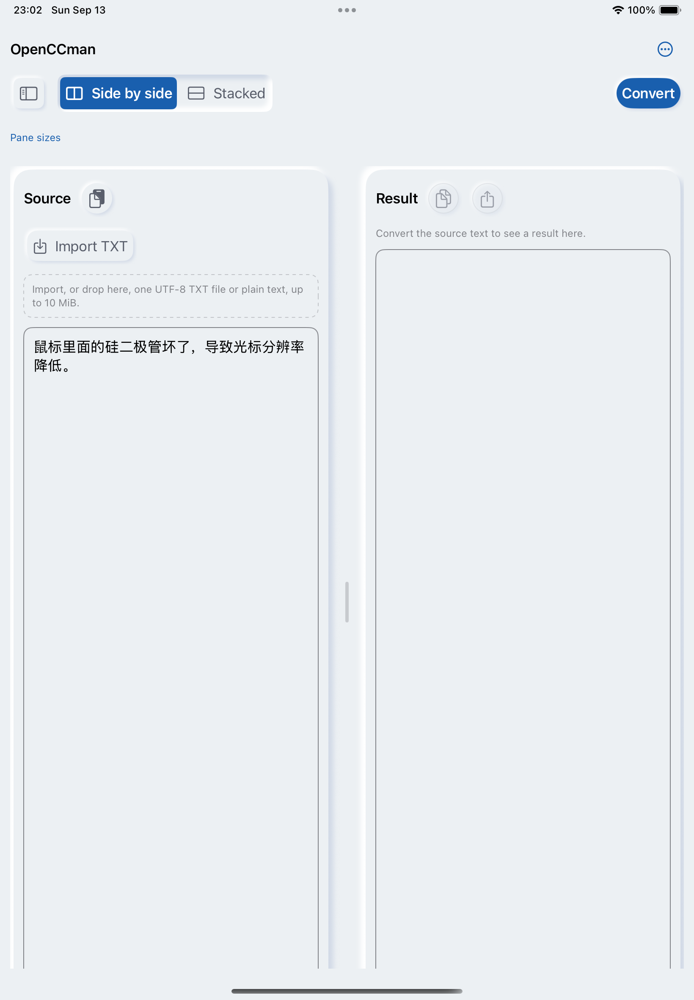 |

## 实际几何与命中

Debug-only `ControlSizingGallery` 将旧包样式与应用样式放在同一进程；GeometryReader 读取完整布局框并绘制橙色内边框，不是手写尺寸标签。Mac 可用 ⌘⌥D 进入，模拟器可带 `-control-sizing-gallery` 启动。仅计数，不触发转换、额度或购买；Release 不包含此入口。

| 测量 | Mac（900×702pt，浅色） | iPhone / iPad（浅色） |
| --- | ---: | ---: |
| 原库请求30×30 | 44×44 | 44×44 |
| 应用图标 | 28×28 | 44×44 |
| 文字按钮高度 | 28 | 44 |
| 主操作高度 | 32 | 44 |
| Segment 含槽高度 | 28 | 44 |
| 自定义开关完整尺寸 | 44×28 | 68×44 |
| 双行示例高度 | 40 | 约59 |

原生 AppKit 回归另测原库请求28×28、非固定样式padding0，均仍为44×44。AX 元素框与布局框可能不同，未用 AX 可见表面尺寸冒充命中范围。

- 三端分别点击图标透明边缘2次、文字按钮边缘1次、Segment 接缝左右各1次，计数恰好5；接缝最终回到左项。禁用按钮未增加计数（若误触会+100），开关可切换。
- Mac 窗口局部坐标：图标(21,212)/(47,236)，文字(21,273)，接缝(450.5,399)/(449.5,399)。
- iPhone逻辑坐标：图标(21,250)/(62,290)，文字(21,328)，接缝(215.5,485)/(214.5,485)。
- iPad逻辑坐标：图标(21,215)/(63,257)，文字(21,294)，接缝(410.5,451)/(409.5,451)。
- 截图中装饰位于橙色框内；未进行逐像素阴影透明度阈值分析。按压时只缩放背景的实现保证布局和命中框稳定。

| Mac | iPhone | iPad |
| --- | --- | --- |
| 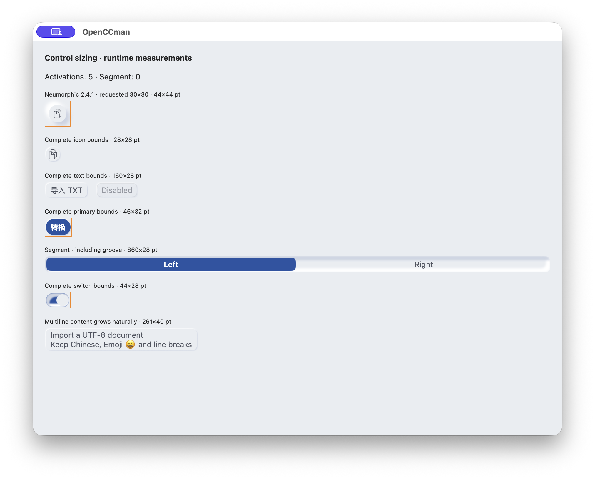 | 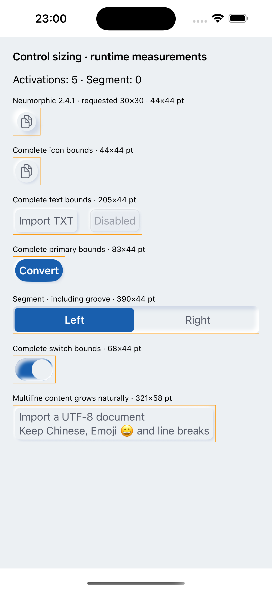 | 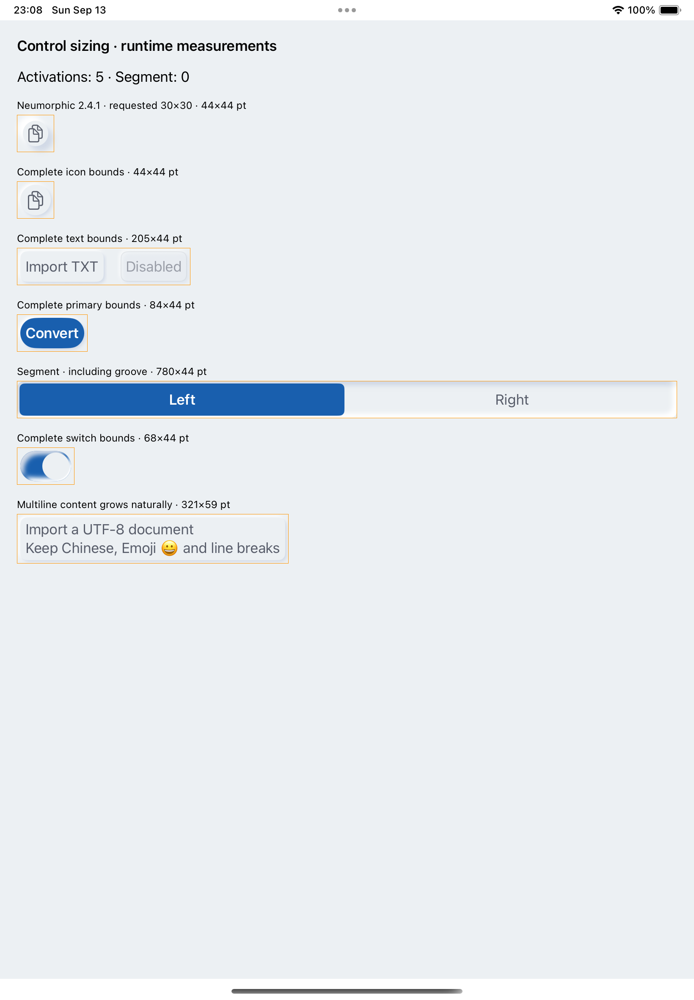 |

## 主题、语言、字号和交互

- Mac 实际简中浅色与繁中深色，英语测量页；三语言标签回归通过。转换同一含中文、空行、Emoji和组合字符的文本成功；复制/导出从禁用变为可用，切换两轴后输入与结果未丢失。
- Mac 鼠标拖动带由50%拖至55%；⌘⌥1/2切换两轴，AX Increment 可调整分隔比例，两轴独立保存。正文宽度重排的字符锚点回归通过，未改编辑器实现。
- iPhone/iPad 英语默认字号浅色测量，iPhone深色工作区及最大辅助字号设置页；iPad深色最大辅助字号测量：文字/主操作80pt、Segment72pt、长多行示例204pt，自然增长无固定高度裁剪。
- iPhone 最大字号设置仍能滚动，完成按钮和标题分开布局。完整三端×三语言×浅深色×字号组合未声称全部实测通过。

| Mac 繁中深色（1200×722pt） | iPhone 英语最大辅助字号设置 | iPad 英语最大辅助字号测量 |
| --- | --- | --- |
| 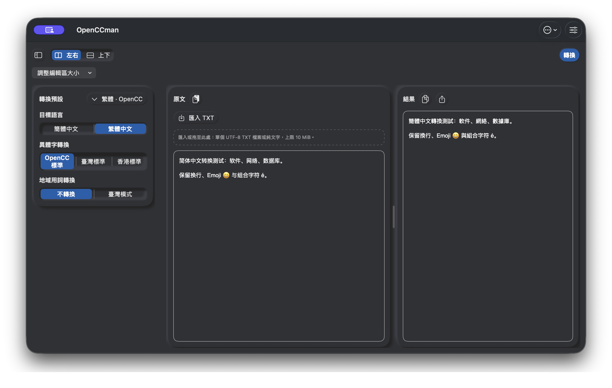 | 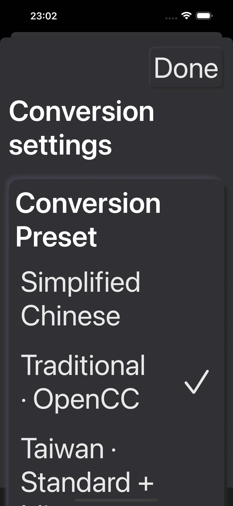 | 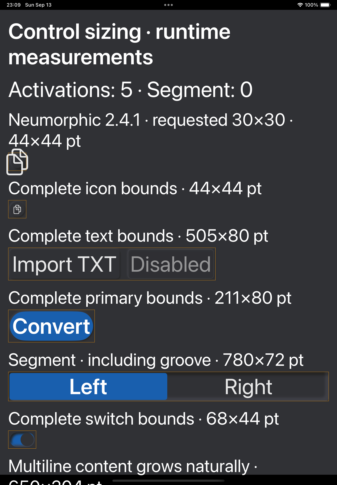 |

## 验证日志与边界

环境：macOS26.6.2（25G83）、Xcode26.6（17F113），macOS与iOS Simulator Debug均以原iOS14/macOS11部署下限编译。构建来源 `8982997`；几何、布局、文案等脚本检查当前修复来源。

```text
xcodebuild -scheme OpenCCman -configuration Debug -destination platform=macOS ...
** BUILD SUCCEEDED **
xcodebuild -scheme OpenCCman -configuration Debug -destination generic/platform=iOS Simulator ...
** BUILD SUCCEEDED **
bash scripts/check-control-sizing.sh
PASS: upstream 30→44 reproduction; Mac icon 28, text 28, primary 32, segment 28, switch 28 and multiline growth
bash scripts/check-workspace.sh
Workspace checks passed: hysteresis, user intent, inspector budget, accessibility, phone, window isolation, ratio recovery and pane minima
bash scripts/check-control-labels.sh
PASS: released control labels resolve English, Simplified/Traditional Chinese, underscore locales, live locale changes and missing-key fallback
bash scripts/check-whats-new.sh
PASS: What’s New content, version persistence, presentation blockers, multi-window ownership, manual viewing and test opt-out
PASS: en.lproj, all 8 What’s New strings
PASS: zh-Hans.lproj, all 8 What’s New strings
bash scripts/check-project.sh
project.pbxproj / Info.plist / entitlements / PrivacyInfo.xcprivacy: OK
zh-Hant / en / zh-Hans Localizable.strings: OK
Swift parsing: exit 0
```

`check-control-sizing.sh` 无参数时在临时目录检出锁定SHA；本地也可传只读包源码目录，未写包缓存。Mac几何回归已接入 App Regression；三端截图不是该原生测试自动生成的结果。

滚动原生测试首次在并行构建期间于宽度重排断言失败；停止并行构建后独立复测3次通过，未修改滚动实现、等待时间或断言。不能把并行负载推断为已证实原因，后续 CI 如复现需继续调查。`actionlint` 本机不可用；workflow仅新增一个检查步骤，最终以GitHub Actions实际运行验收。

### 保留的发布前验收

- iOS14/macOS11 实际运行：维护者确认没有环境，继续留在 [#16](https://github.com/gewill/OpenCCman/issues/16)。支持部署下限编译不等于最低系统运行通过。
- 完整 VoiceOver 朗读、纯键盘流程、真实中文输入法组合文字、导入/转换/取消/导出进行中切换布局、最终签名产物与跨App快捷键：沿用 [#20](https://github.com/gewill/OpenCCman/issues/20)、[#37](https://github.com/gewill/OpenCCman/issues/37)、[#15](https://github.com/gewill/OpenCCman/issues/15)。本次尺寸和局部操作通过不关闭这些追踪项。
- 高对比度、Reduce Motion和全语言主题字号矩阵在最终产物上复验；旧来源的通过记录不自动迁移到新来源。
- #57 窗口尺寸和 #52 大文件Pro不在本次范围。不推送build分支，不触发Xcode Cloud或正式发布。

### 测试设置恢复

桌面采用独立测试bundle ID，未改正式应用偏好、购买权益或快捷键权限。模拟器测试前为默认字体 `large`，测试后恢复；本次改动的模拟器浅深色恢复为light。系统VoiceOver开始为off，本次没有启用。语言/主题仅操作隔离Mac应用，收尾恢复跟随系统并退出测试实例；不退出用户自己的应用窗口。
