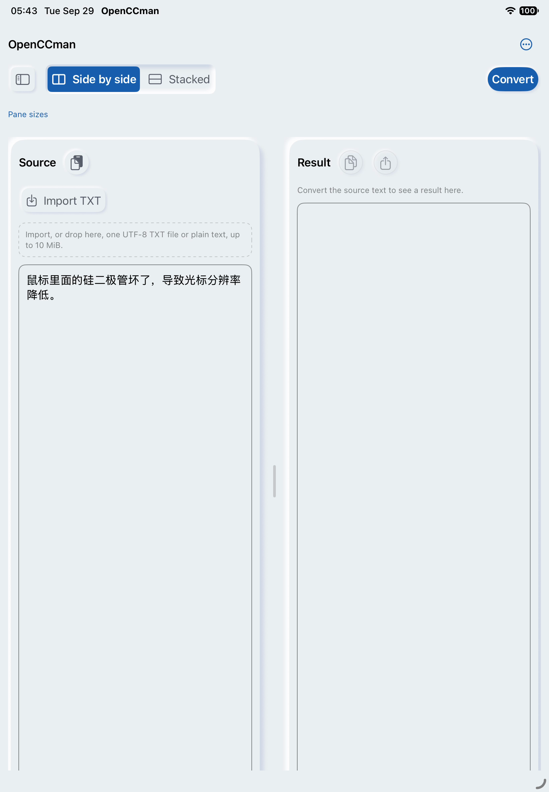
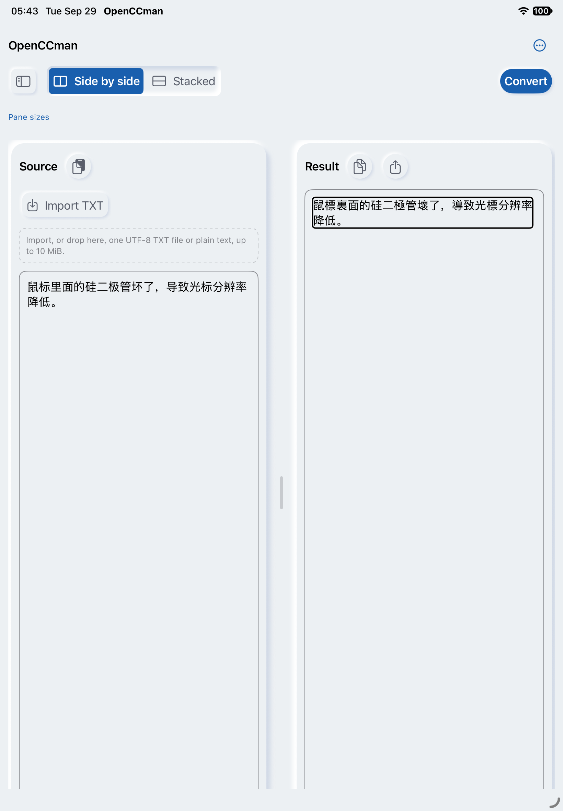
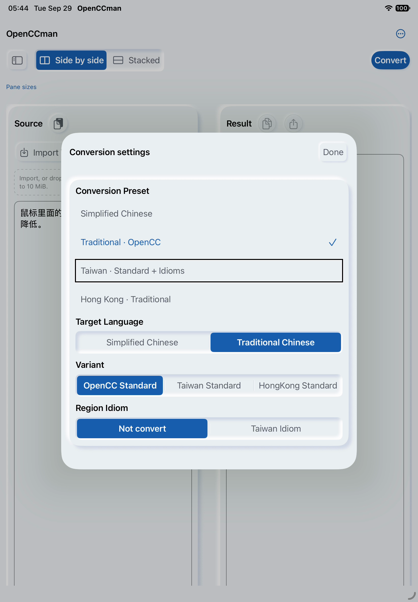
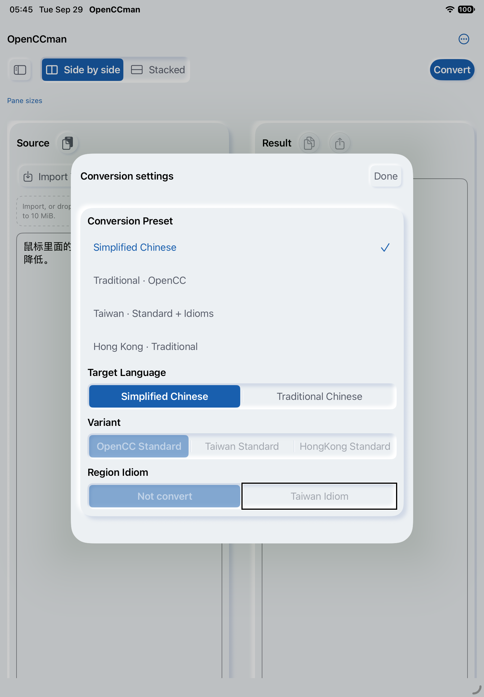

# #20：iPad VoiceOver 首页、结果与预设运行子集（2026-09-29）

在专用 iPad Air 11-inch (M4)／iPadOS 27.0 模拟器上，XCUITest 使用 `XCUIDevice.voiceOverService` 移动读屏焦点，并保存系统实际返回的朗读文本。首页／转换结果和预设设置两项测试分别通过。本轮只修正已有测试探针在全新 VoiceOver 光标上直接读取 `currentSpeech()` 的假设，不改应用 UI 或业务代码。**#20 仍开放**，因为测试通过的子集不等于完整键盘、输入法、文件及签名包验收。

| 项目 | 本轮事实 |
| --- | --- |
| 应用源码 | `develop` `80688176aece23beb029fe9b0a71c48beaf98e72`；Xcode 27.0 (27A266a)，iOS Simulator Debug，独立 bundle `org.gewill.OpenCCman.Issue20QA20260928`，未签名；应用调试 dylib SHA-256 `991d1dfa1469f3b185ca1d7ef9098313f917e5a3a885a92162c454eec75b9794` |
| 设备 | 专用模拟器 `OpenCCman 2.1 iPad VoiceOver QA`，iPad Air 11-inch (M4)，iPadOS 27.0 (24A434)，英语、浅色、默认字号；输入为应用内合成中文样本 |
| 工具 | `xcodebuild`、`xcresulttool`、`devicectl device info voiceover`、`simctl io recordVideo`；[原探针及工程](../issue-20-v21-voiceover/probe/) |
| 结果 | 首页／结果 `TEST SUCCEEDED`，1/1、55.381 秒；预设 `TEST SUCCEEDED`，1/1、46.833 秒。两次结束后 `devicectl` 均读回 VoiceOver **disabled** |

首次直接运行原探针时，两项均报 `com.apple.xctest.voiceoverservice Code=3 No speech available`，分别发生在 `currentSpeech()` 的首页和预设起点。此时新启用的 VoiceOver 没有当前朗读；这属于探针前置状态错误，尚无证据指向应用缺陷。把首页／预设序列和转换结果的首个采样改为 `moveForward()` 后，分别单独重跑通过。临时运行副本和本 PR 探针的可执行代码相同，唯一差异是本 PR 多了两行说明注释。首次失败运行的结果收集在测试完成后停滞，已停止该 `xcodebuild` 进程；成功重跑的两个结果包均正常完成。

## 实际朗读与交互

首页朗读包括 `Conversion settings`、`Editor layout selected Side by side`、`Source`、可编辑原文的 `Text field Double tap to edit`、`Convert`、`Result`，以及转换前禁用的 `Copy Result dimmed`／`Export TXT dimmed`。[完整首页朗读](logs/home-speech.txt)。结果成功后，复制／导出变为可用；读屏返回 `鼠標裏面的硅二極管壞了，導致光標分辨率降低。`，没有把结果读成可编辑输入区。测试关闭 VoiceOver 后点按结果区，键盘没有出现，结果值未变。[转换后朗读](logs/converted-speech.txt)。注意读屏序列末尾还进入了模拟器桌面项目 `iPerfman`；断言仅使用应用内所需的朗读项，不能把桌面项解释成应用控件。

预设页先明确选中 `Traditional · OpenCC`，读屏返回 `selected Traditional · OpenCC`、`Target Language` 和高级选项；再点 `Simplified Chinese`，返回 `selected Simplified Chinese`、`Variant dimmed`、`OpenCC Standard dimmed`、`Region Idiom dimmed`。测试同时核对被禁用选项的 `isEnabled == false`。[切换前朗读](logs/preset-initial-speech.txt) · [切换后朗读](logs/preset-simplified-speech.txt)。按钮切换由 XCUITest 普通点按完成，并非 VoiceOver 双击手势验收。

下图是**同一源码的操作前后状态**，不是 UI 代码改动前后。截图为真实模拟器视频帧／XCTest 截图，1640×2360 px；视频来自完整 `simctl io recordVideo` 的 App 画面片段，缩放至 820 px 宽、8 fps、H.264、无音频。朗读内容以附带的 XCUITest 文本为准。相同媒体也通过 `gh` 上传并在 PR 中引用。

| 转换前 | 转换后，VoiceOver 聚焦结果 |
| --- | --- |
|  |  |

[首页朗读、转换与结果点按录像](media/home-result.mp4)。

| 繁体 OpenCC 预设 | 简体预设与禁用选项 |
| --- | --- |
|  |  |

[预设切换与焦点移动录像](media/preset-transition.mp4)。

## 复现及尚未通过的范围

按[原运行说明](../issue-20-v21-voiceover/README.md#重跑与剩余范围)用上述 bundle ID 构建并安装 App，以 `xcodegen generate` 生成探针工程。将 `xcodebuild test` destination 指向专用 iPad 模拟器 `C9D2FE51-2CE6-48DC-B133-4E83F6A50996`；本轮为避免 XCUITest 结果收集互相影响，分别用 `-only-testing:OpenCCman21VoiceOverProbe/CurrentVoiceOverProbe/testHomeAndConvertedResultSpeech` 与 `.../testPresetSheetSpeechAndDisabledOptions` 执行，`-parallel-testing-enabled NO CODE_SIGNING_ALLOWED=NO`。测试后用 `xcrun devicectl device info voiceover --device <UDID>` 读回关闭状态。构建日志 SHA-256 `c907efd70ce8068c9e8c83440579285c6ff953bef2033b87c63860ee7810e5dc`；原始完整日志和 `.xcresult` 保存在本机 `/private/tmp/openccman-20-ipad-*`，仓库保存关键 speech attachments 与界面媒体。

仍需在签名分发包、真实设备及最低系统上验证：VoiceOver 手势独立激活、三语言／大字号／深色、完整焦点及键盘顺序、真实中文输入法组合文字、长文选择与复制、转换取消、文件导入导出及错误弹窗。iOS 15／macOS 12 的最低系统由 #16 跟踪；本轮不将本地未签名模拟器结果算作其通过。
