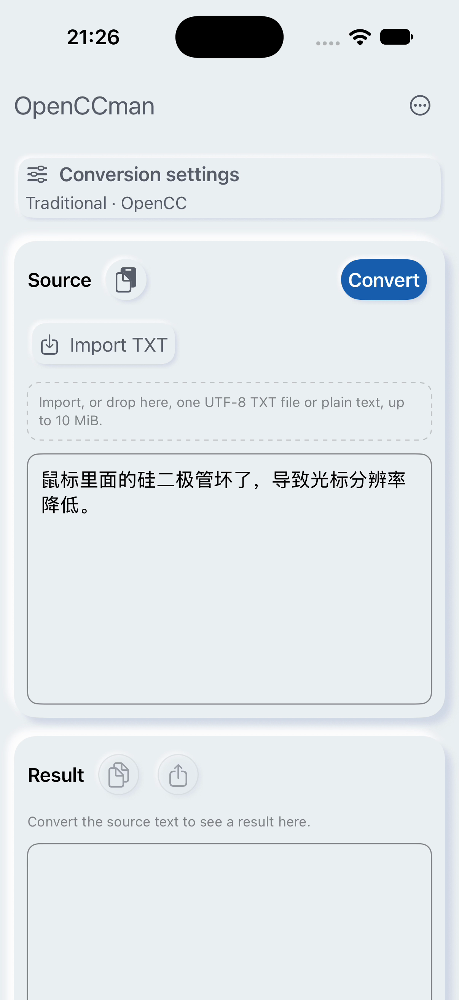
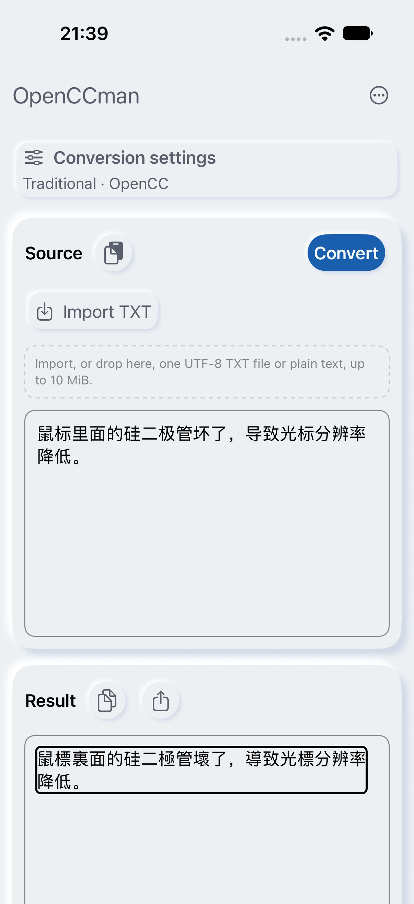
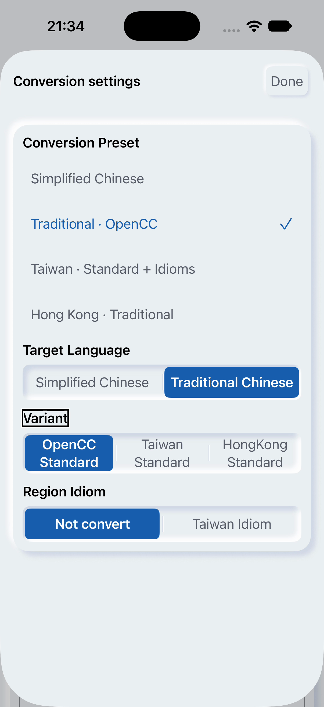
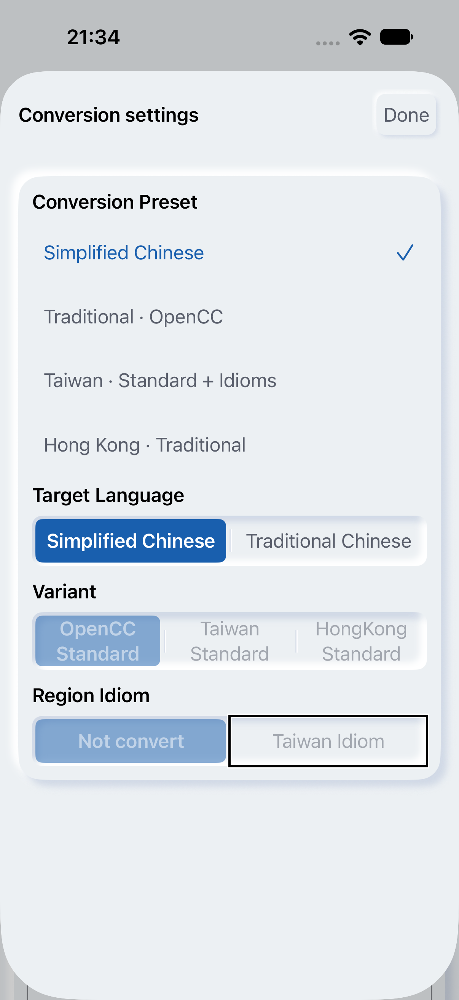

# #20：2.1 当前源码的 iPhone VoiceOver 运行子集（2026-09-28）

这次在 iPhone 18 Pro／iOS 27.0 模拟器上，用 Xcode 27 的 `XCUIDevice.voiceOverService` 逐项移动焦点并读取**实际朗读文本**。当前源码的首页、转换结果和设置面板两个测试均通过。测试验证了“原文可编辑、结果不被读作可编辑”、转换结果文字会朗读，以及繁体预设切换到简体后选中和禁用状态会朗读。它不是 #20 的完整验收：测试中的按钮通过 XCUITest 点按，未由 VoiceOver 手势独立激活；没有覆盖真实中文输入法、物理设备、全部键盘／文件／错误路径或最终分发签名包，Issue 保持开放。

| 来源 | 本次记录 |
| --- | --- |
| 应用源码 | `develop` `cb7a6469efba6c77beac5f26fa65ab472f652b4d`（已含 #233）；本 PR 不改应用代码、依赖或最低系统 |
| 构建 | iOS Simulator Debug，2.1(30)，独立 bundle `org.gewill.OpenCCman.Issue20QA20260928`，`CODE_SIGNING_ALLOWED=NO`；Xcode 27.0 (27A266a) 构建成功；应用调试 dylib SHA-256 `491a63079beb44e07cd3c42ed45d584aeb422ed787b13961d30e480e357cd657`；构建日志 SHA-256 `52d45f4c6f73bbbd353efdbdd10622bce6ef7b920a053e543bcad0a644b34d48` |
| 环境 | 专用 `OpenCCman VoiceOver QA 20260925` 模拟器，iPhone 18 Pro，iOS 27.0 (24A434)，英语、浅色、默认字号；来源为应用内合成文稿 |
| 测试 | [XcodeGen 工程与 XCUITest](probe/)；单独执行首页／结果和预设切换两项，均 `TEST SUCCEEDED`。测试前 VoiceOver 为 off，成功运行后用 `devicectl device info voiceover` 读回 off |

## 实际结果

首页从顶部向后朗读：More、Conversion settings、Source、Paste Text、Convert、Import TXT、可编辑 Source、Result、禁用的 Copy Result／Export TXT、空结果提示。点击 Convert 后，Copy Result／Export TXT 被读作可用，VoiceOver 朗读了 `鼠標裏面的硅二極管壞了，導致光標分辨率降低。`；结果没有 `Double tap to edit` 提示，原文保留 `Text field Double tap to edit`。关闭 VoiceOver 后点按结果区，键盘没有出现，结果值不变。[首页朗读原文](logs/home-speech.txt)和[转换后朗读原文](logs/converted-speech.txt)来自 XCUITest attachment，不是根据 AX 标签推测。

预设测试先**显式选择** `Traditional · OpenCC`，避免模拟器保留的旧偏好掩盖状态转换。VoiceOver 读出 `selected Traditional · OpenCC`，随后切换 `Simplified Chinese`；读出 `selected Simplified Chinese`、`Target Language selected Simplified Chinese`，以及 `Variant dimmed`、`OpenCC Standard dimmed`、`Region Idiom dimmed`。XCUITest 同时核对高级选项 `isEnabled == false`。[繁体朗读](logs/preset-traditional-speech.txt)与[简体朗读](logs/preset-simplified-speech.txt)保留完整顺序。

测试最初一次在转换后遇到应用评分弹窗，VoiceOver 正确朗读了弹窗，因此该次不能算作结果朗读失败。测试随后显式处理可能出现的 `Not Now`，重跑通过。另一轮断言只把 `selected` 写成了大写 `Selected`，与实际系统朗读大小写不符；修正后通过。失败运行后 XCUITest 的 `defer` 没能关掉 VoiceOver，已用 `devicectl --disable` 恢复并读回。最终两次成功运行均读回 off。没有把这些测试夹具问题记作产品缺陷。

截图展示**同一源码运行前后状态**，不是代码改动前后；画面为 1206×2622 px。屏幕录制来自 `simctl io recordVideo`，剪辑为 H.264、无音频；真实朗读内容以对应的 XCUITest 日志为准。媒体通过 `gh api POST repos/gewill/OpenCCman/git/blobs` 上传并核对 Git 对象 SHA，见 [`media/uploads.json`](media/uploads.json)。

| 转换前 | 转换后，VoiceOver 聚焦结果文字 |
| --- | --- |
|  |  |

[首页朗读、转换和结果区点按视频](media/voiceover-convert.mp4)（42.78 秒；SHA-256 `7d006ab8064c204e33fdd530e547a84dff55588865ccf2381d77852caa78ff63`）。

| 繁体 OpenCC 预设 | 简体预设，高级选项禁用 |
| --- | --- |
|  |  |

[预设切换及朗读焦点交互视频](media/preset-transition.mp4)（22.26 秒；SHA-256 `50e2313e3e71ea8266637d5b0650d8ad35ad4231aeb7fc208e9a72312be1a98a`）。截图和视频只包含此专用模拟器的测试画面；剪辑不是整个 XCUITest 运行，完整测试结果另见 [首页／结果](logs/test-summary.txt)与[预设](logs/preset-test-summary.txt)。

## 重跑与剩余范围

先用 `xcodebuild` 将 `OpenCCman.xcodeproj` 的 `OpenCCman` scheme 以 iOS Simulator Debug 和上述独立 bundle ID 构建并安装到专用 iOS 27 模拟器；在 [`probe/`](probe/) 运行 `xcodegen generate`，然后用 `xcodebuild test -project OpenCCman21VoiceOverProbe.xcodeproj -scheme OpenCCman21VoiceOverProbe -destination 'platform=iOS Simulator,id=<UDID>' -parallel-testing-enabled NO CODE_SIGNING_ALLOWED=NO` 执行。测试中启用 VoiceOver，结束后必须用 `devicectl device info voiceover` 读回，并在需要时显式关闭。

#20 后续仍要在最终签名包和支持系统上完成 VoiceOver 独立手势激活、全部三语与大字号、真实中文输入法组合文字、转换／取消、文件错误和键盘矩阵；iOS 15／macOS 12 最低系统另由 #16 验收。本轮没有更改购买或每日额度规则。
