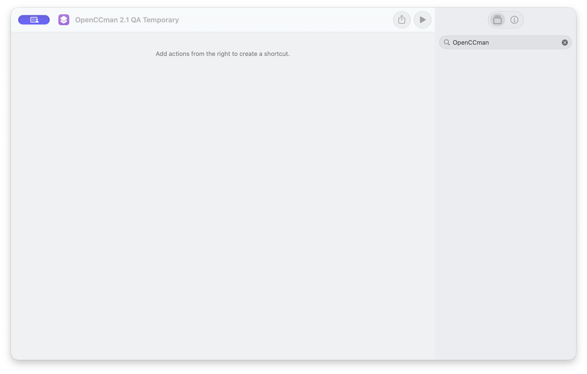
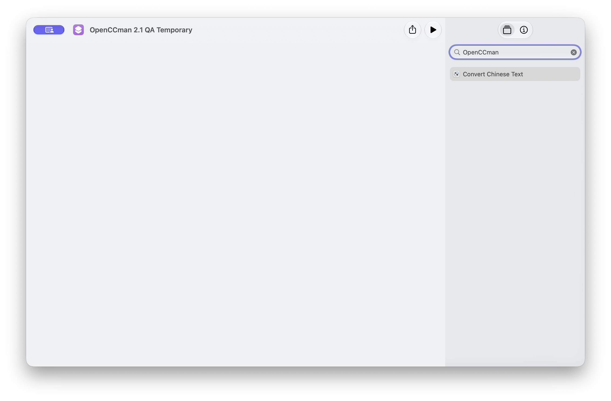
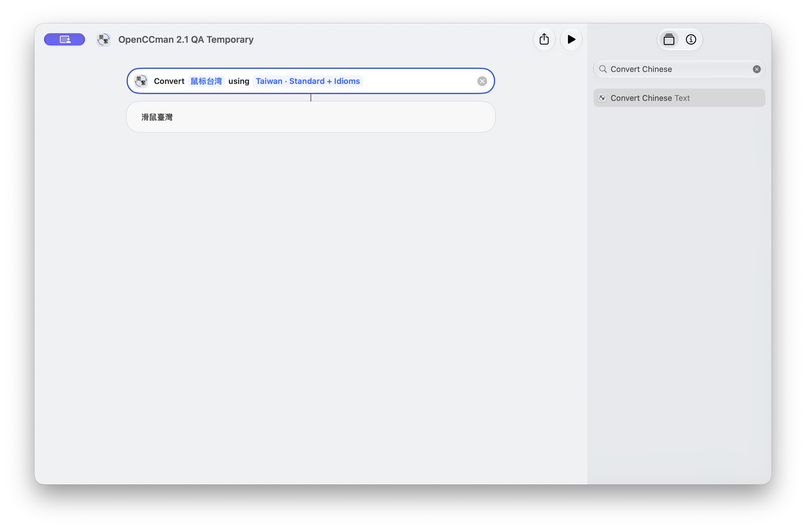
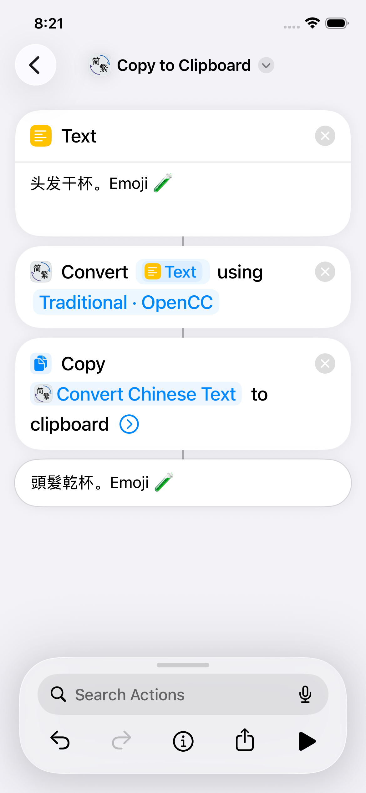
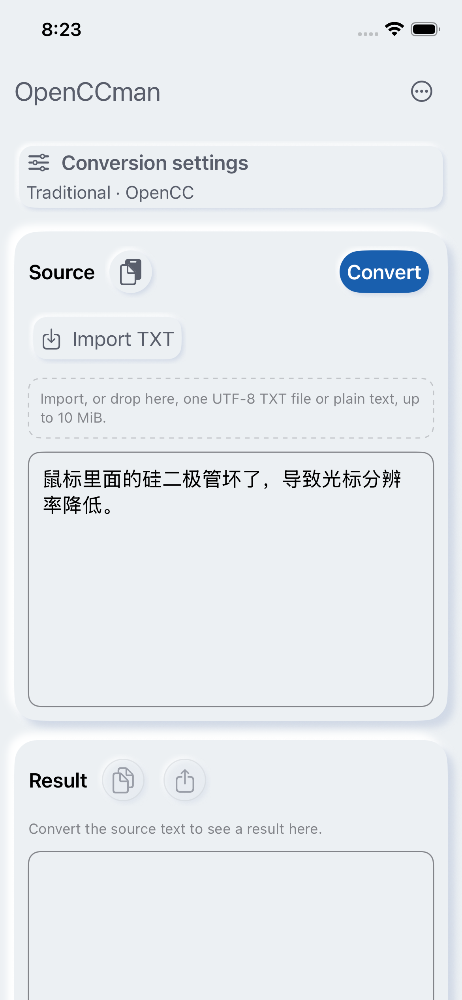

# Issue #26: Shortcuts action validation

Captured 2026-09-28 from the #26 candidate based on `develop`
`e9caf37593c7ec24ebb02e9d7134ff9b0bffc14e`. The Mac test used Xcode
27.0 on macOS 27.0, an isolated `org.gewill.OpenCCman.ShortcutsQA` build,
and Apple Development signing. The iPhone Simulator build was installed and
launched on iOS 26.5; its Shortcuts editor was not operated in this run.

| Before: Shortcuts search on the published app | Candidate action discovered |
| --- | --- |
|  |  |

In the Mac Shortcuts editor, the candidate action displayed all four presets.
The Taiwan preset converted `鼠标台湾` to `滑鼠臺灣` and `头发干杯` to
`頭髮乾杯`. The editor displayed the returned value in
. The
[window recording](media/mac-shortcuts-interaction.mp4) shows the input
changing from `鼠标台湾` to `头发干杯`, followed by a run that returns
`頭髮乾杯`. Repeated runs succeeded.
The already-open OpenCCman window kept its source text and empty result, so
the action did not write to the workspace.

The first ad-hoc-signed test bundle was discoverable but failed to run: the
system log said `linkd` rejected an unvalidated bundle with no Team ID.
Apple Development signing of the isolated QA bundle resolved that test setup
error; the same Mac Shortcuts action then ran. This does not verify the final
App Store-signed package.

The SwiftPM regression runs the action with the free homepage quota exhausted,
checks that the quota remains unchanged, compares all four presets against the
existing conversion service for empty/CRLF/Unicode/NUL samples, and checks a
specific over-limit error. It exercises `perform()` directly, separate from
the system Shortcuts editor test above.

On 2026-09-28, after #229 merged as `fbd48cde68c1bdee6857179fcbddef52e7580bb5`,
the Mac Shortcuts editor also verified downstream output in the same isolated
QA bundle. A three-step shortcut connected **Text** (`头发和干杯。Emoji 🧪`) →
**Convert Chinese Text** (Traditional · OpenCC) → the system **Change Case**
(UPPERCASE). The OpenCCman action produced `頭髮和乾杯。Emoji 🧪`; the final
Shortcuts result bubble and accessibility tree showed
`頭髮和乾杯。EMOJI 🧪`. This demonstrates that the conversion result reached
another system action. Two identically named actions appeared in this local
QA environment. Choosing the first produced “couldn’t communicate with the
app”; the second, from the installed `org.gewill.OpenCCman.ShortcutsQA`,
worked. The duplicate registration has not been reproduced with a single
published app installation and does not establish a production defect.
After quitting the QA app, the same shortcut again returned
`頭髮和乾杯。EMOJI 🧪` while Shortcuts stayed in front. The system started the
QA app process in the background during the run; this verifies the closed-app
invocation, but does not prove that no workspace window was created behind
Shortcuts. Bringing that QA window forward afterwards showed its existing
source `鼠标里面的硅二极管坏了，导致光标分辨率降低。` and empty result unchanged.

At the time of this Mac run, system Shortcuts invocation and downstream output
on iPhone and iPad, Mac cancellation and continuous-run matrix, three-language
UI checks in a signed package, and a final signed build remained open. Xcode
27 Device Hub was inspected but its computer-control window timed out during
that run; simulator installation and launch alone were not Shortcuts acceptance.
The iPhone editor result below supersedes that particular iPhone gap.

## 2026-09-28: iPhone system Shortcuts execution

An iPhone 17e simulator running iOS 26.5 executed the installed
`org.gewill.OpenCCman.ShortcutsQA` app action in the actual Shortcuts editor.
The QA bundle reports version 2.1 (30); its executable SHA-256 is
`7aac1b212ead1af9e228b82ca161dbf9f07935a3bffb916789e7d06df8a3c112`.
It is the simulator QA build from the #229 candidate, whose PR identifies
source `6af425542c01d416eb25e465a7946d6a44a5d2b1`. The installed binary
does not embed a source SHA, so this record binds the actual tested binary by
hash rather than asserting an independent source-to-binary proof. This is not
an App Store or TestFlight-signed build.

The Shortcuts editor connected three actions in order: **Text**
(`头发干杯。Emoji 🧪`) → **Convert Chinese Text** (`Traditional · OpenCC`) →
the system **Copy to Clipboard**, whose input chip explicitly selected
**Convert Chinese Text**. After Run, the system result bubble displayed
`頭髮乾杯。Emoji 🧪`. A prior `Test` run completed the same chain. The Chinese
run verifies visible conversion and system-action handoff; the clipboard's
bytes were not independently read back. The OpenCCman QA process retained
PID 4696 during the run. Returning to its workspace showed the earlier source
`鼠标里面的硅二极管坏了，导致光标分辨率降低。` and its empty result unchanged.

| iPhone Shortcuts result | Workspace after Shortcuts |
| --- | --- |
|  |  |

[iPhone Shortcuts interaction video](media/ios-shortcuts-chinese-run.mp4)
shows Run, the action chain and returned result. The screenshots are the
simulator's 1170×2532 display in English, Light appearance, default text size;
the video is H.264, 8.91 seconds. Xcode was 27.0 (27A266a) on macOS 27.0.
The iPhone screen was mirrored through `serve-sim` for UI interaction, while
`xcrun simctl io` captured the native screenshot and recording. All three
media files were uploaded with `gh api POST repos/gewill/OpenCCman/git/blobs`,
and returned blob SHAs were checked against local `git hash-object`; see
[`ios-uploads.json`](media/ios-uploads.json). The host clipboard was restored
and hash-verified after entering the test sample; the mirror helper was stopped.

This closes the earlier **iPhone Simulator editor not operated** evidence gap.
It does not close #26: iPad system execution, a physical/final-distribution
build, three-language UI, cancellation/continuous-run matrix and larger system
input/error cases remain. Direct `perform()` regression covers more strings and
quota behavior but is a separate layer of evidence.
