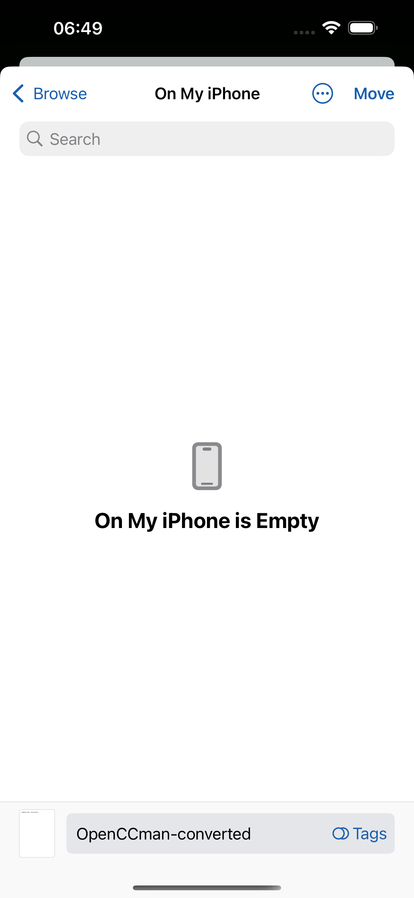
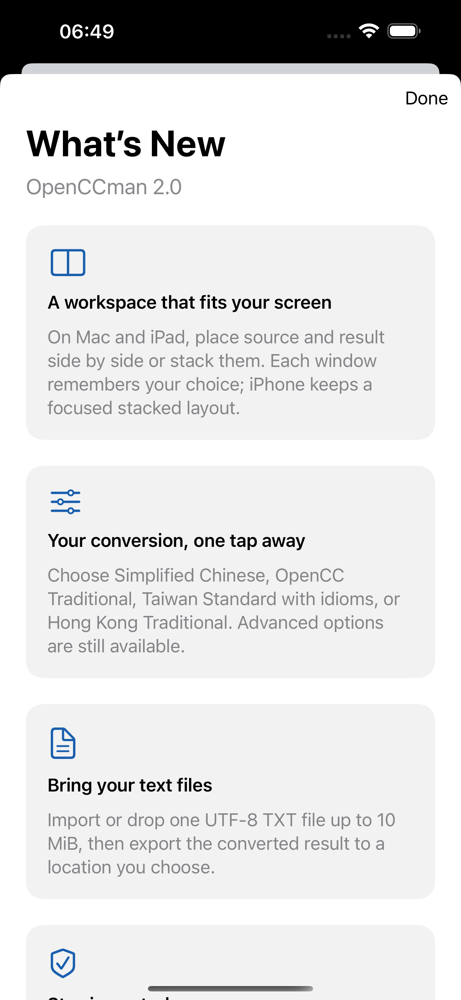

# #34: iPhone export cancellation and deferred What's New

Source baseline: `develop` `1df42cb69ed21162be9775df9d41c5327e88a875`.
Xcode 27.0 (27A266a); dedicated Debug QA bundle
`org.gewill.OpenCCman.WhatsNewUITests`; English, light appearance, standard
text size, portrait. No production installation or preference was changed.

After conversion, the native Files exporter covered the app and the unread
What's New sheet stayed hidden. The exporter opened inside **On My iPhone**;
returning to **Browse** exposed **Cancel**. Tapping Cancel closed the exporter
and showed the pending 2.0 cards once. Done dismissed the cards without a
second presentation. The recorded screenshots show two states of the same app
source, not a visual change between commits.

| Exporter open: cards deferred | Exporter cancelled: cards shown |
| --- | --- |
|  |  |

[Real interaction video](media/export-cancel-flow.mp4) captures the converted
result, exporter opening, navigation to Browse, cancellation, and the cards. It has no
audio. These files were uploaded with `gh api` as Git blobs and their returned
SHAs were checked against local `git hash-object` before being committed.

`testExportPanelDoesNotOverlapCards` passed 1/1 on each of two dedicated
simulators: iPhone 15 Pro Max / iOS 18.6 and iPhone 17 Pro / iOS 26.5. The
test asserts no overlap while the picker is open, uses the screen's top-left
navigation position to return from a Files location and cancel, then asserts
the picker disappears, the cards appear, and dismissal is one-time. The system
extension's Browse/Cancel controls were absent from app-scoped accessibility
queries, so this coordinate-based step is limited to portrait iPhone. On iPad,
the same test still verifies only that the exporter and cards do not overlap.
`scripts/check-whats-new.sh` and `git diff --check` passed.

This is isolated Simulator evidence. iPad export cancellation, iOS 15 and
macOS 12, physical devices, full VoiceOver narration, and the final signed
TestFlight build remain in #34 and related release issues.

## Media SHA-256

| File | SHA-256 |
| --- | --- |
| `exporter-before-cancel.png` | `168693d5c4f954fd2e0e1fa1fb42c610b52588bc916f16fa1f83b058f6bba34c` |
| `cards-after-cancel.png` | `bd61b5c77ea500a3316022da15edfae9b6666284dbc097b7f736f818d2f617c0` |
| `export-cancel-flow.mp4` | `303236093fd21fc46240f545827b72dc020cb0f4f946a86026928b1ec98b645c` |
