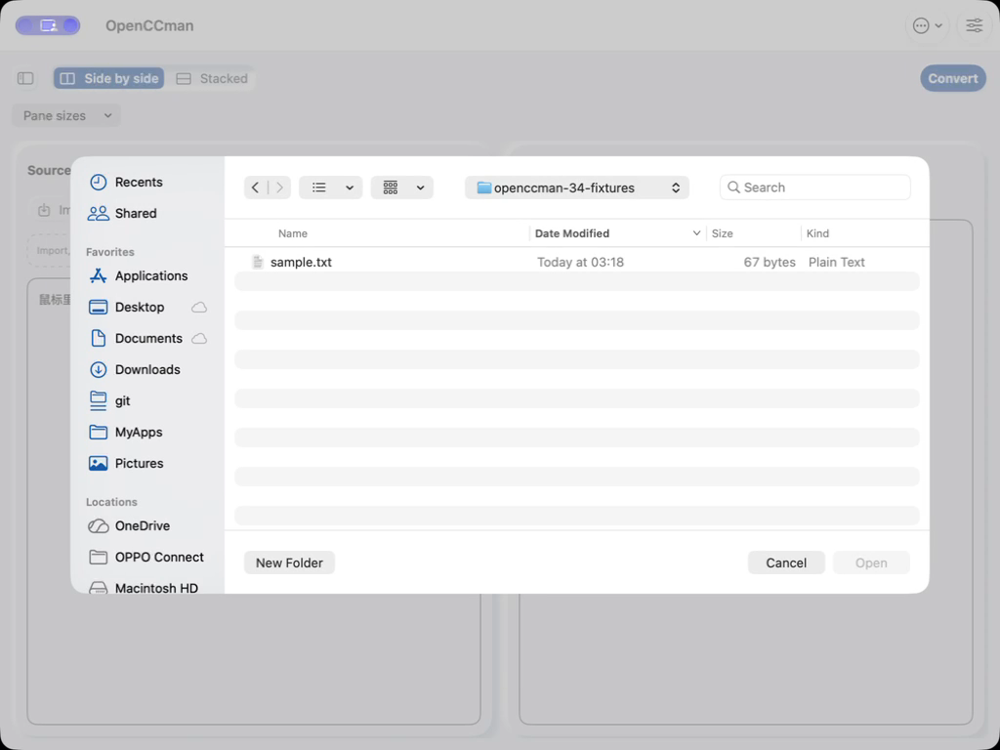
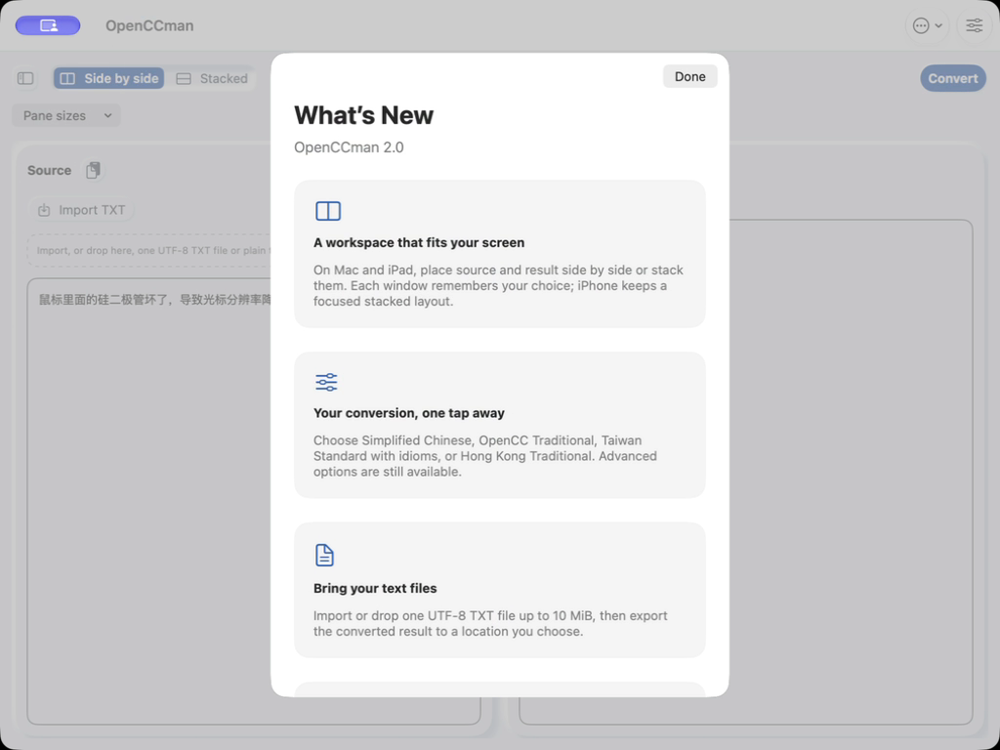

# #34 Mac import-panel deferral (2026-09-24)

This is one runtime acceptance slice, not completion of #34. No production source was changed.

## Source and setup

- Application source: `develop` merge commit `e0acdcb09be5f10518543480b75183d3e6b89ef4`; marketing version 2.0, build 30. Xcode 27.0 (27A266a), macOS 27.0, English, light appearance, default text size, non-Pro.
- The complete Mac Debug build passed with `CODE_SIGNING_ALLOWED=NO`; build log SHA-256 `725574a975f6392523d8ae12fb1eb2b69fc0183ba80ce09c44f466808e1158f7`. A separate copy used bundle ID `org.gewill.OpenCCman.WhatsNewQA20260924`, removed `NSServices`, retained the app's sandbox entitlements and was signed ad hoc. `codesign --verify --deep --strict` passed. Executable SHA-256: `3340676ae459bd6398bf4676563638593c7693044911cbb776fb8322f641a4ab`.
- All UI actions used Codex computer use. The [window-only ScreenCaptureKit recorder](RecordWindow.swift) captured the QA app at 1024×768 pixels, 15 fps, without audio, microphone or cursor. The file picker was navigated to a dedicated `/tmp/openccman-34-fixtures` folder containing only `sample.txt` before recording. The installed production app and its preferences were not used.

## Observation

On first activation, the real 2.0 four-card sheet appeared. After dismissing it, the QA app's `lastPresentedWhatsNewVersion` preference was explicitly set back to `1.3` **from outside the running app** to create a pending automatic presentation. This is a diagnostic setup, not a normal user flow or proof of first-launch timing.

The native Import TXT picker then remained visible without a What’s New sheet. Clicking Cancel closed the picker, after which the 2.0 sheet appeared. The [untrimmed 16.175-second recording](media/import-cancel-card.mp4) and two frames show those states; inspection of one frame per second found no simultaneous visible picker and card. After dismissing the card, the original synthetic source text was unchanged, and the QA preference read back `2.0`. This establishes only the observed Mac cancellation route; it does not prove every dismissal-animation frame or success/import/conversion/error/Pro route.

| File picker open | After Cancel |
| --- | --- |
|  |  |

## Remaining acceptance

#34 stays open for successful/failed import, active conversion and its success/failure/cancel paths, quota/error and Pro presentations, iPhone/iPad VoiceOver and orientations, iOS 15/macOS 12 execution, and the final Xcode Cloud/TestFlight build. Mac export-panel cancellation and success are covered separately in the [export-panel record](../issue-34-export-panel/README.md). The external preference reset and ad-hoc Debug signature limit this record to presentation coordination, not distribution acceptance.

Media SHA-256: `file-panel.png` `91814a79c5447d41ad9a4a00b7ee8785ad2963bacb17dd95fcbaaf0b0f86f2f7`; `import-cancel-card.mp4` `ea16c6604ee5a30d38e6b059b60ca258163e0f38d7c423723542642d6`; `whats-new-after-cancel.png` `a963b35074690ad349914a1734f618a64ba0579492ffb99e44fa8803177f606d`.
