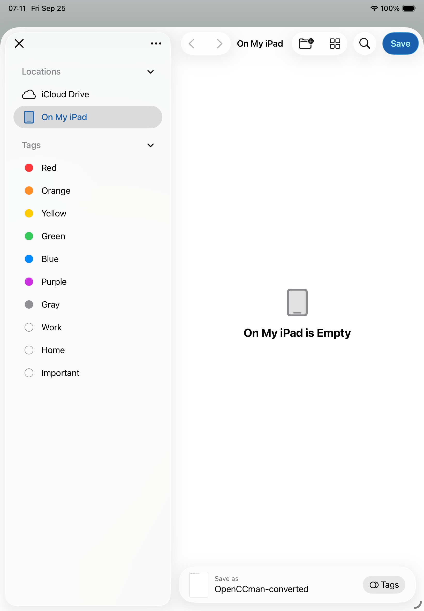
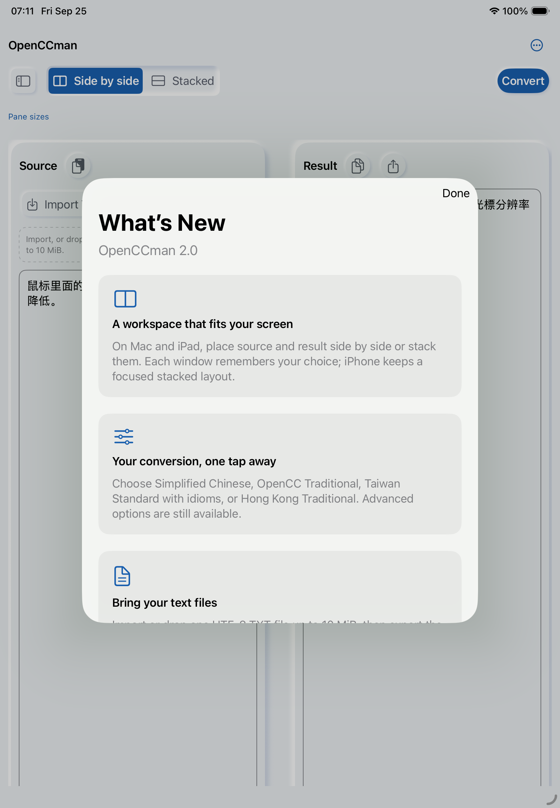

# #34: iPad export cancellation and deferred What's New

Source baseline: `develop` `e01a4047830082906f604a560196669af5453c02`.
Xcode 27.0 (27A266a); dedicated iPad Air 11-inch (M4) / iPadOS 26.5
Simulator; isolated Debug QA bundle `org.gewill.OpenCCman.WhatsNewUITests`;
English, light appearance, standard text size, full-screen portrait. No store
app installation or user preference was changed.

After a successful conversion, the native Files exporter appeared without the
unread What's New sheet. Its top-left close control dismissed the exporter;
the deferred 2.0 cards then appeared once and could be closed with Done. The
screenshots show states of the same app source, not a visual code change.

| Exporter open: cards deferred | Exporter closed: cards shown |
| --- | --- |
|  |  |

[Real interaction video](media/export-cancel-flow.mp4) shows the converted
result, exporter, close action and restored cards. It has no audio. Media were
uploaded with `gh api` as Git blobs; returned SHAs matched local
`git hash-object` before commit.

The extended `testExportPanelDoesNotOverlapCards` passed 1/1. It asserts no
overlap while the native picker is open, taps the observed iPad top-left close
position, then asserts the picker disappears and the cards appear once. The
Files extension control is not present in the app-scoped accessibility tree,
so this coordinate is limited to full-screen portrait iPad and must be
rechecked if the system UI changes. The iPhone path from PR #188 remains
unchanged. `git diff --check` passed.

This isolated Simulator test does not establish iPad narrow-window/landscape
exporter behavior, physical-device behavior, iOS 15/macOS 12, full VoiceOver
narration, or final signed TestFlight acceptance.

## Media SHA-256

| File | SHA-256 |
| --- | --- |
| `exporter-before-close.png` | `b636d426b96d65b17597739ac290918e9613bee309b0c439e380e91877f7e5ed` |
| `cards-after-close.png` | `d1043f9003f777c460def2359bdbc52d22049cd1cfe7114320aee235923bf603` |
| `export-cancel-flow.mp4` | `422acd5c626efd19d9c1f831aa35b99f36e205c6a0c4a3b45283dc628c234641` |
