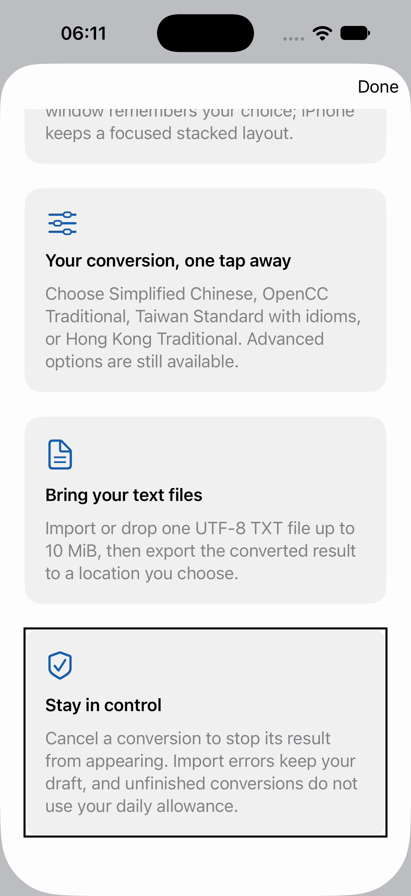
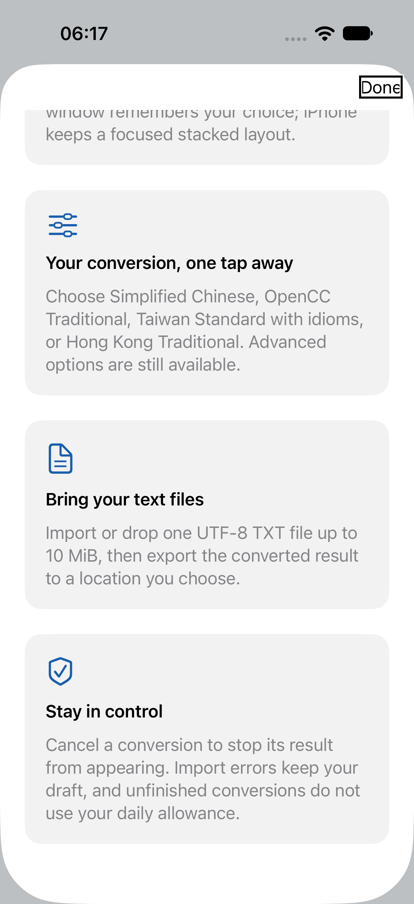

# What’s New VoiceOver order — #34

On the 2.0 sheet, the visually pinned Done button was the first VoiceOver
element. Forward navigation then read the title, version, and four cards but
stopped at the final card; it did not reach Done. The button now has a lower
accessibility sort priority, so the visual layout is unchanged while forward
navigation ends at Done.

| Before: `develop` `8d9a954` | After: candidate from `8d9a954` |
| --- | --- |
|  |  |
| [Navigation recording](media/before-navigation.mp4) | [Navigation recording](media/after-navigation.mp4) |

Environment: Xcode 27.0 (27A266a), dedicated iPhone 18 Pro / iOS 27.0
Simulator, English, light appearance, standard `large` content size. Both
builds use the same isolated Debug bundle ID
`org.gewill.OpenCCman.WhatsNewUITests`; the test presents the cards after a
conversion. The screenshots are real simulator frames. The before screenshot
is a frame extracted at 25 seconds from the original screen recording; the
after screenshot is an XCUITest attachment captured with the Done focus ring.
The recordings use `simctl io recordVideo` and contain no audio. The visible
focus rings and `XCUIDevice.voiceOverService` utterances provide separate
evidence of navigation; the videos alone do not prove spoken text.

The baseline test reported `Done → What’s New → OpenCCman 2.0 → workspace →
presets → files → reliability` and failed the expected-order assertion. The
candidate test reported `What’s New → OpenCCman 2.0 → workspace → presets →
files → reliability → Done` and passed (1 test, 0 failures). These are element
utterance prefixes; Xcode 27's API returned shortened detail text in this
run, so this test does not establish full-paragraph speech. The baseline
`xcodebuild` process did not finish writing its `.xcresult` after the expected
assertion failure; its test log and screen recording were retained. The
candidate `.xcresult` completed and exported both screenshots.

Validation of the candidate: the iOS 27 VoiceOver test passed (1/1),
`bash scripts/check-whats-new.sh` and `bash scripts/check-project.sh` passed,
and iOS Simulator plus macOS Debug builds succeeded with the resolved package
versions unchanged. On a separate iPhone 15 Pro Max / iOS 18.6 simulator, the
new test was explicitly skipped because Apple's speech automation API starts
at iOS 27; it compiled and the test suite completed with 0 failures. This
skip is not VoiceOver acceptance for iOS 18.6.

The test enables VoiceOver only on the dedicated simulator, preserves its
initial state, and checks restoration. After the final run,
`devicectl device info voiceover` returned `enabled: false`. The user's Mac and
physical iPhone were not changed. This covers the iOS 27 simulator's forward
reading path, not iOS 15, iPadOS, macOS, a physical device, or a signed build.
The remaining #34 presentation and release gates stay open.

Reproduce from this candidate with a dedicated booted iOS 27 Simulator:

```bash
xcodebuild test \
  -project Tests/UI/WhatsNewPresentation/WhatsNewPresentation.xcodeproj \
  -scheme WhatsNewPresentationTests \
  -destination 'platform=iOS Simulator,id=<UDID>' \
  -only-testing:WhatsNewPresentationTests/WhatsNewPresentationTests/testVoiceOverCardReadingOrder \
  CODE_SIGNING_ALLOWED=NO
```

The test requires the isolated QA app build described in
[`Tests/UI/WhatsNewPresentation/README.md`](../../../Tests/UI/WhatsNewPresentation/README.md).
The Xcode 27 speech API is documented by
[Apple's XCUIVoiceOverService](https://developer.apple.com/documentation/xcuiautomation/xcuivoiceoverservice).
Media were uploaded with `gh api` before being added to this branch; exact
Git blob SHA and byte counts are in [`media/uploads.json`](media/uploads.json).
