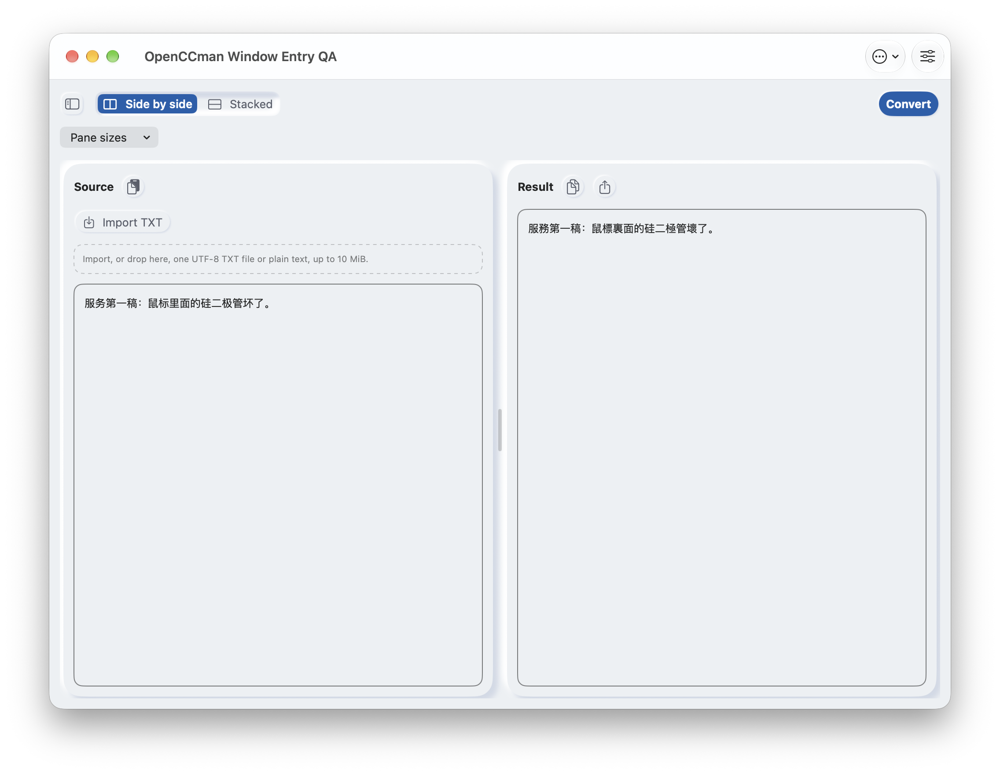
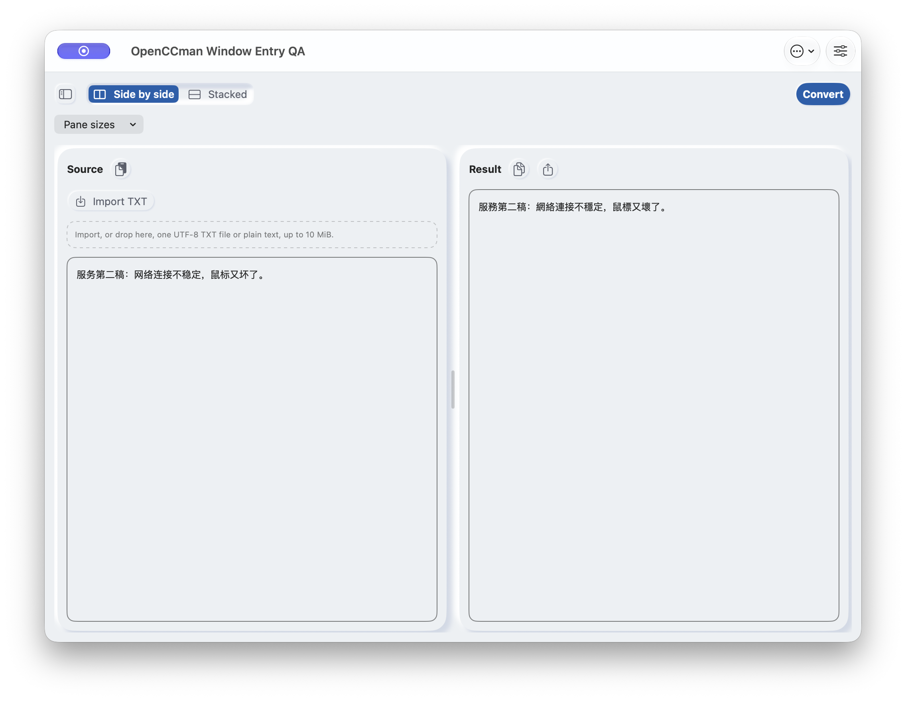

# 全部关窗后的 Services 回写（#19，2026-09-24）

## 结论与边界

在 macOS 27.0 上，用当前 `develop` 的隔离、ad-hoc 签名 Debug 应用，三次从“进程仍在、无可见窗口”状态调用真实 macOS Services。两次 **Convert** 的 pasteboard 输出与同版本 OpenCC CLI 预期逐字节一致，应用在同一 PID 重新显示一扇主窗口，原文和结果分别可见且为本次稿件；一次 **Open** 保留 pasteboard 原文并在同一 PID 重新显示主窗口，原文为本次稿件、结果为空。这修正了旧版服务返回成功但窗口未回写的观察边界。

这不是 #19 的全部验收：调用方是 `NSPerformService` CLI，TextEdit 菜单项虽可见，但本轮 CUA 对其菜单项点击返回 `elementHasNoFrame`，未得到 TextEdit 菜单实际执行的证据。状态栏、全局快捷键、Dock 实际点击、冷启动、多窗口连续请求、额度，以及 Xcode Cloud/TestFlight 签名包和 macOS 12 均未在本轮验证。Issue 保持开放。三次顺序执行，各次之间均再次关闭主窗口，不能当作并发请求合并测试。

## 来源与测试身份

| 项目 | 本次记录 |
| --- | --- |
| 应用源码 | `develop` `458fcd2aafa6b9bfa7d0423e1d927c6f396f0954`，含 PR #147 |
| 构建 | Xcode 27.0 (27A266a)，macOS 27.0 (26A428)，Debug macOS，`CODE_SIGNING_ALLOWED=NO`；本地构建成功，日志 SHA-256 `0a341229e35da0c66fdf6ca03e0a0af490b71691c0d22144e441c242119aa1cd` |
| 测试应用 | `org.gewill.OpenCCman.WindowEntryQA20260924`；唯一服务端口 `OpenCCman Window Entry QA 20260924`，菜单名 `OpenCCman Window QA Convert` / `OpenCCman Window QA Open`；仅从上述构建复制并修改测试身份，以现有应用 Sandbox、选定文件读写、客户端网络 entitlement ad-hoc 签名且 `codesign --verify --deep --strict` 通过 |
| 服务调用方 | 仓库 [`ServicesWaitProbe.swift`](../../../../tests/Benchmarks/ServicesWaitProbe.swift)，`swiftc -O` 编译，以唯一 pasteboard 调用 `NSPerformService`；此调用不代表目标应用菜单响应时间 |
| 实际进程 | 测试应用 PID `79261`，三轮关窗后仍运行；每轮调用前 CoreGraphics 的在屏窗口清单为 0，调用后有一扇 1024×768 主窗口，PID 不变 |
| 转换配置 | 默认 `s2t`；使用仓库锁定的 OpenCC 1.4.2 CLI 生成两份期望输出 |

没有改动正式 bundle、正式偏好、购买/额度后台、发布分支或系统服务偏好。测试应用单独注册 Services，正式构建产物的 Launch Services 临时注册已撤销。

## 实测结果

| 场景 | 输入/预期 | 服务 API 往返 | 输出与窗口 |
| --- | --- | ---: | --- |
| 关窗后 Convert 1 | 55 B，`fixtures/convert-first-input.txt` → `fixtures/convert-first-expected.txt` | 228.815 ms | `NSPerformService=true`；完整输出 SHA-256 `81f2d7238479bba7ffaf15212b578684b34a624b05ddb88f101869d16423f714`，应用显示本次原文和繁体结果 |
| 关窗后 Convert 2 | 61 B，`fixtures/convert-second-input.txt` → `fixtures/convert-second-expected.txt` | 129.037 ms | `NSPerformService=true`；完整输出 SHA-256 `16865e4150c61e3a995fad4ff32a0c3b93e7d334cb1367613c527349c3cc89e8`，应用显示第二稿，未被第一稿覆盖 |
| 关窗后 Open | 49 B，`fixtures/open-input.txt` | 126.053 ms | `NSPerformService=true`；pasteboard 原文未变；应用显示本次原文且结果为空 |

原始调用记录在 [`logs/`](logs/)，包含样本开始/完成、字节数、输入/输出哈希和错误停止协议。上表是各场景一次调用，不作延迟统计或性能结论。`NSPerformService=true` 也不能单独证明 UI 已回写，故另以窗口清单和应用可见文本核对。

两次 Convert 的真实运行截图分别如下。它们是同一源码的两次输入状态，**不是修改前后对照**。录屏从第一次结果开始，包含关窗后的空窗口阶段和第二次服务返回后的新窗口；只捕获该测试应用，无其他应用、音频、麦克风或鼠标指针。

| 第一次服务结果 | 第二次服务结果 |
| --- | --- |
|  |  |

[关窗与第二次 Services 回写视频](media/service-reopen.mp4)。视频 SHA-256 `3c8ab6c61f5a9ca2fd37904ed5f99df9f8fa0a5325fa850233a585fcefbaf25c`，H.264、1496×968、约 59.77 秒。截图与视频在 1024×768pt 浅色、英语界面、默认字体环境取得；黑色区域为应用以外的屏幕遮罩，紫色小条为系统录屏指示。此录像没有展示 TextEdit 菜单点击。

## 复现与后续

1. 从上述 SHA 用 macOS Debug 构建并复制到独立 QA bundle，改用唯一 bundle ID、服务菜单名和端口，签名/验证，向 Launch Services 注册并更新 Services 菜单。不可同时注册同名正式服务，以免误判提供者。
2. 编译 `tests/Benchmarks/ServicesWaitProbe.swift`，用四个参数 `SERVICE_NAME INPUT_UTF8 EXPECTED_UTF8 1` 调用。Convert 的 expected 用锁定的 `opencc -c s2t.json` 生成；Open 的 expected 为原文件。运行前通过界面关闭 QA 的主窗口，分别核对 PID 仍存在、CoreGraphics 在屏窗口清单为 0。
3. 每次调用后核对 JSONL `run_completed`、返回字节与 SHA，并在应用中核对原文和结果。再次关窗后才执行下一轮。不要在零窗阶段查询应用 AX 树：本次该查询会激活并重开默认窗口，破坏前置条件。
4. 后续用真正目标 App 的 Services 菜单、状态栏、全局快捷键、Dock 与连续请求补齐 #19；在最终签名包复验，最低系统留 #16。对于 #22，仍需大文本目标 App 等待/失败路径和产品容量结论。

测试媒体通过 `gh api POST repos/gewill/OpenCCman/git/blobs` 上传并校验对象 SHA，记录见 [`media/uploads.json`](media/uploads.json)。
