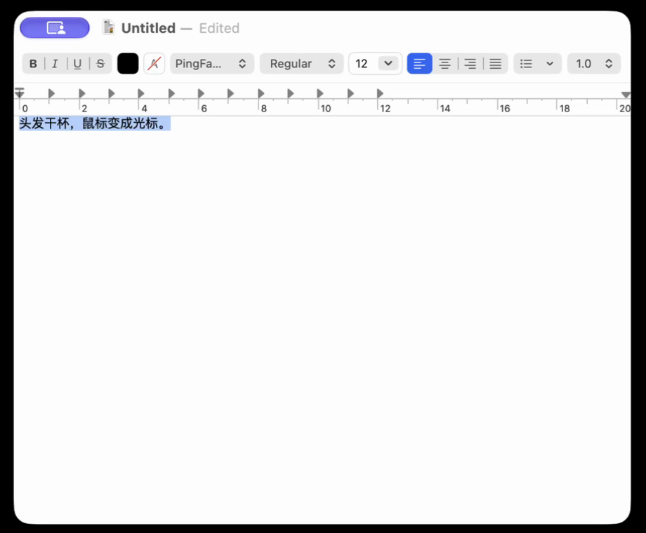
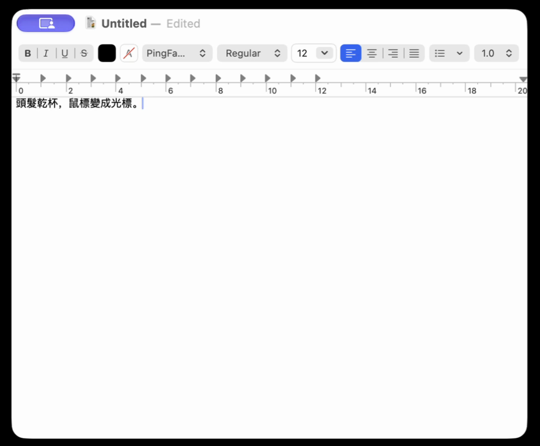
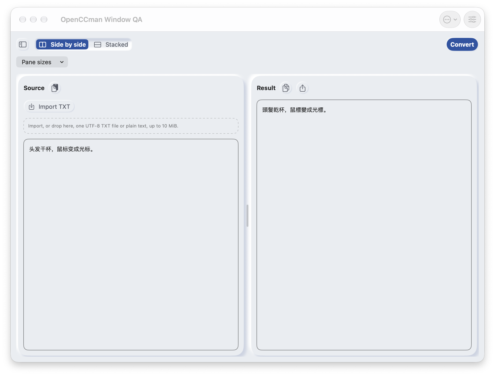

# #19：TextEdit 真实 Services 菜单复验（2026-09-28）

在 macOS 27.0 的 TextEdit 新建测试文稿、全选 `头发干杯，鼠标变成光标。`，通过 **TextEdit → Services → OpenCCman Window QA Convert** 执行转换。操作前隔离 QA 应用 PID `49770` 仍存活，但 CoreGraphics 在屏主窗口清单为 **0**。操作后同一 PID 有 **1** 个 1024×768 pt 主窗口（ID `7265`）；TextEdit 文稿变为 `頭髮乾杯，鼠標變成光標。`，QA 窗口的原文与结果分别匹配这两段文字。`头发` → `頭髮`、`干杯` → `乾杯` 还覆盖了词组边界容易出错的样本。

这是对 [同日 `NSPerformService` 探针](../2026-09-28-v21-qa/README.md)的目标应用菜单补验。此次实际触发的是系统菜单项，不是探针直接调用；只执行了一个请求，不证明并发合并、不同目标应用、空选区或最终分发包行为。

| 条件 | 本次证据 |
| --- | --- |
| 源码 | QA 包源自 `6af425542c01d416eb25e465a7946d6a44a5d2b1`；至 `develop` `5375a1aa3b824ec337882c487fdd7a0d2574d639`，`OpenCCman/`、工程文件及锁定依赖无差异。后续提交只有文档与 QA 记录。 |
| 环境 | Apple Silicon，macOS 27.0 (26A428)，Xcode 27.0 (27A266a)，TextEdit；CUA 用于创建、选中、点击系统菜单并读取两端 AX 状态；CoreGraphics 独立核对在屏窗口。 |
| QA 身份 | `org.gewill.OpenCCman.WindowEntryQA20260928`，版本 2.1(30)，独立偏好与服务名；Apple Development Team `RLK76T8Y89` 签名，Sandbox、用户选取文件读写及网络客户端 entitlement 保留，`codesign --verify --deep --strict` 通过；可执行文件 SHA-256 `5a56e161d4525d851334246a06687590e1c9855130a4e1c22ca17ee2ee5138cf`。这不是 Xcode Cloud 分发签名。 |
| 调用前 | QA 主窗口关闭后 `visible-main-windows=0`，PID `49770` 未退出；TextEdit AX 显示全选原文，系统菜单 AX 明确列出 `OpenCCman Window QA Convert`。 |
| 调用后 | TextEdit AX 值为预期繁体，QA AX 原文与结果一致；CoreGraphics 对同一 PID 仅列出 ID `7265` 一扇主窗口。 |

视频使用 ScreenCaptureKit **仅录 TextEdit 应用窗口**（2250×1350，14.06 秒），无音频、麦克风或指针。它展示选中原文到转换后文字的变化；菜单栏没有进入应用限定录制范围，因此菜单项与点击依据上述 CUA AX 观察，不能仅凭视频证明。以下两张同条件截图取自这段实际录像，QA 结果图由窗口限定 `screencapture` 取得；通过 `gh api POST repos/gewill/OpenCCman/git/blobs` 上传并逐个验证 Git blob SHA，见 [`media/uploads.json`](media/uploads.json)。

| TextEdit 转换前 | TextEdit 转换后 | 重开的 QA 窗口 |
| --- | --- | --- |
|  |  |  |

[TextEdit 实际转换交互录像](media/textedit-services.mp4)。

此次没有改变正式安装的 OpenCCman。对测试期间 TextEdit 的选区替换仅发生在新建临时文稿，未使用用户现有文件。真实云端签名包、Dock、状态栏、全局快捷键、连续与多窗口请求以及 macOS 12 仍按 #19、#15、#16 的原验收要求保留。
