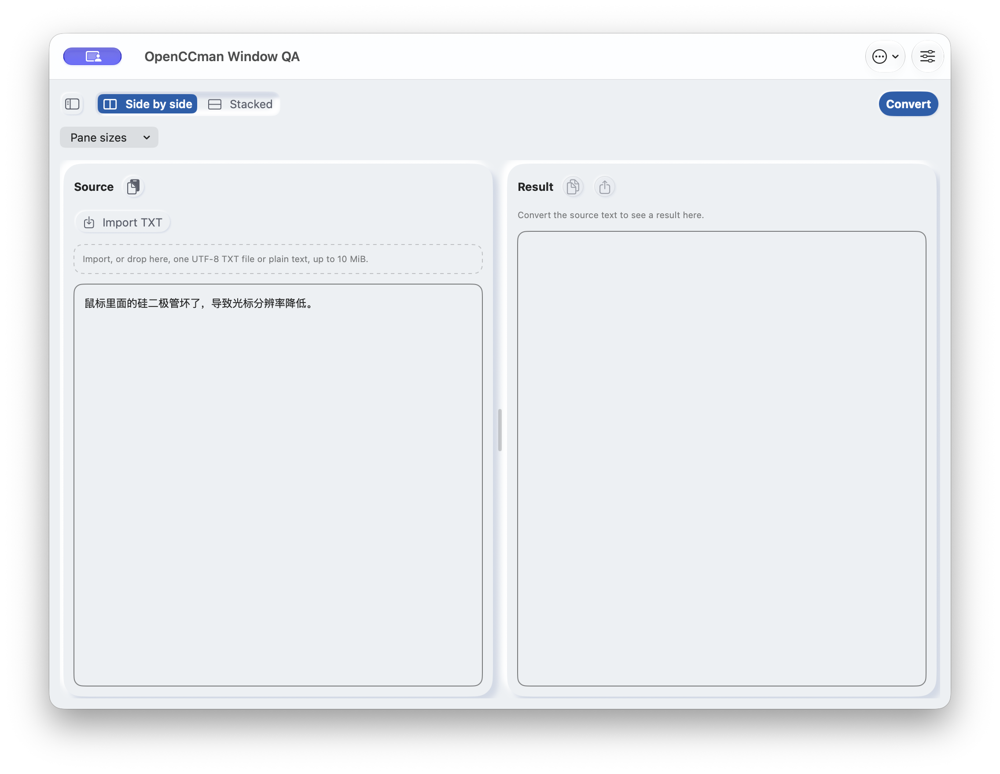
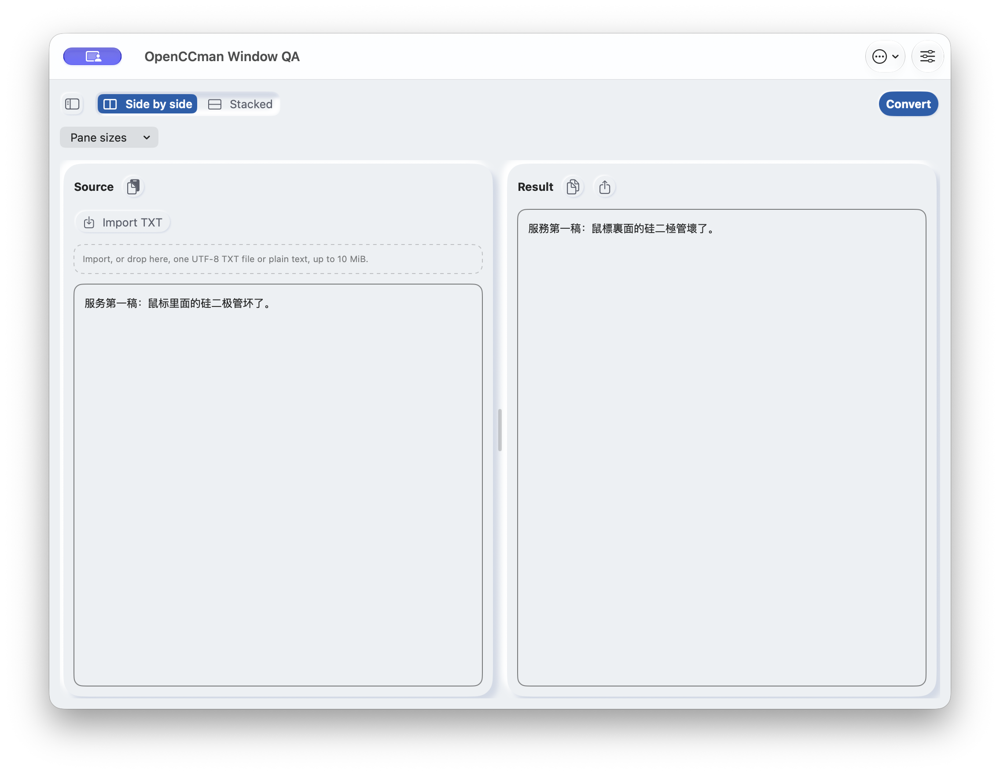
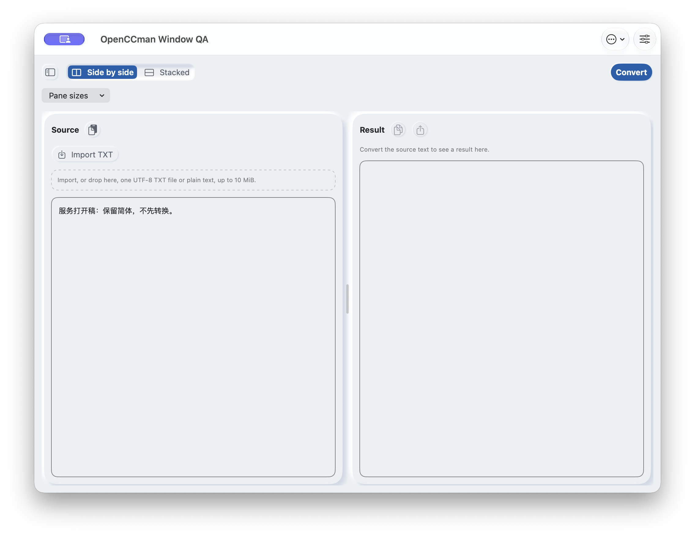

# 2.1 全部关窗后的 Services 复验（#19，2026-09-28）

在 macOS 27.0 (26A428) 上，隔离签名的 2.1(30) QA 应用保持同一进程运行。每次关闭唯一主窗口、确认在屏主窗口数为零后，调用一次 macOS `NSPerformService`：两次 Convert 分别重新打开一个窗口、显示当次原文和正确结果；一次 Open 重新打开一个窗口、显示原文且结果为空。三次调用都成功，pasteboard 字节与预期一致。它们是**顺序**测试，每次调用前重新关窗，不证明并发请求的合并行为。

此报告更新 [2026-09-24 的 Services 验证](../2026-09-24-services/README.md)到 2.1 候选源码。它不满足 #19 全部关闭条件：尚未从 TextEdit 等目标 App 的真实 Services 菜单点击、Dock、状态栏或全局快捷键触发，也未验证连续请求、多窗口、最终分发签名包和 macOS 12。

| 来源与环境 | 实测记录 |
| --- | --- |
| 候选源码 | `develop` 合并 #232 后的 `ab121703c97a9baa2b77ad6c450820cfd8449727`；QA app 原始构建源码 `6af425542c01d416eb25e465a7946d6a44a5d2b1`，两者 `OpenCCman/` 应用源码差异为空；后者不包含本轮 Shortcuts 文档改动 |
| 机器与工具 | macOS 27.0 (26A428)，Xcode 27.0 (27A266a)；CoreGraphics 窗口清单、`NSPerformService` 探针、CUA 关闭窗口、`screencapture` 与 ScreenCaptureKit 录屏 |
| QA 身份 | `org.gewill.OpenCCman.WindowEntryQA20260928`，服务名 `OpenCCman Window QA Convert` / `OpenCCman Window QA Open`，唯一服务端口 `OpenCCman Window Entry QA 20260928`；未替换正式 App |
| 签名 | Debug dylib 和 app 均以同一 Apple Development Team `RLK76T8Y89` 重新签名；保留 Sandbox、用户选定文件读写、网络客户端 entitlement；`codesign --verify --deep --strict` 通过；**不是** Xcode Cloud 分发签名 |
| 可执行文件 | 签名后 SHA-256 `5a56e161d4525d851334246a06687590e1c9855130a4e1c22ca17ee2ee5138cf`；实测 PID `19382` 在三次关窗和服务回写中未变 |
| 窗口 | 每次服务前 CoreGraphics 清单为 0 个在屏主窗口；调用后为 1 个 1024×768pt 主窗口，依次为窗口 ID 6815、6819、6825 |

| 场景 | 预期与实际 | `NSPerformService` 单次耗时 |
| --- | --- | ---: |
| Convert 第一稿 | 55 B，输出 SHA-256 `81f2d7238479bba7ffaf15212b578684b34a624b05ddb88f101869d16423f714`，逐字节匹配既有 [合成语料](../2026-09-24-services/fixtures/convert-first-expected.txt)；新窗口显示第一稿原文和繁体结果 | 273.97 ms |
| Convert 第二稿 | 61 B，输出 SHA-256 `16865e4150c61e3a995fad4ff32a0c3b93e7d334cb1367613c527349c3cc89e8`，逐字节匹配[第二稿预期](../2026-09-24-services/fixtures/convert-second-expected.txt)；新窗口仅显示第二稿 | 145.30 ms |
| Open | 49 B，pasteboard 原文保持 SHA-256 `e7f191e6d59849918a88394dae2dae3a46303067c82b6a710bbb60cabf805993`；新窗口显示[打开稿](../2026-09-24-services/fixtures/open-input.txt)，结果为空、复制和导出不可用 | 143.07 ms |

逐次原始记录见 [`logs/`](logs/)。上述耗时是该 QA 环境里的一次服务调用，不是性能基准或目标 App 菜单响应时间。探针不能单独确认服务提供者身份，因此结合唯一注册名称、同一 PID 和可见窗口核对。零窗状态由独立 CoreGraphics 清单核对；零窗期间不查询 App AX 树，因为查询会激活并可能重开窗口。

下表是**同一候选源码的不同运行状态**，不代表代码修改前后。画面为英语、浅色、默认字号；窗口 1024×768pt。截图和交互视频都通过 `gh api POST repos/gewill/OpenCCman/git/blobs` 上传并核对 blob SHA，见 [`media/uploads.json`](media/uploads.json)。

| 关闭前 | 第一次 Convert 回写 | 第二次 Convert 回写 | Open 回写 |
| --- | --- | --- | --- |
|  |  |  |  |

[关窗并再次通过 Services 重开的交互视频](media/service-reopen.mp4)（H.264，2048×1536，20.02 秒，SHA-256 `7a9e4bdb94e33295988aa62576b7b3047341fb3616792deb77ad9bef7064ab53`）。ScreenCaptureKit 只录 QA 应用窗口，无音频、麦克风或指针；中间黑帧是未显示 QA 窗口时的遮罩，本身不证明零窗，零窗结论来自 CoreGraphics 清单。

## #19 剩余验收

- 用最终分发签名包，从 TextEdit 等目标 App 的 Services 菜单、全局快捷键、状态栏和 Dock 分别触发；确认关窗前后以及冷启动结果可见。
- 验证连续请求和多窗口，检查只有目标窗口获得最新稿、没有重复投递、不可见扣次或多开。
- macOS 12 最低系统实际运行仍由 #16 跟踪；本机 macOS 27 测试不能替代。
