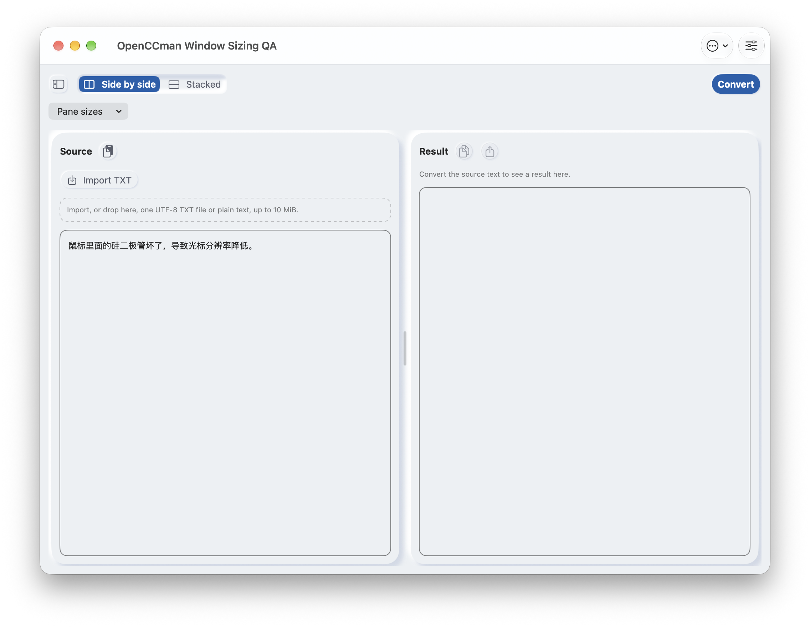
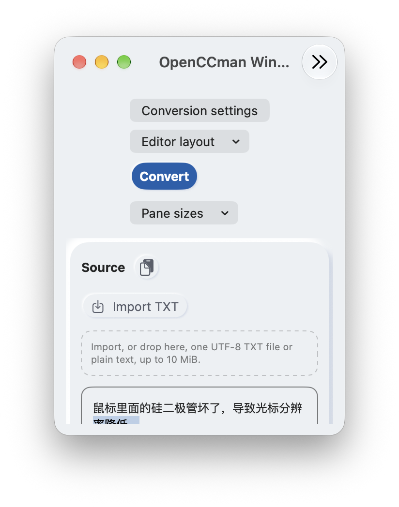
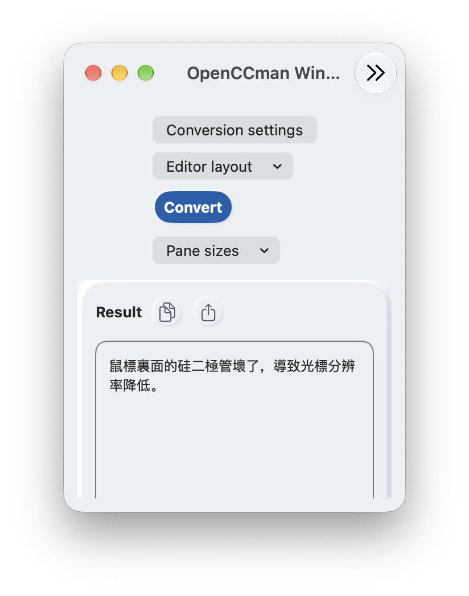

# #57：当前 `develop` 的 Mac 实际缩放与恢复（2026-09-24）

## 本次结果

当前 `develop` `9b335ac1e577c8237c2c05b389a003e8f88ec291` 在隔离的 macOS Debug 应用上，首次主窗口为 **1024×768 pt**。使用系统 Zoom 后，从右边缘真实拖动经过 1101 pt 到 **300 pt** 宽，再从底边拖至整窗 **300×412 pt**；原文和转换结果未丢失，窄窗自动改为上下布局。最小窗口顶部的转换、导入与布局入口可见，滚动后结果、复制及导出入口可见且启用。新开窗口为 1024×768 pt，原窗口仍为 300×412 pt、结果未变；关闭新窗口后退出并重启，原生历史尺寸恢复为 300×412 pt。

这补齐了此前 CUA 边缘拖动未成功时留下的**当前候选实际连续缩放**证据。它不覆盖物理屏幕拔插、Mac 可调大字号或最终 Xcode Cloud/TestFlight 包，因此 #57 仍保持开放。屏幕当前为内建与外接显示器镜像，系统只提供一个逻辑显示区域；没有改变显示器排列或拔插用户设备。

## 来源与测量口径

| 项目 | 本次记录 |
| --- | --- |
| 应用源码 | `9b335ac1e577c8237c2c05b389a003e8f88ec291`（PR #148 合并后的 `develop`；#148 仅改文档） |
| 环境 | macOS 27.0 (26A428)、Xcode 27.0 (27A266a)、内建 Color LCD 与外接 MAG321UX OLED 镜像；一个逻辑屏幕 1496×967 pt，`NSScreen.visibleFrame` 为 1496×879 pt |
| 构建和身份 | Debug `platform=macOS` 完整构建成功；复制成唯一 bundle `org.gewill.OpenCCman.WindowSizingQA20260924`，移除 QA 副本中的 Services 声明，沿用现有沙盒 entitlement 进行 ad-hoc 签名并通过深度校验。构建日志 SHA-256 `0a65357d0b736217171b896a6dd524e0705fb3ba4b04238b6697f7d468eafcc1` |
| 测量 | 外框由只读 `CGWindowListCopyWindowInfo` 获取，单位为 pt、坐标是 Quartz 全局坐标；不是截图像素。缩放由 CUA 实际拖动窗口边缘完成，内容由应用 AX 树和截图核对。原始尺寸顺序、PID/窗口号及媒体哈希见 [`runtime.json`](runtime.json) |

初始窗口 PID `89073`、窗口号 `4763`；系统 Zoom 后外框 1496×879；右边缘拖动后先为 1101×879，再为 300×879；底边拖动后为 300×412。系统标题栏占 52 pt，当前最小根内容区域为 300×360 pt，口径沿用 [主报告](../README.md) 和 [UI-SPEC](../../../design/adaptive-workspace/UI-SPEC.md)。没有将标题栏高度硬编码进应用。

## 实际界面

| 新窗口推荐尺寸 1024×768 pt | 最小窗口顶部 300×412 pt | 滚动到最小窗口结果区 |
| --- | --- | --- |
|  |  |  |

截图为**同一当前源码的不同窗口尺寸/滚动状态，不是代码修改前后对照**；macOS 27、英语浅色、默认字号，中文为应用内合成示例。另有 [重启后恢复最小尺寸截图](media/minimum-reopened.png)。[真实边缘拖动与滚动视频](media/live-resize.mp4) 长 45.267 秒，H.264、15 fps，SHA-256 `b278b91a6edf241a83e9aa296b5521267eb22a99cc11e2a3263b67a3cdefd76c`；ScreenCaptureKit 仅保留该 QA 应用画面，其他区域为黑色，无音频、麦克风或鼠标指针。紫色小条为系统录屏指示。

## 核对过程

1. 用隔离偏好首次启动：主窗口 1024×768 pt；默认合成原文成功转换。完成系统 Zoom、右边缘与底边拖动后，AX 原文仍为“鼠标里面的硅二极管坏了，导致光标分辨率降低。”，结果仍为“鼠標裏面的硅二極管壞了，導致光標分辨率降低。”。本次未声称长文或真实输入法组合过程中的锚点稳定；该项归 #20/#65。
2. 最小窗口主滚动区下滚至约 0.6144，结果和复制／导出均可见；再上滚回顶部，转换与导入仍可达。没有实际导出文件或购买。
3. `⌘N` 新建 1024×768 pt 窗口（窗口号 `4807`），原窗口保持 300×412 pt（窗口号 `4763`）；关闭新窗口后，原窗口的已转换结果仍存在。退出时原生 autosave 写入 `300×412`，重新启动 PID `90117`、窗口号 `4817` 恢复同样大小。应用并不持久化正文，重启后的默认原文/空结果符合当前产品规则。
4. `bash scripts/check-window-sizing.sh` 再次通过：历史损坏、负坐标/断开显示器的几何约束、原生新开/恢复、最小尺寸、sheet 关闭与窗口生命周期检查。这个模拟断屏检查不能代替物理显示器热拔插。

媒体使用 `gh api POST repos/gewill/OpenCCman/git/blobs` 上传并核对返回对象 SHA 与本地 `git hash-object`，见 [`media/uploads.json`](media/uploads.json)。构建副本仅作隔离验收，未触发 Xcode Cloud，也未修改正式应用偏好。测试后 QA 进程退出、副本删除、独立偏好键清空；本机 Launch Services dump 仍列出已不存在的 QA bundle 缓存记录，副本本来不声明 Services，因此没有遗留 QA 服务菜单。没有为清除该缓存重置全局 Launch Services 数据库。

## 保留的 #57 门槛

- 当前 app 没有 Mac 用户可调文字缩放路径。此前已验证系统“文字大小”滑杆并不改变这个 SwiftUI 窗口；不能把两张相同画面当作大字号通过。是否把应用内字号控制列为独立功能，或按当前设计调整 #57 的 Mac 验收范围，待维护者决定。
- 外接显示器处于镜像模式。本轮没有物理断开/重新接入显示器，也没有多逻辑屏幕间的实际移动；历史系统菜单移动与模拟断屏结果保留各自来源，不扩写为本次通过。
- 本轮为 ad-hoc 签名 Debug QA 副本；正式签名包和 macOS 12 最低系统归 #15/#16。#57 的其余语言、主题、侧栏矩阵保留既有记录，不将本轮英语浅色样本推广为全矩阵。
